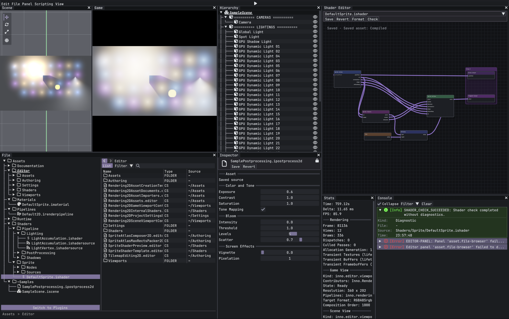

# InnoEngine

*Innovate As You Want.*

**A Plugin-Oriented game engine written in C#.**

Inno expresses a simple idea: **Innovate As You Want**. Build the systems, tools, and workflows your game needs on a shared engine foundation.

InnoEngine is a personal engine-development project with cross-platform ambitions. Its central design principle is **Plugin-Oriented**: the engine provides reusable mechanisms and default backends; plugins define the rendering models, gameplay systems, and specialized tools built on top.

[Wiki](docs/README.md) · [Architecture](docs/architecture/ENGINE_ARCHITECTURE_OVERVIEW.md) · [Plugins](docs/plugins/README.md) · [Build](docs/build/README.md)



> **Work in progress.** APIs, project formats, and tooling are actively evolving. Backward compatibility is not guaranteed.

## Plugin-Oriented, by design

Plugins are a primary way to build with InnoEngine, not just a place to add optional features.

The engine supplies rendering, audio, animation, input, storage, assets, scene structure, and execution lifecycles. Plugins combine those mechanisms into concrete models: a visual-novel dialogue system, a 2D camera and sprite renderer, or a 3D rendering pipeline.

These are examples of what plugins can define, not a list of bundled gameplay plugins.

Plugin-Oriented does **not** mean every engine service must be installed as a plugin. InnoEngine includes default adapters, an Editor, and a Player. The goal is a useful foundation that lets you shape the engine around your game without rebuilding its infrastructure.

## Design principles

- **Mechanisms in the engine, models in plugins.** Common capabilities belong to the engine; genre-specific behavior and rendering models belong to extensions.
- **Explicit boundaries.** Foundation, domain services, adapters, and product composition have distinct responsibilities and checked dependency directions.
- **Backend-neutral APIs.** Engine contracts separate game code from concrete platform and native implementations.
- **Discoverable extensions.** Stable declarations and type discovery connect components, importers, rendering features, audio providers, and Editor tools without a central per-plugin type list.
- **Owned lifecycles.** Identity, resource ownership, candidate publication, and retirement are shared infrastructure. Missing references preserve recovery data; hot reload must verify that retired generations have actually unloaded.
- **One authoring workflow.** Plugins participate in the same asset pipeline, serialization, inspection, and Undo/Redo mechanisms as the rest of the Editor.

## What the engine provides

| Area | Role |
| --- | --- |
| Foundation | Identity, serialization, events, diagnostics, logging, jobs, and lifetime management |
| Content | Assets, import and artifact pipelines, recoverable references, scenes, prefabs, and animation data |
| Services | Backend-neutral rendering, audio, input, storage, and their runtime services |
| Runtime | Host/session isolation, subsystem scheduling, scripting, and plugin discovery and activation |
| Default adapters | SDL3 platform/input, BGFX rendering, MiniAudio audio, filesystem storage, and ImGui presentation |
| Products and tools | A shared Shell for Editor and Player, extensible Editor tooling, build pipelines, and Player Support Packs |

A plugin can contribute both code and content. Projects author content under `Assets/`; exported `.iplugin` packages are installed under `Plugins/` and mounted read-only into the existing asset pipeline. See the [plugin workflow](docs/plugins/Inno.Plugins.Authoring.md).

## Repository layout

This is the current top-level organization. Detailed project maps and public APIs live in the Wiki.

```text
InnoEngine/
├── src/
│   ├── foundation/   # Core infrastructure, extensibility, scripting API declarations
│   ├── content/      # Assets, references, scenes, animation
│   ├── services/     # Rendering, audio, input, storage, platform contracts
│   ├── runtime/      # Host/session execution, subsystem contracts, scripting, plugins
│   ├── adapters/     # Neutral adapter catalogs and concrete backend implementations
│   └── composition/  # Default engine assembly, Shell, Editor, Player
├── native/           # C# bindings to native APIs
├── extern/           # Third-party source dependencies
├── build/            # Build pipelines, native toolchains, Support Packs
├── tools/            # Architecture validation and development tools
├── tests/            # Tests grouped by domain
└── docs/             # Architecture, workflows, and API Wiki
```

Native bindings expose foreign APIs; adapters translate them into engine contracts. Third-party sources and generated native libraries are separate from both.

## Explore and build

The Editor and Player target **.NET 9**. Game exports currently target **Windows x64**, **macOS ARM64**, and **WebAssembly browsers with WebGL 2**. Desktop exports can use CoreCLR or NativeAOT; browser exports use the selected .NET Mono Wasm interpreter or AOT compiler. Platform packaging, managed deployment, native toolchains, and domain adapters are separate choices. Linux is not currently a game export target.

See the [platform and runtime architecture](docs/architecture/PLATFORM_RUNTIME_ARCHITECTURE.md) for these boundaries and the [refactor acceptance report](docs/architecture/PLATFORM_RUNTIME_ACCEPTANCE.md) for actual verification on each host. iOS, consoles, and a future CoreCLR WebAssembly deployment remain documented extension points.

Native dependencies need to be built before running the Editor. Start with:

- [Build and native toolchains](docs/build/README.md)
- [Editor startup and project directories](docs/editor/Inno.Editor.Application.md)
- [Scripting and extension APIs](docs/scripting/README.md)
- [Plugin authoring and installation](docs/plugins/Inno.Plugins.Authoring.md)
- [Player and runtime](docs/runtime/README.md)

## Follow the project

InnoEngine started as a way to understand game engines by building one. Discussions, suggestions, and contributions are welcome.

If this direction interests you, a star helps the project reach more people. Feel free to open an issue or get in touch by [email](mailto:hsuankailiao@gmail.com).

## License

[Apache License 2.0](LICENSE). Third-party dependencies retain their respective licenses.
