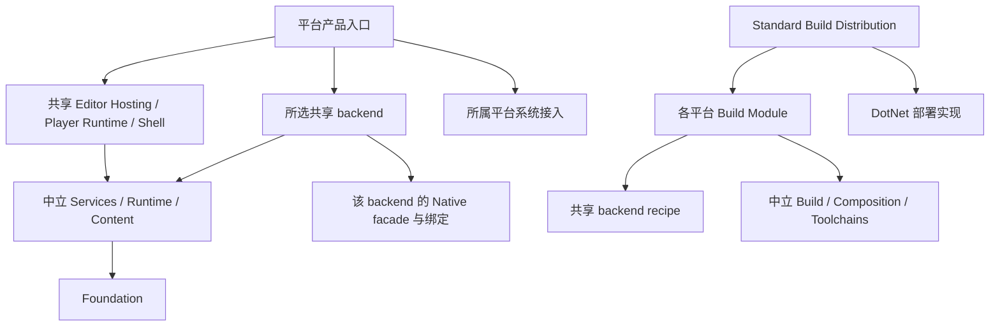

# InnoEngine 当前项目、平台与后端归属

[架构索引](README.md) · [Wiki 首页](../README.md) · [执行计划](PLATFORM_OWNERSHIP_REFACTOR_PLAN.md) · [扩展指南](PLATFORM_EXTENSION_GUIDE.md)

本页根据当前源码及项目引用生成。源码归属与实机支持分别说明；本轮运行结果见平台归属验收记录。

## 目录职责

| 位置 | 唯一职责 | 依赖约束 |
| --- | --- | --- |
| `src/foundation` | 事件、身份、序列化、值、目录与代际机制 | 不选择产品、平台或 backend。 |
| `src/content` | 内容、Asset、引用、Scene、Animation | 内容读取通过中立 store 与 lease。 |
| `src/services` | 中立领域契约与运行服务 | 不引用具体平台、Native 或 backend。 |
| `src/runtime` | Session、子系统、部署、注册、Plugin、创作态脚本流程 | 发行闭包排除创作编译、动态加载与工具链。 |
| `src/adapters` | 中立 SPI、开放 provider/catalog、EventInput | 具体第三方实现属于 backends。 |
| `src/composition` | 共用 Engine、Shell、Player Runtime、Editor Hosting/功能及标准 Adapter 组合 | 共用宿主接受明确配置，不选择 OS 或发行注册。 |
| `backends/<component>` | 共享 backend 的 runtime、Native、recipe 和专属测试 | 单一源码 owner，不引用命名平台。 |
| `platforms/<platform>` | SDK、系统位置、产品启动、布局与 Support Pack | 不引用其他平台包，不复制共享 backend。 |
| `build` | 中立构建/部署/工具链/Support Pack机制、发行组合、Task、CLI | 具体注册只在 Standard Distribution，普通 Build 不反向引用发行。 |
| `tools` | 可执行架构、API、规范和生命周期检查 | 库输出，由统一 CLI 调用。 |

## 四个独立选择

维护归属是 Windows/MacOS/Browser；真正的运行目标包含架构和 ABI。产品决定 Editor 或 Player 闭包；managed deployment 决定 CoreCLR、NativeAOT 或 Mono Wasm 解释执行/AOT。工具宿主只决定所选工具能在哪里执行。

当前发布目标为 `windows-x64`、`macos-arm64`、`browser-wasm`（描述明确为 wasm32）。Linux 仅贡献现有 Native SDK 能力。Desktop 不是注册目标。

当前六个生产入口为 `Inno.Editor.Windows`、`Inno.Editor.MacOS`、`Inno.Player.Windows`、`Inno.Player.MacOS`、`Inno.Player.Browser`、`Inno.Build.Cli`。不同 CPU 不复制 Program。Solution 默认编译共享代码和测试；产品通过明确入口构建，其目标属性隔离于工具图。

## 运行与代际所有权

组合入口借用不可变 catalog、distribution 和配置；Host 拥有其创建的 Session、设备、任务与 callback。停止顺序为拒绝新工作、取消并完成任务、注销回调、保存 Editor 状态或提交存储、退休领域资源、释放设备/窗口/进程 owner。

Core Events 是唯一事件机制；跨代 live object 经 Identity 解析。Missing 与 last-good 不丢失；候选在 owner-thread safe point 原子切换。Editor reload 仍必须执行 Full GC → finalizers → Full GC 并由弱监测确认不可达，Pending/Faulted gate 不因平台重构降低。

## 构建与产物所有权

目标描述、工具宿主、SDK、组件位置与产品组件闭包在操作开始冻结。组件 recipe 从明确 owner 读取真实源码及配置，不通过项目名称或目录层数猜测。CMake 参数只由 CMake 执行器组合；进程工具不隐式添加配置。

| 内容 | Owner |
| --- | --- |
| facade / BGCS 定义 / 宿主绑定 | `backends/<component>/native/Inno.Native.*/`。 |
| 目标桥与 managed source | Native 项目 `obj/<target>/<generationFingerprint>/`。 |
| CMake/object 中间态 | 所属 backend toolchain `obj/native/<target>/<fingerprint>/`。 |
| Native、bindings、managed、Support Pack、产品 | `artifacts` 按目标、部署和指纹隔离；最终输出仍由 BuildProfile 指定。 |
| 验收日志与测量 | `artifacts/acceptance/2026-10-07-platform-ownership/`。 |

完整目录、哈希、exports、绑定身份与工具身份都参与验证。失败或取消不提交候选；相同部署不替换正在加载的 DLL。BGCS 独立维护，Inno 只消费其公开生成入口。

## 当前生产项目

以下项目排除 tests、bin、obj 与生成项目，包含实际 binding extension。

### src/foundation

- `Inno.Core.Collections`：[`src/foundation/core/Inno.Core.Collections/Inno.Core.Collections.csproj`](../../src/foundation/core/Inno.Core.Collections/Inno.Core.Collections.csproj)。
- `Inno.Core.Coroutines`：[`src/foundation/core/Inno.Core.Coroutines/Inno.Core.Coroutines.csproj`](../../src/foundation/core/Inno.Core.Coroutines/Inno.Core.Coroutines.csproj)。
- `Inno.Core.Diagnostics`：[`src/foundation/core/Inno.Core.Diagnostics/Inno.Core.Diagnostics.csproj`](../../src/foundation/core/Inno.Core.Diagnostics/Inno.Core.Diagnostics.csproj)。
- `Inno.Core.Events`：[`src/foundation/core/Inno.Core.Events/Inno.Core.Events.csproj`](../../src/foundation/core/Inno.Core.Events/Inno.Core.Events.csproj)。
- `Inno.Core.Execution`：[`src/foundation/core/Inno.Core.Execution/Inno.Core.Execution.csproj`](../../src/foundation/core/Inno.Core.Execution/Inno.Core.Execution.csproj)。
- `Inno.Core.Graphs`：[`src/foundation/core/Inno.Core.Graphs/Inno.Core.Graphs.csproj`](../../src/foundation/core/Inno.Core.Graphs/Inno.Core.Graphs.csproj)。
- `Inno.Core.IO`：[`src/foundation/core/Inno.Core.IO/Inno.Core.IO.csproj`](../../src/foundation/core/Inno.Core.IO/Inno.Core.IO.csproj)。
- `Inno.Core.Identity`：[`src/foundation/core/Inno.Core.Identity/Inno.Core.Identity.csproj`](../../src/foundation/core/Inno.Core.Identity/Inno.Core.Identity.csproj)。
- `Inno.Core.Input`：[`src/foundation/core/Inno.Core.Input/Inno.Core.Input.csproj`](../../src/foundation/core/Inno.Core.Input/Inno.Core.Input.csproj)。
- `Inno.Core.Jobs`：[`src/foundation/core/Inno.Core.Jobs/Inno.Core.Jobs.csproj`](../../src/foundation/core/Inno.Core.Jobs/Inno.Core.Jobs.csproj)。
- `Inno.Core.Layers`：[`src/foundation/core/Inno.Core.Layers/Inno.Core.Layers.csproj`](../../src/foundation/core/Inno.Core.Layers/Inno.Core.Layers.csproj)。
- `Inno.Core.Logging`：[`src/foundation/core/Inno.Core.Logging/Inno.Core.Logging.csproj`](../../src/foundation/core/Inno.Core.Logging/Inno.Core.Logging.csproj)。
- `Inno.Core.Mathematics`：[`src/foundation/core/Inno.Core.Mathematics/Inno.Core.Mathematics.csproj`](../../src/foundation/core/Inno.Core.Mathematics/Inno.Core.Mathematics.csproj)。
- `Inno.Core.Serialization.Generators`：[`src/foundation/core/Inno.Core.Serialization.Generators/Inno.Core.Serialization.Generators.csproj`](../../src/foundation/core/Inno.Core.Serialization.Generators/Inno.Core.Serialization.Generators.csproj)。
- `Inno.Core.Serialization`：[`src/foundation/core/Inno.Core.Serialization/Inno.Core.Serialization.csproj`](../../src/foundation/core/Inno.Core.Serialization/Inno.Core.Serialization.csproj)。
- `Inno.Core.Settings`：[`src/foundation/core/Inno.Core.Settings/Inno.Core.Settings.csproj`](../../src/foundation/core/Inno.Core.Settings/Inno.Core.Settings.csproj)。
- `Inno.Extensibility.Catalogs`：[`src/foundation/extensibility/Inno.Extensibility.Catalogs/Inno.Extensibility.Catalogs.csproj`](../../src/foundation/extensibility/Inno.Extensibility.Catalogs/Inno.Extensibility.Catalogs.csproj)。
- `Inno.Extensibility.Modules`：[`src/foundation/extensibility/Inno.Extensibility.Modules/Inno.Extensibility.Modules.csproj`](../../src/foundation/extensibility/Inno.Extensibility.Modules/Inno.Extensibility.Modules.csproj)。
- `Inno.Extensibility.Reload`：[`src/foundation/extensibility/Inno.Extensibility.Reload/Inno.Extensibility.Reload.csproj`](../../src/foundation/extensibility/Inno.Extensibility.Reload/Inno.Extensibility.Reload.csproj)。
- `Inno.Extensibility.Types`：[`src/foundation/extensibility/Inno.Extensibility.Types/Inno.Extensibility.Types.csproj`](../../src/foundation/extensibility/Inno.Extensibility.Types/Inno.Extensibility.Types.csproj)。
- `Inno.Scripting.Api`：[`src/foundation/scripting/Inno.Scripting.Api/Inno.Scripting.Api.csproj`](../../src/foundation/scripting/Inno.Scripting.Api/Inno.Scripting.Api.csproj)。

### src/content

- `Inno.Animation.Assets`：[`src/content/animation/Inno.Animation.Assets/Inno.Animation.Assets.csproj`](../../src/content/animation/Inno.Animation.Assets/Inno.Animation.Assets.csproj)。
- `Inno.Animation.Runtime`：[`src/content/animation/Inno.Animation.Runtime/Inno.Animation.Runtime.csproj`](../../src/content/animation/Inno.Animation.Runtime/Inno.Animation.Runtime.csproj)。
- `Inno.Animation`：[`src/content/animation/Inno.Animation/Inno.Animation.csproj`](../../src/content/animation/Inno.Animation/Inno.Animation.csproj)。
- `Inno.Assets.Pipeline`：[`src/content/assets/Inno.Assets.Pipeline/Inno.Assets.Pipeline.csproj`](../../src/content/assets/Inno.Assets.Pipeline/Inno.Assets.Pipeline.csproj)。
- `Inno.Assets`：[`src/content/assets/Inno.Assets/Inno.Assets.csproj`](../../src/content/assets/Inno.Assets/Inno.Assets.csproj)。
- `Inno.Content`：[`src/content/deployment/Inno.Content/Inno.Content.csproj`](../../src/content/deployment/Inno.Content/Inno.Content.csproj)。
- `Inno.References`：[`src/content/references/Inno.References/Inno.References.csproj`](../../src/content/references/Inno.References/Inno.References.csproj)。
- `Inno.Scene.Assets`：[`src/content/scene/Inno.Scene.Assets/Inno.Scene.Assets.csproj`](../../src/content/scene/Inno.Scene.Assets/Inno.Scene.Assets.csproj)。
- `Inno.Scene`：[`src/content/scene/Inno.Scene/Inno.Scene.csproj`](../../src/content/scene/Inno.Scene/Inno.Scene.csproj)。

### src/services

- `Inno.Audio.Assets`：[`src/services/audio/Inno.Audio.Assets/Inno.Audio.Assets.csproj`](../../src/services/audio/Inno.Audio.Assets/Inno.Audio.Assets.csproj)。
- `Inno.Audio.Runtime`：[`src/services/audio/Inno.Audio.Runtime/Inno.Audio.Runtime.csproj`](../../src/services/audio/Inno.Audio.Runtime/Inno.Audio.Runtime.csproj)。
- `Inno.Audio`：[`src/services/audio/Inno.Audio/Inno.Audio.csproj`](../../src/services/audio/Inno.Audio/Inno.Audio.csproj)。
- `Inno.Input.Runtime`：[`src/services/input/Inno.Input.Runtime/Inno.Input.Runtime.csproj`](../../src/services/input/Inno.Input.Runtime/Inno.Input.Runtime.csproj)。
- `Inno.Input`：[`src/services/input/Inno.Input/Inno.Input.csproj`](../../src/services/input/Inno.Input/Inno.Input.csproj)。
- `Inno.Platform`：[`src/services/platform/Inno.Platform/Inno.Platform.csproj`](../../src/services/platform/Inno.Platform/Inno.Platform.csproj)。
- `Inno.Rendering.Assets.Authoring`：[`src/services/rendering/Inno.Rendering.Assets.Authoring/Inno.Rendering.Assets.Authoring.csproj`](../../src/services/rendering/Inno.Rendering.Assets.Authoring/Inno.Rendering.Assets.Authoring.csproj)。
- `Inno.Rendering.Assets`：[`src/services/rendering/Inno.Rendering.Assets/Inno.Rendering.Assets.csproj`](../../src/services/rendering/Inno.Rendering.Assets/Inno.Rendering.Assets.csproj)。
- `Inno.Rendering.Runtime`：[`src/services/rendering/Inno.Rendering.Runtime/Inno.Rendering.Runtime.csproj`](../../src/services/rendering/Inno.Rendering.Runtime/Inno.Rendering.Runtime.csproj)。
- `Inno.Rendering.Shaders`：[`src/services/rendering/Inno.Rendering.Shaders/Inno.Rendering.Shaders.csproj`](../../src/services/rendering/Inno.Rendering.Shaders/Inno.Rendering.Shaders.csproj)。
- `Inno.Rendering`：[`src/services/rendering/Inno.Rendering/Inno.Rendering.csproj`](../../src/services/rendering/Inno.Rendering/Inno.Rendering.csproj)。
- `Inno.Storage.Runtime`：[`src/services/storage/Inno.Storage.Runtime/Inno.Storage.Runtime.csproj`](../../src/services/storage/Inno.Storage.Runtime/Inno.Storage.Runtime.csproj)。
- `Inno.Storage`：[`src/services/storage/Inno.Storage/Inno.Storage.csproj`](../../src/services/storage/Inno.Storage/Inno.Storage.csproj)。
- `Inno.Text.Assets`：[`src/services/text/Inno.Text.Assets/Inno.Text.Assets.csproj`](../../src/services/text/Inno.Text.Assets/Inno.Text.Assets.csproj)。
- `Inno.Text.Runtime`：[`src/services/text/Inno.Text.Runtime/Inno.Text.Runtime.csproj`](../../src/services/text/Inno.Text.Runtime/Inno.Text.Runtime.csproj)。
- `Inno.Text`：[`src/services/text/Inno.Text/Inno.Text.csproj`](../../src/services/text/Inno.Text/Inno.Text.csproj)。
- `Inno.UI.Assets`：[`src/services/ui/Inno.UI.Assets/Inno.UI.Assets.csproj`](../../src/services/ui/Inno.UI.Assets/Inno.UI.Assets.csproj)。
- `Inno.UI.Runtime`：[`src/services/ui/Inno.UI.Runtime/Inno.UI.Runtime.csproj`](../../src/services/ui/Inno.UI.Runtime/Inno.UI.Runtime.csproj)。
- `Inno.UI`：[`src/services/ui/Inno.UI/Inno.UI.csproj`](../../src/services/ui/Inno.UI/Inno.UI.csproj)。

### src/runtime

- `Inno.Runtime.Contracts`：[`src/runtime/contracts/Inno.Runtime.Contracts/Inno.Runtime.Contracts.csproj`](../../src/runtime/contracts/Inno.Runtime.Contracts/Inno.Runtime.Contracts.csproj)。
- `Inno.Runtime`：[`src/runtime/engine/Inno.Runtime/Inno.Runtime.csproj`](../../src/runtime/engine/Inno.Runtime/Inno.Runtime.csproj)。
- `Inno.Runtime.Generators`：[`src/runtime/generators/Inno.Runtime.Generators/Inno.Runtime.Generators.csproj`](../../src/runtime/generators/Inno.Runtime.Generators/Inno.Runtime.Generators.csproj)。
- `Inno.Plugins.Authoring`：[`src/runtime/plugins/Inno.Plugins.Authoring/Inno.Plugins.Authoring.csproj`](../../src/runtime/plugins/Inno.Plugins.Authoring/Inno.Plugins.Authoring.csproj)。
- `Inno.Plugins`：[`src/runtime/plugins/Inno.Plugins/Inno.Plugins.csproj`](../../src/runtime/plugins/Inno.Plugins/Inno.Plugins.csproj)。
- `Inno.Scripting.Compiler`：[`src/runtime/scripting/Inno.Scripting.Compiler/Inno.Scripting.Compiler.csproj`](../../src/runtime/scripting/Inno.Scripting.Compiler/Inno.Scripting.Compiler.csproj)。
- `Inno.Scripting.Reload`：[`src/runtime/scripting/Inno.Scripting.Reload/Inno.Scripting.Reload.csproj`](../../src/runtime/scripting/Inno.Scripting.Reload/Inno.Scripting.Reload.csproj)。

### src/adapters

- `Inno.Adapter.Audio`：[`src/adapters/audio/Inno.Adapter.Audio/Inno.Adapter.Audio.csproj`](../../src/adapters/audio/Inno.Adapter.Audio/Inno.Adapter.Audio.csproj)。
- `Inno.Adapter`：[`src/adapters/common/Inno.Adapter/Inno.Adapter.csproj`](../../src/adapters/common/Inno.Adapter/Inno.Adapter.csproj)。
- `Inno.Adapter.Input`：[`src/adapters/input/Inno.Adapter.Input/Inno.Adapter.Input.csproj`](../../src/adapters/input/Inno.Adapter.Input/Inno.Adapter.Input.csproj)。
- `Inno.Adapter.Platform`：[`src/adapters/platform/Inno.Adapter.Platform/Inno.Adapter.Platform.csproj`](../../src/adapters/platform/Inno.Adapter.Platform/Inno.Adapter.Platform.csproj)。
- `Inno.Adapter.Presentation`：[`src/adapters/presentation/Inno.Adapter.Presentation/Inno.Adapter.Presentation.csproj`](../../src/adapters/presentation/Inno.Adapter.Presentation/Inno.Adapter.Presentation.csproj)。
- `Inno.Adapter.Rendering.Authoring`：[`src/adapters/rendering/Inno.Adapter.Rendering.Authoring/Inno.Adapter.Rendering.Authoring.csproj`](../../src/adapters/rendering/Inno.Adapter.Rendering.Authoring/Inno.Adapter.Rendering.Authoring.csproj)。
- `Inno.Adapter.Rendering`：[`src/adapters/rendering/Inno.Adapter.Rendering/Inno.Adapter.Rendering.csproj`](../../src/adapters/rendering/Inno.Adapter.Rendering/Inno.Adapter.Rendering.csproj)。
- `Inno.Adapter.Storage`：[`src/adapters/storage/Inno.Adapter.Storage/Inno.Adapter.Storage.csproj`](../../src/adapters/storage/Inno.Adapter.Storage/Inno.Adapter.Storage.csproj)。
- `Inno.Adapter.Text`：[`src/adapters/text/Inno.Adapter.Text/Inno.Adapter.Text.csproj`](../../src/adapters/text/Inno.Adapter.Text/Inno.Adapter.Text.csproj)。
- `Inno.Adapter.UI`：[`src/adapters/ui/Inno.Adapter.UI/Inno.Adapter.UI.csproj`](../../src/adapters/ui/Inno.Adapter.UI/Inno.Adapter.UI.csproj)。

### src/composition

- `Inno.Adapter.Authoring.Default`：[`src/composition/adapters/Inno.Adapter.Authoring.Default/Inno.Adapter.Authoring.Default.csproj`](../../src/composition/adapters/Inno.Adapter.Authoring.Default/Inno.Adapter.Authoring.Default.csproj)。
- `Inno.Adapter.Default`：[`src/composition/adapters/Inno.Adapter.Default/Inno.Adapter.Default.csproj`](../../src/composition/adapters/Inno.Adapter.Default/Inno.Adapter.Default.csproj)。
- `Inno.Engine.Default`：[`src/composition/default/Inno.Engine.Default/Inno.Engine.Default.csproj`](../../src/composition/default/Inno.Engine.Default/Inno.Engine.Default.csproj)。
- `Inno.Editor.Annotations`：[`src/composition/editor/contracts/Inno.Editor.Annotations/Inno.Editor.Annotations.csproj`](../../src/composition/editor/contracts/Inno.Editor.Annotations/Inno.Editor.Annotations.csproj)。
- `Inno.Editor.Assets`：[`src/composition/editor/features/Inno.Editor.Assets/Inno.Editor.Assets.csproj`](../../src/composition/editor/features/Inno.Editor.Assets/Inno.Editor.Assets.csproj)。
- `Inno.Editor.Audio`：[`src/composition/editor/features/Inno.Editor.Audio/Inno.Editor.Audio.csproj`](../../src/composition/editor/features/Inno.Editor.Audio/Inno.Editor.Audio.csproj)。
- `Inno.Editor.Exporting`：[`src/composition/editor/features/Inno.Editor.Exporting/Inno.Editor.Exporting.csproj`](../../src/composition/editor/features/Inno.Editor.Exporting/Inno.Editor.Exporting.csproj)。
- `Inno.Editor.PlayMode`：[`src/composition/editor/features/Inno.Editor.PlayMode/Inno.Editor.PlayMode.csproj`](../../src/composition/editor/features/Inno.Editor.PlayMode/Inno.Editor.PlayMode.csproj)。
- `Inno.Editor.Rendering`：[`src/composition/editor/features/Inno.Editor.Rendering/Inno.Editor.Rendering.csproj`](../../src/composition/editor/features/Inno.Editor.Rendering/Inno.Editor.Rendering.csproj)。
- `Inno.Editor.Scene`：[`src/composition/editor/features/Inno.Editor.Scene/Inno.Editor.Scene.csproj`](../../src/composition/editor/features/Inno.Editor.Scene/Inno.Editor.Scene.csproj)。
- `Inno.Editor.Scripting`：[`src/composition/editor/features/Inno.Editor.Scripting/Inno.Editor.Scripting.csproj`](../../src/composition/editor/features/Inno.Editor.Scripting/Inno.Editor.Scripting.csproj)。
- `Inno.Editor.Shaders`：[`src/composition/editor/features/Inno.Editor.Shaders/Inno.Editor.Shaders.csproj`](../../src/composition/editor/features/Inno.Editor.Shaders/Inno.Editor.Shaders.csproj)。
- `Inno.Editor.Core`：[`src/composition/editor/framework/Inno.Editor.Core/Inno.Editor.Core.csproj`](../../src/composition/editor/framework/Inno.Editor.Core/Inno.Editor.Core.csproj)。
- `Inno.Editor.Diagnostics`：[`src/composition/editor/framework/Inno.Editor.Diagnostics/Inno.Editor.Diagnostics.csproj`](../../src/composition/editor/framework/Inno.Editor.Diagnostics/Inno.Editor.Diagnostics.csproj)。
- `Inno.Editor.Graph`：[`src/composition/editor/framework/Inno.Editor.Graph/Inno.Editor.Graph.csproj`](../../src/composition/editor/framework/Inno.Editor.Graph/Inno.Editor.Graph.csproj)。
- `Inno.Editor.Inspection`：[`src/composition/editor/framework/Inno.Editor.Inspection/Inno.Editor.Inspection.csproj`](../../src/composition/editor/framework/Inno.Editor.Inspection/Inno.Editor.Inspection.csproj)。
- `Inno.Editor.Interactions`：[`src/composition/editor/framework/Inno.Editor.Interactions/Inno.Editor.Interactions.csproj`](../../src/composition/editor/framework/Inno.Editor.Interactions/Inno.Editor.Interactions.csproj)。
- `Inno.Editor.Settings`：[`src/composition/editor/framework/Inno.Editor.Settings/Inno.Editor.Settings.csproj`](../../src/composition/editor/framework/Inno.Editor.Settings/Inno.Editor.Settings.csproj)。
- `Inno.Editor.Hosting`：[`src/composition/editor/hosting/Inno.Editor.Hosting/Inno.Editor.Hosting.csproj`](../../src/composition/editor/hosting/Inno.Editor.Hosting/Inno.Editor.Hosting.csproj)。
- `Inno.Editor.Panel.FileBrowser`：[`src/composition/editor/panels/Inno.Editor.Panel.FileBrowser/Inno.Editor.Panel.FileBrowser.csproj`](../../src/composition/editor/panels/Inno.Editor.Panel.FileBrowser/Inno.Editor.Panel.FileBrowser.csproj)。
- `Inno.Editor.Panel.GameView`：[`src/composition/editor/panels/Inno.Editor.Panel.GameView/Inno.Editor.Panel.GameView.csproj`](../../src/composition/editor/panels/Inno.Editor.Panel.GameView/Inno.Editor.Panel.GameView.csproj)。
- `Inno.Editor.Panel.Global`：[`src/composition/editor/panels/Inno.Editor.Panel.Global/Inno.Editor.Panel.Global.csproj`](../../src/composition/editor/panels/Inno.Editor.Panel.Global/Inno.Editor.Panel.Global.csproj)。
- `Inno.Editor.Panel.Hierarchy`：[`src/composition/editor/panels/Inno.Editor.Panel.Hierarchy/Inno.Editor.Panel.Hierarchy.csproj`](../../src/composition/editor/panels/Inno.Editor.Panel.Hierarchy/Inno.Editor.Panel.Hierarchy.csproj)。
- `Inno.Editor.Panel.Inspector`：[`src/composition/editor/panels/Inno.Editor.Panel.Inspector/Inno.Editor.Panel.Inspector.csproj`](../../src/composition/editor/panels/Inno.Editor.Panel.Inspector/Inno.Editor.Panel.Inspector.csproj)。
- `Inno.Editor.Panel.Logging`：[`src/composition/editor/panels/Inno.Editor.Panel.Logging/Inno.Editor.Panel.Logging.csproj`](../../src/composition/editor/panels/Inno.Editor.Panel.Logging/Inno.Editor.Panel.Logging.csproj)。
- `Inno.Editor.Panel.SceneView`：[`src/composition/editor/panels/Inno.Editor.Panel.SceneView/Inno.Editor.Panel.SceneView.csproj`](../../src/composition/editor/panels/Inno.Editor.Panel.SceneView/Inno.Editor.Panel.SceneView.csproj)。
- `Inno.Editor.Panel.Settings`：[`src/composition/editor/panels/Inno.Editor.Panel.Settings/Inno.Editor.Panel.Settings.csproj`](../../src/composition/editor/panels/Inno.Editor.Panel.Settings/Inno.Editor.Panel.Settings.csproj)。
- `Inno.Editor.Panel.ShaderEditor`：[`src/composition/editor/panels/Inno.Editor.Panel.ShaderEditor/Inno.Editor.Panel.ShaderEditor.csproj`](../../src/composition/editor/panels/Inno.Editor.Panel.ShaderEditor/Inno.Editor.Panel.ShaderEditor.csproj)。
- `Inno.Editor.Panel.Stats`：[`src/composition/editor/panels/Inno.Editor.Panel.Stats/Inno.Editor.Panel.Stats.csproj`](../../src/composition/editor/panels/Inno.Editor.Panel.Stats/Inno.Editor.Panel.Stats.csproj)。
- `Inno.Editor.ImGui`：[`src/composition/editor/presentation/Inno.Editor.ImGui/Inno.Editor.ImGui.csproj`](../../src/composition/editor/presentation/Inno.Editor.ImGui/Inno.Editor.ImGui.csproj)。
- `Inno.Player.Runtime`：[`src/composition/player/Inno.Player.Runtime/Inno.Player.Runtime.csproj`](../../src/composition/player/Inno.Player.Runtime/Inno.Player.Runtime.csproj)。
- `Inno.Shell`：[`src/composition/shell/Inno.Shell/Inno.Shell.csproj`](../../src/composition/shell/Inno.Shell/Inno.Shell.csproj)。

### backends

- `Inno.Build.Toolchains.Bgfx.Shaders`：[`backends/Bgfx/build/Inno.Build.Toolchains.Bgfx.Shaders/Inno.Build.Toolchains.Bgfx.Shaders.csproj`](../../backends/Bgfx/build/Inno.Build.Toolchains.Bgfx.Shaders/Inno.Build.Toolchains.Bgfx.Shaders.csproj)。
- `Inno.Build.Toolchains.Bgfx.Tools`：[`backends/Bgfx/build/Inno.Build.Toolchains.Bgfx.Tools/Inno.Build.Toolchains.Bgfx.Tools.csproj`](../../backends/Bgfx/build/Inno.Build.Toolchains.Bgfx.Tools/Inno.Build.Toolchains.Bgfx.Tools.csproj)。
- `Inno.Build.Toolchains.Bgfx`：[`backends/Bgfx/build/Inno.Build.Toolchains.Bgfx/Inno.Build.Toolchains.Bgfx.csproj`](../../backends/Bgfx/build/Inno.Build.Toolchains.Bgfx/Inno.Build.Toolchains.Bgfx.csproj)。
- `Inno.Native.Bgfx`：[`backends/Bgfx/native/Inno.Native.Bgfx/Inno.Native.Bgfx.csproj`](../../backends/Bgfx/native/Inno.Native.Bgfx/Inno.Native.Bgfx.csproj)。
- `Inno.Adapter.Rendering.Bgfx`：[`backends/Bgfx/runtime/Inno.Adapter.Rendering.Bgfx/Inno.Adapter.Rendering.Bgfx.csproj`](../../backends/Bgfx/runtime/Inno.Adapter.Rendering.Bgfx/Inno.Adapter.Rendering.Bgfx.csproj)。
- `Inno.Build.Managed.DotNet`：[`backends/DotNet/build/Inno.Build.Managed.DotNet/Inno.Build.Managed.DotNet.csproj`](../../backends/DotNet/build/Inno.Build.Managed.DotNet/Inno.Build.Managed.DotNet.csproj)。
- `Inno.Adapter.Modules.DotNet`：[`backends/DotNet/runtime/Inno.Adapter.Modules.DotNet/Inno.Adapter.Modules.DotNet.csproj`](../../backends/DotNet/runtime/Inno.Adapter.Modules.DotNet/Inno.Adapter.Modules.DotNet.csproj)。
- `Inno.Adapter.Serialization.DotNet`：[`backends/DotNet/runtime/Inno.Adapter.Serialization.DotNet/Inno.Adapter.Serialization.DotNet.csproj`](../../backends/DotNet/runtime/Inno.Adapter.Serialization.DotNet/Inno.Adapter.Serialization.DotNet.csproj)。
- `Inno.Adapter.Content.FileSystem`：[`backends/FileSystem/runtime/Inno.Adapter.Content.FileSystem/Inno.Adapter.Content.FileSystem.csproj`](../../backends/FileSystem/runtime/Inno.Adapter.Content.FileSystem/Inno.Adapter.Content.FileSystem.csproj)。
- `Inno.Adapter.Storage.FileSystem`：[`backends/FileSystem/runtime/Inno.Adapter.Storage.FileSystem/Inno.Adapter.Storage.FileSystem.csproj`](../../backends/FileSystem/runtime/Inno.Adapter.Storage.FileSystem/Inno.Adapter.Storage.FileSystem.csproj)。
- `Inno.Build.Toolchains.ImGui`：[`backends/ImGui/build/Inno.Build.Toolchains.ImGui/Inno.Build.Toolchains.ImGui.csproj`](../../backends/ImGui/build/Inno.Build.Toolchains.ImGui/Inno.Build.Toolchains.ImGui.csproj)。
- `Inno.Build.Toolchains.ImGuizmo`：[`backends/ImGui/build/Inno.Build.Toolchains.ImGuizmo/Inno.Build.Toolchains.ImGuizmo.csproj`](../../backends/ImGui/build/Inno.Build.Toolchains.ImGuizmo/Inno.Build.Toolchains.ImGuizmo.csproj)。
- `Inno.Native.ImGui.BindingExtension`：[`backends/ImGui/native/Inno.Native.ImGui/Bindings/Extension/Inno.Native.ImGui.BindingExtension.csproj`](../../backends/ImGui/native/Inno.Native.ImGui/Bindings/Extension/Inno.Native.ImGui.BindingExtension.csproj)。
- `Inno.Native.ImGui`：[`backends/ImGui/native/Inno.Native.ImGui/Inno.Native.ImGui.csproj`](../../backends/ImGui/native/Inno.Native.ImGui/Inno.Native.ImGui.csproj)。
- `Inno.Native.ImGuizmo`：[`backends/ImGui/native/Inno.Native.ImGuizmo/Inno.Native.ImGuizmo.csproj`](../../backends/ImGui/native/Inno.Native.ImGuizmo/Inno.Native.ImGuizmo.csproj)。
- `Inno.Adapter.Presentation.ImGui.Bgfx`：[`backends/ImGui/runtime/Inno.Adapter.Presentation.ImGui.Bgfx/Inno.Adapter.Presentation.ImGui.Bgfx.csproj`](../../backends/ImGui/runtime/Inno.Adapter.Presentation.ImGui.Bgfx/Inno.Adapter.Presentation.ImGui.Bgfx.csproj)。
- `Inno.Adapter.Presentation.ImGui.Sdl3`：[`backends/ImGui/runtime/Inno.Adapter.Presentation.ImGui.Sdl3/Inno.Adapter.Presentation.ImGui.Sdl3.csproj`](../../backends/ImGui/runtime/Inno.Adapter.Presentation.ImGui.Sdl3/Inno.Adapter.Presentation.ImGui.Sdl3.csproj)。
- `Inno.Native.LibraryLoading`：[`backends/Interop/native/Inno.Native.LibraryLoading/Inno.Native.LibraryLoading.csproj`](../../backends/Interop/native/Inno.Native.LibraryLoading/Inno.Native.LibraryLoading.csproj)。
- `Inno.Build.Toolchains.MiniAudio`：[`backends/MiniAudio/build/Inno.Build.Toolchains.MiniAudio/Inno.Build.Toolchains.MiniAudio.csproj`](../../backends/MiniAudio/build/Inno.Build.Toolchains.MiniAudio/Inno.Build.Toolchains.MiniAudio.csproj)。
- `Inno.Native.MiniAudio`：[`backends/MiniAudio/native/Inno.Native.MiniAudio/Inno.Native.MiniAudio.csproj`](../../backends/MiniAudio/native/Inno.Native.MiniAudio/Inno.Native.MiniAudio.csproj)。
- `Inno.Adapter.Audio.MiniAudio`：[`backends/MiniAudio/runtime/Inno.Adapter.Audio.MiniAudio/Inno.Adapter.Audio.MiniAudio.csproj`](../../backends/MiniAudio/runtime/Inno.Adapter.Audio.MiniAudio/Inno.Adapter.Audio.MiniAudio.csproj)。
- `Inno.Build.Toolchains.UI`：[`backends/RmlUi/build/Inno.Build.Toolchains.UI/Inno.Build.Toolchains.UI.csproj`](../../backends/RmlUi/build/Inno.Build.Toolchains.UI/Inno.Build.Toolchains.UI.csproj)。
- `Inno.Native.UI`：[`backends/RmlUi/native/Inno.Native.UI/Inno.Native.UI.csproj`](../../backends/RmlUi/native/Inno.Native.UI/Inno.Native.UI.csproj)。
- `Inno.Adapter.UI.RmlUi.Authoring`：[`backends/RmlUi/runtime/Inno.Adapter.UI.RmlUi.Authoring/Inno.Adapter.UI.RmlUi.Authoring.csproj`](../../backends/RmlUi/runtime/Inno.Adapter.UI.RmlUi.Authoring/Inno.Adapter.UI.RmlUi.Authoring.csproj)。
- `Inno.Adapter.UI.RmlUi`：[`backends/RmlUi/runtime/Inno.Adapter.UI.RmlUi/Inno.Adapter.UI.RmlUi.csproj`](../../backends/RmlUi/runtime/Inno.Adapter.UI.RmlUi/Inno.Adapter.UI.RmlUi.csproj)。
- `Inno.Build.Toolchains.Sdl3`：[`backends/Sdl3/build/Inno.Build.Toolchains.Sdl3/Inno.Build.Toolchains.Sdl3.csproj`](../../backends/Sdl3/build/Inno.Build.Toolchains.Sdl3/Inno.Build.Toolchains.Sdl3.csproj)。
- `Inno.Native.Sdl3`：[`backends/Sdl3/native/Inno.Native.Sdl3/Inno.Native.Sdl3.csproj`](../../backends/Sdl3/native/Inno.Native.Sdl3/Inno.Native.Sdl3.csproj)。
- `Inno.Adapter.Platform.Sdl3`：[`backends/Sdl3/runtime/Inno.Adapter.Platform.Sdl3/Inno.Adapter.Platform.Sdl3.csproj`](../../backends/Sdl3/runtime/Inno.Adapter.Platform.Sdl3/Inno.Adapter.Platform.Sdl3.csproj)。
- `Inno.Build.Toolchains.Text`：[`backends/Text/build/Inno.Build.Toolchains.Text/Inno.Build.Toolchains.Text.csproj`](../../backends/Text/build/Inno.Build.Toolchains.Text/Inno.Build.Toolchains.Text.csproj)。
- `Inno.Native.Text`：[`backends/Text/native/Inno.Native.Text/Inno.Native.Text.csproj`](../../backends/Text/native/Inno.Native.Text/Inno.Native.Text.csproj)。
- `Inno.Adapter.Text.FreeTypeHarfBuzz`：[`backends/Text/runtime/Inno.Adapter.Text.FreeTypeHarfBuzz/Inno.Adapter.Text.FreeTypeHarfBuzz.csproj`](../../backends/Text/runtime/Inno.Adapter.Text.FreeTypeHarfBuzz/Inno.Adapter.Text.FreeTypeHarfBuzz.csproj)。

### platforms

- `Inno.Build.Browser`：[`platforms/Browser/build/Inno.Build.Browser/Inno.Build.Browser.csproj`](../../platforms/Browser/build/Inno.Build.Browser/Inno.Build.Browser.csproj)。
- `Inno.Player.Browser`：[`platforms/Browser/player/Inno.Player.Browser/Inno.Player.Browser.csproj`](../../platforms/Browser/player/Inno.Player.Browser/Inno.Player.Browser.csproj)。
- `Inno.Adapter.Storage.Browser`：[`platforms/Browser/runtime/Inno.Adapter.Storage.Browser/Inno.Adapter.Storage.Browser.csproj`](../../platforms/Browser/runtime/Inno.Adapter.Storage.Browser/Inno.Adapter.Storage.Browser.csproj)。
- `Inno.Build.Linux`：[`platforms/Linux/build/Inno.Build.Linux/Inno.Build.Linux.csproj`](../../platforms/Linux/build/Inno.Build.Linux/Inno.Build.Linux.csproj)。
- `Inno.Build.MacOS`：[`platforms/MacOS/build/Inno.Build.MacOS/Inno.Build.MacOS.csproj`](../../platforms/MacOS/build/Inno.Build.MacOS/Inno.Build.MacOS.csproj)。
- `Inno.Editor.MacOS`：[`platforms/MacOS/editor/Inno.Editor.MacOS/Inno.Editor.MacOS.csproj`](../../platforms/MacOS/editor/Inno.Editor.MacOS/Inno.Editor.MacOS.csproj)。
- `Inno.Player.MacOS`：[`platforms/MacOS/player/Inno.Player.MacOS/Inno.Player.MacOS.csproj`](../../platforms/MacOS/player/Inno.Player.MacOS/Inno.Player.MacOS.csproj)。
- `Inno.Platform.MacOS`：[`platforms/MacOS/runtime/Inno.Platform.MacOS/Inno.Platform.MacOS.csproj`](../../platforms/MacOS/runtime/Inno.Platform.MacOS/Inno.Platform.MacOS.csproj)。
- `Inno.Build.Windows`：[`platforms/Windows/build/Inno.Build.Windows/Inno.Build.Windows.csproj`](../../platforms/Windows/build/Inno.Build.Windows/Inno.Build.Windows.csproj)。
- `Inno.Editor.Windows`：[`platforms/Windows/editor/Inno.Editor.Windows/Inno.Editor.Windows.csproj`](../../platforms/Windows/editor/Inno.Editor.Windows/Inno.Editor.Windows.csproj)。
- `Inno.Player.Windows`：[`platforms/Windows/player/Inno.Player.Windows/Inno.Player.Windows.csproj`](../../platforms/Windows/player/Inno.Player.Windows/Inno.Player.Windows.csproj)。
- `Inno.Platform.Windows`：[`platforms/Windows/runtime/Inno.Platform.Windows/Inno.Platform.Windows.csproj`](../../platforms/Windows/runtime/Inno.Platform.Windows/Inno.Platform.Windows.csproj)。

### build

- `Inno.Build.Cli`：[`build/cli/Inno.Build.Cli/Inno.Build.Cli.csproj`](../../build/cli/Inno.Build.Cli/Inno.Build.Cli.csproj)。
- `Inno.Build.Composition`：[`build/composition/Inno.Build.Composition/Inno.Build.Composition.csproj`](../../build/composition/Inno.Build.Composition/Inno.Build.Composition.csproj)。
- `Inno.Build.Distribution.Standard`：[`build/distributions/Inno.Build.Distribution.Standard/Inno.Build.Distribution.Standard.csproj`](../../build/distributions/Inno.Build.Distribution.Standard/Inno.Build.Distribution.Standard.csproj)。
- `Inno.Build.Managed`：[`build/managed/Inno.Build.Managed/Inno.Build.Managed.csproj`](../../build/managed/Inno.Build.Managed/Inno.Build.Managed.csproj)。
- `Inno.Build`：[`build/pipeline/Inno.Build/Inno.Build.csproj`](../../build/pipeline/Inno.Build/Inno.Build.csproj)。
- `Inno.Build.SupportPacks.Core`：[`build/support/Inno.Build.SupportPacks.Core/Inno.Build.SupportPacks.Core.csproj`](../../build/support/Inno.Build.SupportPacks.Core/Inno.Build.SupportPacks.Core.csproj)。
- `Inno.Build.TaskHosting`：[`build/tasks/Inno.Build.TaskHosting/Inno.Build.TaskHosting.csproj`](../../build/tasks/Inno.Build.TaskHosting/Inno.Build.TaskHosting.csproj)。
- `Inno.Build.Tasks`：[`build/tasks/Inno.Build.Tasks/Inno.Build.Tasks.csproj`](../../build/tasks/Inno.Build.Tasks/Inno.Build.Tasks.csproj)。
- `Inno.Build.Toolchains`：[`build/toolchains/Inno.Build.Toolchains/Inno.Build.Toolchains.csproj`](../../build/toolchains/Inno.Build.Toolchains/Inno.Build.Toolchains.csproj)。

### tools

- `Inno.Tooling.Architecture`：[`tools/Inno.Tooling.Architecture/Inno.Tooling.Architecture.csproj`](../../tools/Inno.Tooling.Architecture/Inno.Tooling.Architecture.csproj)。

## 平台与后端的连接边界

平台基础 build/runtime 不引用 backend；共享 backend 不引用平台/integration。实际 SDK 与 backend 连接归 `platforms/<platform>/integrations/Inno.Integration.<platform>.<backend>`；产品和 Standard Distribution 选择它。IGameBuildTarget 只验证和打包，IGameContentCompiler 由所选 backend 提供，GameBuildContribution 绑定两者；BuildDistribution.CreateBindings 返回完整绑定。

新增 WindowsX86：补 Windows 的目标/SDK/ABI 支持，复用 Windows 产品与 packager，增加真实 BGFX/SDL 接入配置后验收并注册。换图形 backend：增加该 backend 与需要的 integration，替换 compiler/Native plan，平台 packager 不改。NS/iOS：真实 SDK、产品入口与 packaging 归平台包，backend 可复用时直接选择，仅实际差异进入 integration。Browser 换托管运行时只换部署 compiler 和 linker。

Native 步骤显式声明 Static/Shared、有序组件参数和输入 bytes；SDL 应用统一窗口 owner/surface；ImGui 在 NewFrame 前刷新尺度，不维护 WindowsX64 返回 ABI。完整树与测试见[当前批准计划](BACKEND_PLATFORM_INTEGRATION_PLAN.md)，实机状态见[验收](BACKEND_PLATFORM_INTEGRATION_ACCEPTANCE.md)。

## 当前集成程序集

- `Inno.Integration.Windows.Bgfx`：`platforms/Windows/integrations/Inno.Integration.Windows.Bgfx/`。构建接入。
- `Inno.Integration.Windows.Sdl3`：`platforms/Windows/integrations/Inno.Integration.Windows.Sdl3/`。运行宿主接入。
- `Inno.Integration.MacOS.Bgfx`：`platforms/MacOS/integrations/Inno.Integration.MacOS.Bgfx/`。构建接入。
- `Inno.Integration.MacOS.Sdl3`：`platforms/MacOS/integrations/Inno.Integration.MacOS.Sdl3/`。运行宿主接入。
- `Inno.Integration.Browser.Bgfx`：`platforms/Browser/integrations/Inno.Integration.Browser.Bgfx/`。构建接入。
- `Inno.Integration.Browser.Sdl3`：`platforms/Browser/integrations/Inno.Integration.Browser.Sdl3/`。运行宿主接入。
- `Inno.Integration.Linux.Bgfx`：`platforms/Linux/integrations/Inno.Integration.Linux.Bgfx/`。构建接入。

## Backend 运行与绑定生成程序集

新增 Inno.Build.Bindings、Inno.Integration.Windows.Bgfx.Runtime、Inno.Integration.MacOS.Bgfx.Runtime、Inno.Integration.Browser.Bgfx.Runtime 四个库，无新增生产入口。Bindings 依赖 BGCS 公开库与中立 Toolchains；runtime integration 依赖所属 BGFX SPI 与中立 Platform。完整本轮结构与门禁见 BACKEND_RUNTIME_BOUNDARY_OPTIMIZATION_ACCEPTANCE.md。
