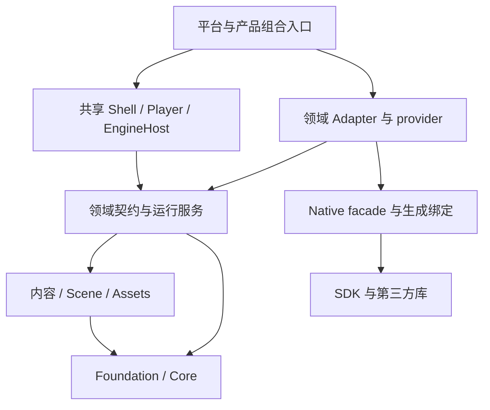

# InnoEngine 当前项目与依赖总览

[架构索引](README.md) · [Wiki 首页](../README.md) · [平台与运行时架构](PLATFORM_RUNTIME_ARCHITECTURE.md) · [本次验收](PLATFORM_RUNTIME_ACCEPTANCE.md)

本页以当前源码和项目引用为依据，更新于 2026-10-05。
详细公开 API、初始化和资源所有权见各项目 Wiki；实现是否通过实机验证见验收记录。
[2026-09-07 至 09-08 审计](ENGINE_ARCHITECTURE_AUDIT_2026_09_07.md)保留在独立历史页。

## 1. 源码层次

| 位置 | 职责 | 依赖边界 |
| --- | --- | --- |
| `src/foundation/core` | 值、身份、事件、序列化、数学、执行和 IO 机制 | 不依赖游戏世界观、Editor 或具体 Adapter。 |
| `src/foundation/extensibility` | 模块、类型目录和 generation 事务 | 目录事实由叶契约 Catalogs 提供；动态加载实现属于 Adapter。 |
| `src/content` | Asset、引用、Scene 和 Animation | 通过身份、序列化和领域契约管理内容；不选择平台后端。 |
| `src/services` | Input、Storage、Rendering、Audio、Text、UI 和 Platform | 描述中立能力和运行服务；第三方类型留在对应实现。 |
| `src/runtime` | EngineHost、Session、子系统、部署、脚本编译和 reload | 共享 Player 不携带作者端编译器或 collectible loader。 |
| `src/adapters` | 开放 provider、第三方后端、动态模块和反射序列化 | 依赖领域契约及所属 Native facade；不反向控制领域。 |
| `src/composition` | 默认组合、Shell、Player 和 Editor | 显式选择模块来源、能力、Adapter 和帧调度。 |
| `native` | 单组件语义 facade、BGCS 配置及生成绑定 | 第三方源留在 extern；目标生成物按身份隔离。 |
| `build` | CLI、Task、发布 pipeline、managed compiler、toolchain 和 Support Pack | CLI 是工具组合根；通用 Build 不引用 Editor。 |
| `tools` | 架构、公开文档和源码规范验证 | 作为库由唯一构建 CLI 调用。 |



以上表示允许的总体依赖方向，具体项目仍按自身最小契约引用。
Rendering 的中立机制不反向依赖 Scene、Editor 或 Shader 创作层；具体世界模型由 Plugin 组合。
Editor 可复用的 inspection、interaction、history 和 presentation 分属框架项目，Panel 承担自身业务。

## 2. 五个独立平台选择

发布平台负责布局与打包；managed deployment 负责 CoreCLR、Mono Wasm 或 NativeAOT；
平台宿主负责启动与系统回调；native toolchain 负责 ABI、SDK 和链接；领域 Adapter 负责具体能力。
这些选择在对应组合边界相遇，共享业务不通过浏览器判断选择实现。

当前生产入口为 Editor、Desktop Player、Browser Player 和 `Inno.Build.Cli`。
原生、Shader、Support Pack 和架构验证均为库，不各自建立 Program。
默认 solution 编译宿主源码和测试；Browser 由统一 CLI 准备 SDK/原生闭包后实际构建与发布。
未来 iOS、主机和 CoreCLR WebAssembly 的具体接入位置见[平台架构](PLATFORM_RUNTIME_ARCHITECTURE.md#7-新平台接入)。

## 3. 运行与代际所有权

- Composition 传入模块、类型和序列化来源。静态生成目录与动态反射目录进入共同 registry。
- ModuleHost 管理候选、依赖与目录切换；DotNet Adapter 管理 ALC、shadow copy 和弱监测。
- EngineHost 管理引擎服务；RuntimeSession 管理玩法会话；Shell 管理窗口、平台事件与帧资源。
- 暂停沿 Core Events 进入输入与音频，恢复后继续同一会话。停止先拒绝新工作，再退休任务与回调，最后释放资源。
- 持久协议保存稳定身份和中立值。跨 generation 的运行对象解析统一经过 Core Identity。
- Editor reload 必须完成 Full GC、finalizers、Full GC 和弱监测；失败进入 Faulted，不能继续 Play 或 Export。

完整不变量见[Identity、引用与 reload 标准](IDENTITY_REFERENCE_RELOAD_STANDARD.md)。
原生呈现的 borrowed handle 属于 Adapter SPI，不能进入 Platform 服务或脚本契约。

## 4. 构建与产物所有权

构建请求冻结当前代码和内容闭包，经 SDK/native toolchain 解析、生成注册、托管发布与原生链接，
最后由平台 target 完成布局校验和输出提交。失败或取消保留上一份完整产品。

| 数据 | Owner 与位置 |
| --- | --- |
| 手写 Native facade / BGCS 共同定义 | 所属 `native/Inno.Native.*` 项目。 |
| 目标 C 桥与 managed 单文件 | 所属项目 `obj/<target>/<generationFingerprint>`。 |
| CMake 和对象文件 | 所属组件 toolchain 的 `obj/native/<target>/<fingerprint>`。 |
| 完整 native/managed 产品 | `artifacts` 下按目标、部署和指纹隔离。 |
| Support Pack | 不可变内容目录，由原子 current 索引选择；保留旧读者正在使用的目录。 |
| 用户最终游戏输出 | BuildProfile 指定目录，staging 完成校验后提交。 |
| 验收证据 | `artifacts/acceptance`，记录环境、命令、日志和实际运行结果。 |

BGCS 独立于引擎维护自己的目标描述、Parser、IR、emitter、Runtime 和验收。
引擎通过公开库入口消费它；引擎联调成功不能代替 BGCS 的独立调用验收。

## 5. 规范与验证入口

[通用 C# 规范](CSHARP_DEVELOPMENT_STANDARD.md)规定命名、声明排版、公开 XML、显式导入、资源所有权及测试边界。
引擎领域规则由 AGENTS 和相应标准管理，架构验证同步检查项目归属、引用、脚本 API 与公开边界。

```powershell
dotnet build build/cli/Inno.Build.Cli/Inno.Build.Cli.csproj -c Release --disable-build-servers -m:1 -nodeReuse:false
dotnet build/cli/Inno.Build.Cli/bin/Release/net9.0/Inno.Build.Cli.dll verify . --configuration Release
dotnet build/cli/Inno.Build.Cli/bin/Release/net9.0/Inno.Build.Cli.dll verify-native --engine-root . --configuration Release
```

构建、自动化契约、游戏实际运行和桌面视觉验收分别记录，不互相替代。

## 当前全部生产项目

以下 143 个项目来自本次源码扫描；包含组件自己的 binding extension，排除测试、bin、obj 和生成源码。

### src/foundation

| 项目 | 源码归属 | 项目 Wiki |
| --- | --- | --- |
| Inno.Core.Collections | `src/foundation/core/Inno.Core.Collections` | [API 与生命周期](../core/Inno.Core.Collections.md) |
| Inno.Core.Coroutines | `src/foundation/core/Inno.Core.Coroutines` | [API 与生命周期](../core/Inno.Core.Coroutines.md) |
| Inno.Core.Diagnostics | `src/foundation/core/Inno.Core.Diagnostics` | [API 与生命周期](../core/Inno.Core.Diagnostics.md) |
| Inno.Core.Events | `src/foundation/core/Inno.Core.Events` | [API 与生命周期](../core/Inno.Core.Events.md) |
| Inno.Core.Execution | `src/foundation/core/Inno.Core.Execution` | [API 与生命周期](../core/Inno.Core.Execution.md) |
| Inno.Core.Graphs | `src/foundation/core/Inno.Core.Graphs` | [API 与生命周期](../core/Inno.Core.Graphs.md) |
| Inno.Core.Identity | `src/foundation/core/Inno.Core.Identity` | [API 与生命周期](../core/Inno.Core.Identity.md) |
| Inno.Core.Input | `src/foundation/core/Inno.Core.Input` | [API 与生命周期](../core/Inno.Core.Input.md) |
| Inno.Core.IO | `src/foundation/core/Inno.Core.IO` | [API 与生命周期](../core/Inno.Core.IO.md) |
| Inno.Core.Jobs | `src/foundation/core/Inno.Core.Jobs` | [API 与生命周期](../core/Inno.Core.Jobs.md) |
| Inno.Core.Layers | `src/foundation/core/Inno.Core.Layers` | [API 与生命周期](../core/Inno.Core.Layers.md) |
| Inno.Core.Logging | `src/foundation/core/Inno.Core.Logging` | [API 与生命周期](../core/Inno.Core.Logging.md) |
| Inno.Core.Mathematics | `src/foundation/core/Inno.Core.Mathematics` | [API 与生命周期](../core/Inno.Core.Mathematics.md) |
| Inno.Core.Serialization | `src/foundation/core/Inno.Core.Serialization` | [API 与生命周期](../core/Inno.Core.Serialization.md) |
| Inno.Core.Serialization.Generators | `src/foundation/core/Inno.Core.Serialization.Generators` | [API 与生命周期](../core/Inno.Core.Serialization.Generators.md) |
| Inno.Core.Settings | `src/foundation/core/Inno.Core.Settings` | [API 与生命周期](../core/Inno.Core.Settings.md) |
| Inno.Extensibility.Catalogs | `src/foundation/extensibility/Inno.Extensibility.Catalogs` | [API 与生命周期](../extensibility/Inno.Extensibility.Catalogs.md) |
| Inno.Extensibility.Modules | `src/foundation/extensibility/Inno.Extensibility.Modules` | [API 与生命周期](../extensibility/Inno.Extensibility.Modules.md) |
| Inno.Extensibility.Reload | `src/foundation/extensibility/Inno.Extensibility.Reload` | [API 与生命周期](../extensibility/Inno.Extensibility.Reload.md) |
| Inno.Extensibility.Types | `src/foundation/extensibility/Inno.Extensibility.Types` | [API 与生命周期](../extensibility/Inno.Extensibility.Types.md) |
| Inno.Scripting.Api | `src/foundation/scripting/Inno.Scripting.Api` | [API 与生命周期](../scripting/Inno.Scripting.Api.md) |

### src/content

| 项目 | 源码归属 | 项目 Wiki |
| --- | --- | --- |
| Inno.Animation | `src/content/animation/Inno.Animation` | [API 与生命周期](../animation/Inno.Animation.md) |
| Inno.Animation.Assets | `src/content/animation/Inno.Animation.Assets` | [API 与生命周期](../animation/Inno.Animation.Assets.md) |
| Inno.Animation.Runtime | `src/content/animation/Inno.Animation.Runtime` | [API 与生命周期](../animation/Inno.Animation.Runtime.md) |
| Inno.Assets | `src/content/assets/Inno.Assets` | [API 与生命周期](../assets/Inno.Assets.md) |
| Inno.Assets.Pipeline | `src/content/assets/Inno.Assets.Pipeline` | [API 与生命周期](../assets/Inno.Assets.Pipeline.md) |
| Inno.References | `src/content/references/Inno.References` | [API 与生命周期](../references/Inno.References.md) |
| Inno.Scene | `src/content/scene/Inno.Scene` | [API 与生命周期](../scene/Inno.Scene.md) |
| Inno.Scene.Assets | `src/content/scene/Inno.Scene.Assets` | [API 与生命周期](../scene/Inno.Scene.Assets.md) |

### src/services

| 项目 | 源码归属 | 项目 Wiki |
| --- | --- | --- |
| Inno.Audio | `src/services/audio/Inno.Audio` | [API 与生命周期](../audio/Inno.Audio.md) |
| Inno.Audio.Assets | `src/services/audio/Inno.Audio.Assets` | [API 与生命周期](../audio/Inno.Audio.Assets.md) |
| Inno.Audio.Runtime | `src/services/audio/Inno.Audio.Runtime` | [API 与生命周期](../audio/Inno.Audio.Runtime.md) |
| Inno.Input | `src/services/input/Inno.Input` | [API 与生命周期](../input/Inno.Input.md) |
| Inno.Input.Runtime | `src/services/input/Inno.Input.Runtime` | [API 与生命周期](../input/Inno.Input.Runtime.md) |
| Inno.Platform | `src/services/platform/Inno.Platform` | [API 与生命周期](../platform/Inno.Platform.md) |
| Inno.Rendering | `src/services/rendering/Inno.Rendering` | [API 与生命周期](../rendering/Inno.Rendering.md) |
| Inno.Rendering.Assets | `src/services/rendering/Inno.Rendering.Assets` | [API 与生命周期](../rendering/Inno.Rendering.Assets.md) |
| Inno.Rendering.Runtime | `src/services/rendering/Inno.Rendering.Runtime` | [API 与生命周期](../rendering/Inno.Rendering.Runtime.md) |
| Inno.Rendering.Shaders | `src/services/rendering/Inno.Rendering.Shaders` | [API 与生命周期](../rendering/Inno.Rendering.Shaders.md) |
| Inno.Storage | `src/services/storage/Inno.Storage` | [API 与生命周期](../storage/Inno.Storage.md) |
| Inno.Storage.Runtime | `src/services/storage/Inno.Storage.Runtime` | [API 与生命周期](../storage/Inno.Storage.Runtime.md) |
| Inno.Text | `src/services/text/Inno.Text` | [API 与生命周期](../text/Inno.Text.md) |
| Inno.Text.Assets | `src/services/text/Inno.Text.Assets` | [API 与生命周期](../text/Inno.Text.Assets.md) |
| Inno.Text.Runtime | `src/services/text/Inno.Text.Runtime` | [API 与生命周期](../text/Inno.Text.Runtime.md) |
| Inno.UI | `src/services/ui/Inno.UI` | [API 与生命周期](../ui/Inno.UI.md) |
| Inno.UI.Assets | `src/services/ui/Inno.UI.Assets` | [API 与生命周期](../ui/Inno.UI.Assets.md) |
| Inno.UI.Runtime | `src/services/ui/Inno.UI.Runtime` | [API 与生命周期](../ui/Inno.UI.Runtime.md) |

### src/runtime

| 项目 | 源码归属 | 项目 Wiki |
| --- | --- | --- |
| Inno.Runtime.Contracts | `src/runtime/contracts/Inno.Runtime.Contracts` | [API 与生命周期](../runtime/Inno.Runtime.Contracts.md) |
| Inno.Runtime | `src/runtime/engine/Inno.Runtime` | [API 与生命周期](../runtime/Inno.Runtime.md) |
| Inno.Runtime.Generators | `src/runtime/generators/Inno.Runtime.Generators` | [API 与生命周期](../runtime/Inno.Runtime.Generators.md) |
| Inno.Plugins | `src/runtime/plugins/Inno.Plugins` | [API 与生命周期](../plugins/Inno.Plugins.md) |
| Inno.Plugins.Authoring | `src/runtime/plugins/Inno.Plugins.Authoring` | [API 与生命周期](../plugins/Inno.Plugins.Authoring.md) |
| Inno.Scripting.Compiler | `src/runtime/scripting/Inno.Scripting.Compiler` | [API 与生命周期](../scripting/Inno.Scripting.Compiler.md) |
| Inno.Scripting.Reload | `src/runtime/scripting/Inno.Scripting.Reload` | [API 与生命周期](../scripting/Inno.Scripting.Reload.md) |

### src/adapters

| 项目 | 源码归属 | 项目 Wiki |
| --- | --- | --- |
| Inno.Adapter.Audio | `src/adapters/audio/Inno.Adapter.Audio` | [API 与生命周期](../audio/Inno.Adapter.Audio.md) |
| Inno.Adapter.Audio.MiniAudio | `src/adapters/audio/Inno.Adapter.Audio.MiniAudio` | [API 与生命周期](../audio/Inno.Adapter.Audio.MiniAudio.md) |
| Inno.Adapter | `src/adapters/common/Inno.Adapter` | [API 与生命周期](../runtime/Inno.Adapter.md) |
| Inno.Adapter.Authoring.Default | `src/adapters/default/Inno.Adapter.Authoring.Default` | [API 与生命周期](../runtime/Inno.Adapter.Authoring.Default.md) |
| Inno.Adapter.Default | `src/adapters/default/Inno.Adapter.Default` | [API 与生命周期](../runtime/Inno.Adapter.Default.md) |
| Inno.Adapter.Input | `src/adapters/input/Inno.Adapter.Input` | [API 与生命周期](../input/Inno.Adapter.Input.md) |
| Inno.Adapter.Input.Sdl3 | `src/adapters/input/Inno.Adapter.Input.Sdl3` | [API 与生命周期](../input/Inno.Adapter.Input.Sdl3.md) |
| Inno.Adapter.Modules.DotNet | `src/adapters/modules/Inno.Adapter.Modules.DotNet` | [API 与生命周期](../platform/Inno.Adapter.Modules.DotNet.md) |
| Inno.Adapter.Platform | `src/adapters/platform/Inno.Adapter.Platform` | [API 与生命周期](../platform/Inno.Adapter.Platform.md) |
| Inno.Adapter.Platform.Sdl3 | `src/adapters/platform/Inno.Adapter.Platform.Sdl3` | [API 与生命周期](../platform/Inno.Adapter.Platform.Sdl3.md) |
| Inno.Adapter.Presentation | `src/adapters/presentation/Inno.Adapter.Presentation` | [API 与生命周期](../platform/Inno.Adapter.Presentation.md) |
| Inno.Adapter.Presentation.ImGui.Bgfx | `src/adapters/presentation/Inno.Adapter.Presentation.ImGui.Bgfx` | [API 与生命周期](../rendering/Inno.Adapter.Presentation.ImGui.Bgfx.md) |
| Inno.Adapter.Presentation.ImGui.Sdl3 | `src/adapters/presentation/Inno.Adapter.Presentation.ImGui.Sdl3` | [API 与生命周期](../platform/Inno.Adapter.Presentation.ImGui.Sdl3.md) |
| Inno.Adapter.Rendering | `src/adapters/rendering/Inno.Adapter.Rendering` | [API 与生命周期](../rendering/Inno.Adapter.Rendering.md) |
| Inno.Adapter.Rendering.Authoring | `src/adapters/rendering/Inno.Adapter.Rendering.Authoring` | [API 与生命周期](../rendering/Inno.Adapter.Rendering.Authoring.md) |
| Inno.Adapter.Rendering.Bgfx | `src/adapters/rendering/Inno.Adapter.Rendering.Bgfx` | [API 与生命周期](../rendering/Inno.Adapter.Rendering.Bgfx.md) |
| Inno.Adapter.Serialization.DotNet | `src/adapters/serialization/Inno.Adapter.Serialization.DotNet` | [API 与生命周期](../platform/Inno.Adapter.Serialization.DotNet.md) |
| Inno.Adapter.Storage | `src/adapters/storage/Inno.Adapter.Storage` | [API 与生命周期](../storage/Inno.Adapter.Storage.md) |
| Inno.Adapter.Storage.Browser | `src/adapters/storage/Inno.Adapter.Storage.Browser` | [API 与生命周期](../storage/Inno.Adapter.Storage.Browser.md) |
| Inno.Adapter.Storage.FileSystem | `src/adapters/storage/Inno.Adapter.Storage.FileSystem` | [API 与生命周期](../storage/Inno.Adapter.Storage.FileSystem.md) |
| Inno.Adapter.Text | `src/adapters/text/Inno.Adapter.Text` | [API 与生命周期](../text/Inno.Adapter.Text.md) |
| Inno.Adapter.Text.FreeTypeHarfBuzz | `src/adapters/text/Inno.Adapter.Text.FreeTypeHarfBuzz` | [API 与生命周期](../text/Inno.Adapter.Text.FreeTypeHarfBuzz.md) |
| Inno.Adapter.UI | `src/adapters/ui/Inno.Adapter.UI` | [API 与生命周期](../ui/Inno.Adapter.UI.md) |
| Inno.Adapter.UI.RmlUi | `src/adapters/ui/Inno.Adapter.UI.RmlUi` | [API 与生命周期](../ui/Inno.Adapter.UI.RmlUi.md) |
| Inno.Adapter.UI.RmlUi.Authoring | `src/adapters/ui/Inno.Adapter.UI.RmlUi.Authoring` | [API 与生命周期](../ui/Inno.Adapter.UI.RmlUi.Authoring.md) |

### src/composition

| 项目 | 源码归属 | 项目 Wiki |
| --- | --- | --- |
| Inno.Engine.Default | `src/composition/default/Inno.Engine.Default` | [API 与生命周期](../runtime/Inno.Engine.Default.md) |
| Inno.Editor.Annotations | `src/composition/editor/contracts/Inno.Editor.Annotations` | [API 与生命周期](../editor/Inno.Editor.Annotations.md) |
| Inno.Editor.Assets | `src/composition/editor/features/Inno.Editor.Assets` | [API 与生命周期](../editor/Inno.Editor.Assets.md) |
| Inno.Editor.Audio | `src/composition/editor/features/Inno.Editor.Audio` | [API 与生命周期](../editor/Inno.Editor.Audio.md) |
| Inno.Editor.Exporting | `src/composition/editor/features/Inno.Editor.Exporting` | [API 与生命周期](../editor/Inno.Editor.Exporting.md) |
| Inno.Editor.PlayMode | `src/composition/editor/features/Inno.Editor.PlayMode` | [API 与生命周期](../editor/Inno.Editor.PlayMode.md) |
| Inno.Editor.Rendering | `src/composition/editor/features/Inno.Editor.Rendering` | [API 与生命周期](../editor/Inno.Editor.Rendering.md) |
| Inno.Editor.Scene | `src/composition/editor/features/Inno.Editor.Scene` | [API 与生命周期](../editor/Inno.Editor.Scene.md) |
| Inno.Editor.Scripting | `src/composition/editor/features/Inno.Editor.Scripting` | [API 与生命周期](../editor/Inno.Editor.Scripting.md) |
| Inno.Editor.Shaders | `src/composition/editor/features/Inno.Editor.Shaders` | [API 与生命周期](../editor/Inno.Editor.Shaders.md) |
| Inno.Editor.Core | `src/composition/editor/framework/Inno.Editor.Core` | [API 与生命周期](../editor/Inno.Editor.Core.md) |
| Inno.Editor.Diagnostics | `src/composition/editor/framework/Inno.Editor.Diagnostics` | [API 与生命周期](../editor/Inno.Editor.Diagnostics.md) |
| Inno.Editor.Graph | `src/composition/editor/framework/Inno.Editor.Graph` | [API 与生命周期](../editor/Inno.Editor.Graph.md) |
| Inno.Editor.Inspection | `src/composition/editor/framework/Inno.Editor.Inspection` | [API 与生命周期](../editor/Inno.Editor.Inspection.md) |
| Inno.Editor.Interactions | `src/composition/editor/framework/Inno.Editor.Interactions` | [API 与生命周期](../editor/Inno.Editor.Interactions.md) |
| Inno.Editor.Settings | `src/composition/editor/framework/Inno.Editor.Settings` | [API 与生命周期](../editor/Inno.Editor.Settings.md) |
| Inno.Editor.Application | `src/composition/editor/host/Inno.Editor.Application` | [API 与生命周期](../editor/Inno.Editor.Application.md) |
| Inno.Editor.Panel.FileBrowser | `src/composition/editor/panels/Inno.Editor.Panel.FileBrowser` | [API 与生命周期](../editor/Inno.Editor.Panel.FileBrowser.md) |
| Inno.Editor.Panel.GameView | `src/composition/editor/panels/Inno.Editor.Panel.GameView` | [API 与生命周期](../editor/Inno.Editor.Panel.GameView.md) |
| Inno.Editor.Panel.Global | `src/composition/editor/panels/Inno.Editor.Panel.Global` | [API 与生命周期](../editor/Inno.Editor.Panel.Global.md) |
| Inno.Editor.Panel.Hierarchy | `src/composition/editor/panels/Inno.Editor.Panel.Hierarchy` | [API 与生命周期](../editor/Inno.Editor.Panel.Hierarchy.md) |
| Inno.Editor.Panel.Inspector | `src/composition/editor/panels/Inno.Editor.Panel.Inspector` | [API 与生命周期](../editor/Inno.Editor.Panel.Inspector.md) |
| Inno.Editor.Panel.Logging | `src/composition/editor/panels/Inno.Editor.Panel.Logging` | [API 与生命周期](../editor/Inno.Editor.Panel.Logging.md) |
| Inno.Editor.Panel.SceneView | `src/composition/editor/panels/Inno.Editor.Panel.SceneView` | [API 与生命周期](../editor/Inno.Editor.Panel.SceneView.md) |
| Inno.Editor.Panel.Settings | `src/composition/editor/panels/Inno.Editor.Panel.Settings` | [API 与生命周期](../editor/Inno.Editor.Panel.Settings.md) |
| Inno.Editor.Panel.ShaderEditor | `src/composition/editor/panels/Inno.Editor.Panel.ShaderEditor` | [API 与生命周期](../editor/Inno.Editor.Panel.ShaderEditor.md) |
| Inno.Editor.Panel.Stats | `src/composition/editor/panels/Inno.Editor.Panel.Stats` | [API 与生命周期](../editor/Inno.Editor.Panel.Stats.md) |
| Inno.Editor.ImGui | `src/composition/editor/presentation/Inno.Editor.ImGui` | [API 与生命周期](../editor/Inno.Editor.ImGui.md) |
| Inno.Player | `src/composition/player/Inno.Player` | [API 与生命周期](../runtime/Inno.Player.md) |
| Inno.Player.Browser | `src/composition/player/Inno.Player.Browser` | [API 与生命周期](../runtime/Inno.Player.Browser.md) |
| Inno.Player.Runtime | `src/composition/player/Inno.Player.Runtime` | [API 与生命周期](../runtime/Inno.Player.Runtime.md) |
| Inno.Shell | `src/composition/shell/Inno.Shell` | [API 与生命周期](../runtime/Inno.Shell.md) |

### native

| 项目 | 源码归属 | 项目 Wiki |
| --- | --- | --- |
| Inno.Native.Bgfx | `native/Inno.Native.Bgfx` | [API 与生命周期](../native/Inno.Native.Bgfx.md) |
| Inno.Native.ImGui.BindingExtension | `native/Inno.Native.ImGui/Bindings/Extension` | [API 与生命周期](../native/Inno.Native.ImGui.BindingExtension.md) |
| Inno.Native.ImGui | `native/Inno.Native.ImGui` | [API 与生命周期](../native/Inno.Native.ImGui.md) |
| Inno.Native.ImGuizmo | `native/Inno.Native.ImGuizmo` | [API 与生命周期](../native/Inno.Native.ImGuizmo.md) |
| Inno.Native.LibraryLoading | `native/Inno.Native.LibraryLoading` | [API 与生命周期](../native/Inno.Native.LibraryLoading.md) |
| Inno.Native.MiniAudio | `native/Inno.Native.MiniAudio` | [API 与生命周期](../native/Inno.Native.MiniAudio.md) |
| Inno.Native.Sdl3 | `native/Inno.Native.Sdl3` | [API 与生命周期](../native/Inno.Native.Sdl3.md) |
| Inno.Native.Text | `native/Inno.Native.Text` | [API 与生命周期](../native/Inno.Native.Text.md) |
| Inno.Native.UI | `native/Inno.Native.UI` | [API 与生命周期](../native/Inno.Native.UI.md) |

### build

| 项目 | 源码归属 | 项目 Wiki |
| --- | --- | --- |
| Inno.Build.Cli | `build/cli/Inno.Build.Cli` | [API 与生命周期](../build/Inno.Build.Cli.md) |
| Inno.Build.Managed | `build/managed/Inno.Build.Managed` | [API 与生命周期](../build/Inno.Build.Managed.md) |
| Inno.Build.Managed.DotNet | `build/managed/Inno.Build.Managed.DotNet` | [API 与生命周期](../build/Inno.Build.Managed.DotNet.md) |
| Inno.Build | `build/pipeline/Inno.Build` | [API 与生命周期](../build/Inno.Build.md) |
| Inno.Build.Platform.Browser | `build/pipeline/Inno.Build.Platform.Browser` | [API 与生命周期](../build/Inno.Build.Platform.Browser.md) |
| Inno.Build.Platform.MacOS | `build/pipeline/Inno.Build.Platform.MacOS` | [API 与生命周期](../build/Inno.Build.Platform.MacOS.md) |
| Inno.Build.Platform.Windows | `build/pipeline/Inno.Build.Platform.Windows` | [API 与生命周期](../build/Inno.Build.Platform.Windows.md) |
| Inno.Build.SupportPacks | `build/support/Inno.Build.SupportPacks` | [API 与生命周期](../build/Inno.Build.SupportPacks.md) |
| Inno.Build.SupportPacks.Core | `build/support/Inno.Build.SupportPacks.Core` | [API 与生命周期](../build/Inno.Build.SupportPacks.Core.md) |
| Inno.Build.Tasks | `build/tasks/Inno.Build.Tasks` | [API 与生命周期](../build/Inno.Build.Tasks.md) |
| Inno.Build.Toolchains | `build/toolchains/Inno.Build.Toolchains` | [API 与生命周期](../build/Inno.Build.Toolchains.md) |
| Inno.Build.Toolchains.Bgfx | `build/toolchains/Inno.Build.Toolchains.Bgfx` | [API 与生命周期](../build/Inno.Build.Toolchains.Bgfx.md) |
| Inno.Build.Toolchains.Bgfx.Shaders | `build/toolchains/Inno.Build.Toolchains.Bgfx.Shaders` | [API 与生命周期](../build/Inno.Build.Toolchains.Bgfx.Shaders.md) |
| Inno.Build.Toolchains.Bgfx.Tools | `build/toolchains/Inno.Build.Toolchains.Bgfx.Tools` | [API 与生命周期](../build/Inno.Build.Toolchains.Bgfx.Tools.md) |
| Inno.Build.Toolchains.Browser | `build/toolchains/Inno.Build.Toolchains.Browser` | [API 与生命周期](../build/Inno.Build.Toolchains.Browser.md) |
| Inno.Build.Toolchains.Host | `build/toolchains/Inno.Build.Toolchains.Host` | [API 与生命周期](../build/Inno.Build.Toolchains.Host.md) |
| Inno.Build.Toolchains.ImGui | `build/toolchains/Inno.Build.Toolchains.ImGui` | [API 与生命周期](../build/Inno.Build.Toolchains.ImGui.md) |
| Inno.Build.Toolchains.ImGuizmo | `build/toolchains/Inno.Build.Toolchains.ImGuizmo` | [API 与生命周期](../build/Inno.Build.Toolchains.ImGuizmo.md) |
| Inno.Build.Toolchains.MiniAudio | `build/toolchains/Inno.Build.Toolchains.MiniAudio` | [API 与生命周期](../build/Inno.Build.Toolchains.MiniAudio.md) |
| Inno.Build.Toolchains.Sdl3 | `build/toolchains/Inno.Build.Toolchains.Sdl3` | [API 与生命周期](../build/Inno.Build.Toolchains.Sdl3.md) |
| Inno.Build.Toolchains.Text | `build/toolchains/Inno.Build.Toolchains.Text` | [API 与生命周期](../build/Inno.Build.Toolchains.Text.md) |
| Inno.Build.Toolchains.UI | `build/toolchains/Inno.Build.Toolchains.UI` | [API 与生命周期](../build/Inno.Build.Toolchains.UI.md) |

### tools

| 项目 | 源码归属 | 项目 Wiki |
| --- | --- | --- |
| Inno.Tooling.Architecture | `tools/Inno.Tooling.Architecture` | [API 与生命周期](../tooling/Inno.Tooling.Architecture.md) |
