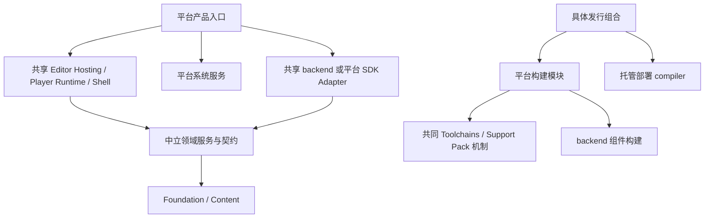

# 平台、产品与共享后端接入指南

[架构索引](README.md) · [Wiki 首页](../README.md) · [平台包](../platform/README.md) · [共享后端](../backends/README.md)

当前 BGFX Native recipe 接收平台贡献的 `BgfxNativeBuildProfile`，Shader compiler 接收不可变的
`BgfxShaderTargetProfile`；共享 backend 不再维护命名平台工厂或 Inno target 枚举。
完整变更与实测边界见[平台边界收口验收](PLATFORM_BOUNDARY_CLOSEOUT_ACCEPTANCE_2026_10_08.md)。
下面的接入结构仍须配合实际 SDK、第三方能力和设备验收，不能仅凭可组合配置宣称平台支持。

## 1. 一个归属位置，多个明确职责

新增平台的系统接入、SDK、产品入口和打包集中放在 `platforms/<Platform>`。共同领域和第三方 backend 分别维护自己的源码。平台目录不是另一个引擎实现，也不复制 Rendering、Input、Editor 或 SDL。



维护平台、运行目标、产品、托管部署和工具宿主分别表达。例如在 Windows 上运行构建工具，可以请求 Browser Wasm32；当前 Windows Editor 导出 Browser 游戏时仍使用 Windows 的 ImGui 和 Native 产物。

| 事实 | 声明位置 |
| --- | --- |
| 平台、CPU、ABI、RID、产品能力 | 平台模块的 `PlatformTargetDescriptor` |
| 实际执行工具的 OS 与 CPU | `BuildHostDescriptor` |
| 已解析 SDK、工具、环境与参数 | `NativeToolchainSelection` |
| 组件源码、生成定义与中间目录 | `NativeComponentDescriptor` |
| 游戏目标、Support Pack、SDK provider | `BuildPlatformContribution` |
| 实际组件闭包 | `ProductNativeBuildPlan` |
| 托管执行与最终链接 | `IManagedDeploymentCompiler` |

Stable target ID 不通过项目名称、CPU 或宿主 OS 拼接。当前完整发布目标是 `windows-x64`、`macos-arm64`、`browser-wasm`；最后一个明确声明 wasm32。Linux 只有 Native SDK 贡献，不是完整游戏发行。

## 2. 以后添加 NS 的具体位置

下面是未来接入结构，当前没有这些项目或 API。只有存在真实实现时建立对应目录。

```text
platforms/NS/
├─ player/Inno.Player.NS/
│  ├─ Inno.Player.NS.csproj
│  ├─ Program.cs
│  └─ NsPlayerComposition.cs
├─ runtime/
│  └─ 实际 SDK 所需的领域 Adapter 与系统服务
├─ native/
│  └─ 必要 SDK facade、BGCS 定义和生成绑定
├─ build/Inno.Build.NS/
│  ├─ Inno.Build.NS.csproj
│  ├─ NsBuildModule.cs
│  ├─ Targets/
│  ├─ Toolchain/
│  ├─ Managed/
│  ├─ Packaging/
│  └─ SupportPacks/
├─ editor/Inno.Editor.NS.Tools/       确实有专属工具时添加
├─ tests/
└─ docs/
```

`Inno.Editor.NS.Tools` 表示已有 Windows/macOS Editor 的设备、资源、调试或发布工具，不表示 Editor 在 NS 上运行。Editor 功能实现继续复用共同 framework/features/panels。

### 接入顺序

1. **冻结目标事实**：实际系统、CPU、ABI、运行时限制与支持产品，由 NS 模块声明一次。
2. **解析 SDK**：实现 `INativeToolchainProvider`，校验工具能在哪些宿主执行，并返回冻结的绝对工具、SDK 输入与参数。
3. **选择后端**：验证 SDL、BGFX、MiniAudio 等已有实现的 SDK、surface、线程和生命周期能力。可以复用时直接组合；缺失能力在所属 Adapter/native 边界实现。
4. **选择托管部署**：复用合适 compiler 或增加匹配 SDK 的实现。该实现负责静态注册、interop、回调、异常和最终链接。
5. **编写薄产品入口**：注入内容来源、Storage namespace、日志、帧驱动与 backend catalog；共同玩法启动留在 Player Runtime。
6. **实现发布布局**：平台 target、Support Pack、打包、签名和设备部署有明确 owner。
7. **注册完整贡献**：加入 `StandardBuildDistribution` 或自定义发行组合的唯一入口。贡献的 `nativeProducts` 明确绑定各产品的组件闭包，普通 Task 通过 `ResolveNativeProduct` 取得计划。共同 Build、Editor 和领域不增加 NS 分支。
8. **验收真实设备**：内容、输入、音频、渲染、暂停恢复、退出、持久化、Native API、失败与取消全部验证后才标记支持。

源码位置只有一个平台包，但实现会分为几个真实项目，因为运行系统接入和 SDK 构建工具的依赖与生命周期不同。项目数量按职责决定，不按每种 CPU 或第三方库机械复制。

## 3. SDL、BGFX、MiniAudio 如何复用

```text
platforms/NS/player/NsPlayerComposition
├─ Inno.Player.Runtime
├─ 已验证可用的 Sdl3 platform backend
├─ 已验证可用的 Bgfx rendering backend
├─ 已验证可用的 MiniAudio audio backend
└─ NS SDK 必要的系统/存储/生命周期实现
```

backend 不引用 `Inno.Platform.NS`。它只消费领域 SPI 和所属 Native facade。NS SDK 必须提供的能力可以通过公开中立描述或该平台自己的 Adapter 注入，不让共享 backend 倒依赖平台项目。

“可选择同一 backend”是架构能力，不代表这些库、C# 运行时或 SDK 已具备 NS 的完整支持。具体兼容性需使用实际适用实现验证；不能以目录可组合代替设备验收。

## 4. 新增同平台 CPU

例如 WindowsArm64：增加真实目标描述、ABI profile、SDK 参数、runtime/compiler 能力和验收。复用 `Inno.Editor.Windows`、`Inno.Player.Windows` 与 Windows 系统位置服务。

仅当项目框架、入口或系统生命周期确实不同，才增加产品项目。不得复制一份 Editor、SDL、BGFX 或生成器。Native、binding、managed 与产品产物以明确目标和指纹隔离。

产品的图形编译配置同样由平台明确注入：Player 的 `InnoProductBuildProperties` 指向所属平台的 `ProductBuild.props`，声明 Shader target 与 API 集合；Editor 的 `EditorProduct.props` 导入该配置并声明 ImGui 使用的 API。新 CPU 可以复用已验证的配置；需要不同配置时只调整平台 owner，不在共享 BGFX/ImGui backend 添加目标判断。工具引导保持宿主配置，游戏导出继续使用自己的目标贡献。

### BGFX 与 Support Pack 的明确扩展点

- Native：平台提供 `BgfxNativeBuildProfile` 的目标、GENie 参数、输出 token 和冻结 SDK invocation。
  共同 recipe 负责源码、执行、完整参数指纹与发布，不读取一个命名平台列表。
- Shader：平台构造 `BgfxShaderCompilerProfile`，明确能力、shaderc 参数、阶段方言和 defines；
  将所需 renderer 集合组成 `BgfxShaderTargetProfile`，发行组合把它与同一 target contribution 绑定。
  `BgfxGameContentCompiler` 接收实际需要的 renderer 闭包，不通过三个固定平台工厂创建。
- 静态 Native：产品计划声明真实 `staticBuild` recipe，由平台聚合执行器执行；不能填入不会运行的独立 producer。
- Support Pack：source 的 `CreatePlanAsync` 完成只读预检并冻结 SDK 与 CLI，返回 `PlayerSupportPackPlan`。
  publisher 校验目标后才创建输出、取得 lease 和建立 staging；plan 使用冻结选择执行，失败保持旧完整输出。

这些协议属于构建边界，领域 Runtime、Rendering Core、Input 和玩法不需要引用它们。

## 5. iOS 与 Browser 运行时替换

未来 iOS 的产品包提供 AppDelegate、帧调度、设备/模拟器目标、SDK、签名和发布布局。共享 Player、Content、Input、Scene 与 Rendering 机制继续复用。设备和模拟器不能只用一个模糊 iOS target。

未来 Browser 更换到另一托管运行时：新增匹配的 deployment compiler 与链接接入，重新验证 interop、回调、异常、SDK与启动。Browser 页面宿主及中立领域逻辑保持同一实现，不在玩法或 Rendering 内增加运行时判断。

## 6. 必须保持的不变量

- catalog、配置和来源在操作开始前冻结，具体资源 owner 负责退出。
- Core Events 是唯一事件机制；跨代 live object 使用 Identity。
- Missing、last-good、候选原子切换和唯一 History/Workspace owner 保持。
- collectible retirement 完成 Full GC → finalizers → Full GC 与弱监测前不能报告成功。
- 不引入旧目录回退、兼容类型、空项目或 `Compile Link` 共享手写实现。
- 新平台同步 Solution、架构分类、公开 XML、项目 Wiki、消费者和真实测试。

当前执行证据见 [平台归属验收](PLATFORM_OWNERSHIP_REFACTOR_ACCEPTANCE.md)。

## 平台与后端的连接边界

平台基础 build/runtime 不引用 backend；共享 backend 不引用平台/integration。实际 SDK 与 backend 连接归 `platforms/<platform>/integrations/Inno.Integration.<platform>.<backend>`；产品和 Standard Distribution 选择它。IGameBuildTarget 只验证和打包，IGameContentCompiler 由所选 backend 提供，GameBuildContribution 绑定两者；BuildDistribution.CreateBindings 返回完整绑定。

新增 WindowsX86：补 Windows 的目标/SDK/ABI 支持，复用 Windows 产品与 packager，增加真实 BGFX/SDL 接入配置后验收并注册。换图形 backend：增加该 backend 与需要的 integration，替换 compiler/Native plan，平台 packager 不改。NS/iOS：真实 SDK、产品入口与 packaging 归平台包，backend 可复用时直接选择，仅实际差异进入 integration。Browser 换托管运行时只换部署 compiler 和 linker。

Native 步骤显式声明 Static/Shared、有序组件参数和输入 bytes；SDL 应用统一窗口 owner/surface；ImGui 在 NewFrame 前刷新尺度，不维护 WindowsX64 返回 ABI。完整树与测试见[当前批准计划](BACKEND_PLATFORM_INTEGRATION_PLAN.md)，实机状态见[验收](BACKEND_PLATFORM_INTEGRATION_ACCEPTANCE.md)。
