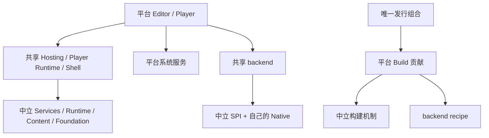

# 平台归属计划、Solution 与启动方式复核

[架构索引](README.md) · [完整计划](PLATFORM_OWNERSHIP_REFACTOR_PLAN.md) · [原实施验收](PLATFORM_OWNERSHIP_REFACTOR_ACCEPTANCE.md) · [产品启动](../platform/PRODUCT_STARTUP.md)

## 1. 结论与用户问题

**后续执行记录**：下文是发现时的源码与验收状态。BGFX 封闭选择和 Support Pack 预检顺序现已完成源码替换，
411 项受影响测试与四条最终 Player 发布/运行均通过；当前结果、实际 UI 与未实测边界见
[平台边界收口验收](PLATFORM_BOUNDARY_CLOSEOUT_ACCEPTANCE_2026_10_08.md)。
下方旧行号/API 描述用于保留发现证据，不作为当前 API 使用说明。

本次从当前源码重新核查，而非把之前的通过汇总当成计划完成证明。工作区基线 HEAD 为
`818163b5222632a6bc2cbe92804b0c6b62b8921d`，审查包含尚未提交的重构内容。
证据目录为 `artifacts/acceptance/2026-10-07-platform-audit`；审查跨越本机 10 月 7 日与 8 日。

| 用户要求 | 复核结论 |
| --- | --- |
| Plan 是否全部完成 | **尚未全部关闭**。主要分层与当前发布链成立；BGFX 平台配置/构建选择仍封闭，SDK 预检顺序未满足严格计划。三个最终可见 UI 复核仍暂缓。 |
| 架构是否干净、解耦清楚 | 共同领域、平台产品、共享 backend、中立构建及具体发行的依赖方向清楚；本次 217 项实际 MSBuild 引用图通过。不能据此宣称所有实现都已达到零修改扩展。 |
| 新 extension/backend/platform 是否简单明确 | Registry、Provider/Catalog、Platform Contribution 入口明确；新增 BGFX 目标仍会遇到 P2-01。 |
| Solution 是否有孤立/废弃项目或 Folder | 217 项目均有归属；138 个 Folder 都有有效项目后代；无失效显式 ProjectReference、无缺失配置。六个生产 Exe 均有实际用途。 |
| 是否有游离 code/test | 删除一份无当前项目、runner 或 Wiki 消费的旧手工验收脚本；保留自动测试、动态加载 fixtures、生成扩展及仅由产品 props 引入的 Panel。 |
| “not built” 是什么 | 五个平台产品有 ActiveCfg、无默认 Build.0；表示批量构建跳过，不能推导为废弃或不可启动。 |
| Player 能否直接启动 | 都是产品入口，但游戏代码和内容必须由导出流程组合。Windows/macOS 运行发布产品，Browser 由网页宿主启动；普通源码 Run 不生成完整游戏。 |

**按“完全达到 Plan 再提交”的标准，本次不能给出无保留完成结论。** 当前改动可以作为阶段性重构审阅；
若提交说明声称整个计划已经完成，应先处理两个源码缺口及仍未关闭的验收。

## 2. 两个源码缺口与解决方向

### P2-01：BGFX 仍承载具体目标选择与发行配置

位置：

- `BgfxBuilderFactory.cs`（后续收口已删除）：
  CreateForTarget 用固定 switch 选择 windows-x64、macos-arm64、linux-x64、linux-arm64。
- [BgfxBuildSession.cs](../../backends/Bgfx/build/Inno.Build.Toolchains.Bgfx/BgfxBuildSession.cs#L19)：共同构建链调用该封闭工厂。
- [BgfxGameContentCompiler.cs](../../backends/Bgfx/build/Inno.Build.Toolchains.Bgfx.Tools/BgfxGameContentCompiler.cs#L68)：
  私有构造函数，只开放 CreateMacOSArm64、CreateWindowsX64、CreateBrowserWasm，并内置各目标的 Graphics API 集合。

影响：新增目标即使已经注册 SDK/provider，仍不能直接通过该 BGFX shared-library recipe；
需要修改共享 backend 的目标名单。新的游戏编译组合也只能通过已有三个发行工厂选择。
这没有污染 Rendering Core，也不是当前 Windows/Web 已确认的运行失败，但违背“平台配置集中维护、组件 recipe 接收选择”的完整计划。
它们有真实消费者，**不是可以直接删除的死代码**。

解决方向：

1. 在平台/发行贡献中冻结 BGFX 的工具执行配置、目标编译配置和产物定位；BGFX 专有 recipe/参数协议继续归 backend。
2. 共同 BGFX build 消费显式配置，不再根据 Inno target ID 创建命名平台 builder；删除固定目标 switch 及被替代入口。
3. 游戏内容编译器接受不可变编译 profile/API 集合；各平台提供选择，删除三个命名平台工厂。
4. 同步平台消费者、recipe 指纹、XML/Wiki、构建模板和真实发布。用未知 fixture target 验证只增加贡献即可接入。
5. 后端尚未支持的新 SDK/Shader dialect 仍需实现与实测；开放组合不等于第三方已经支持。

本次执行审查和清理，没有在缺少完整行为回归时替换该构建协议。

### P2-02：SDK 检查发生在 Support Pack staging 之后

位置：

- [PlayerSupportPackPublisher.cs](../../build/support/Inno.Build.SupportPacks.Core/PlayerSupportPackPublisher.cs#L95)
  创建 output；101 行创建 staging；105 行才调用 source.PrepareAsync。
- [FilePlayerSupportPackPreparation.cs](../../build/support/Inno.Build.SupportPacks.Core/FilePlayerSupportPackPreparation.cs)
  的 PrepareAsync 内才调用 toolchainProvider.ResolveAsync。
- BrowserPlayerSupportPackSource.PrepareAsync 也在进入 source 后解析 Emscripten。

影响：缺 SDK 或不支持宿主/目标时，仍先创建 output、锁文件和 staging。
finally 会清理 transaction，完整产物的原子保护仍在；未满足“缺少工具链在创建 staging 前失败”的严格顺序。
目标/deployment 注册预检已经存在，不能把它当成真实 SDK 预检完成的证明。

解决方向：准备流程分为只读预检/冻结和 staged 执行；publisher 先取得校验过的冻结计划，
再取得发布 owner 并创建候选。Native 工具及 managed SDK 使用同一计划，不能两阶段重复从 PATH 选择。
通过公开边界验证缺 SDK、不支持宿主、预取消不创建 staging，以及执行失败/取消保留旧输出。
保留现有 source/validator/packager 归属与原子发布机制。

## 3. 计划逐项核对

“完成”表示职责已存在并有对应证据；“部分”列出具体差距；“未实测”不等同于实现不存在。

| 计划节点 | 当前事实/证据 | 状态 |
| --- | --- | --- |
| 平台、明确目标、产品、部署独立 | PlatformTargetDescriptor、BuildHostDescriptor、ManagedDeploymentId 与产品 props 分离 | 完成 |
| 三个当前目标与 Linux 工具链 | 稳定 ID；Linux 不注册 game target | 源码完成，macOS/Linux 未实测 |
| 删除 Desktop 目标及宿主猜测 | 发布目标显式，host 在标准组合捕获 | 完成 |
| 共享领域不引用平台 | 有效引用图、公开 API/源码检查通过 | 完成 |
| backend 唯一 owner，无平台倒依赖 | backends runtime/native/build；Browser 消费组件片段 | 完成 |
| 平台互不引用 | 当前四平台项目图通过 | 完成 |
| 标准 Adapter 归组合，中立 selection 无默认 | 两个 Default 项目位于 composition/adapters | 完成 |
| Editor Hosting 与平台入口分开 | 共用 Hosting 无 Program；Windows/MacOS 薄入口 | 完成 |
| Editor 功能/Panel 只有一份 | EditorProduct.props 统一产品引用，有效求值覆盖 | 完成 |
| 共享 Player 与文件/HTTP 来源 | 三平台复用同一内容 reader/store/生命周期 | 完成 |
| 旧 Desktop Player/Application/Host/Browser Toolchain 删除 | 旧项目/API 无兼容转发 | 完成 |
| Native component owner、工具和绑定显式 | Descriptor/Selection/ProductNativeBuildPlan；七个 binding owner 验收 | 完成 |
| SDK/目标配置归平台 | SDK provider 已迁移；BGFX 内部目标 builder/发行选择保留 | **部分：P2-01** |
| 新目标只改接入与贡献 | 中立 Contribution 可扩展；BGFX 固定选择需改 backend | **部分：P2-01** |
| staging 前完成 SDK 预检 | 工具与 SDK CLI 冻结已实现；Support Pack 先创建 staging | **部分：P2-02** |
| Browser 原生聚合拆分 | 选定 backend CMake 片段和共同 Wasm 约束 | 完成 |
| ImGui Shader 按 Editor 产品目标 | 平台产品 props 注入，导出不改变 Editor Shader | 完成 |
| Support Pack 归平台，共同机制归 Core | 三平台 source/validator/template，Core 复制/发布 | 完成 |
| 中立 Composition/唯一发行独立 | StandardBuildDistribution，CLI/Editor/Task 共用 | 完成 |
| 六个生产入口，其余为库 | 重新枚举与实际用途一致 | 完成 |
| 普通 IDE Build/Publish、design-time 隔离 | PrepareProductNativeTask、共同引导/Analyzer/引用属性；前轮实际 Build | 完成 |
| 不同目标/配置产物隔离 | fingerprint/selected binding/SDK/RID/编译属性；契约与实际并发验证 | 完成 |
| 所有产品使用 artifacts/products 布局 | IDE 实际使用目标 bin/obj；不可变部署按指纹隔离 | **与计划布局示例不同** |
| 外国产品/Browser 不进入默认 Build | 实际五个产品都 opt-in，包括本机 Windows；单独 Build 验证 | **比计划最低范围更严格** |
| 生命周期/Identity/reload/History/Play 隔离 | owner、GC barrier、候选/Faulted 保留；现有契约通过 | 完成 |
| Canvas/Rendering2D/Samples/BGCS | 消费者与独立 BGCS 调用报告分别保存 | 自动门禁通过 |
| Solution、项目、规范与公开边界 | 本次 217 项求值/归属通过；无测试后门，无游离手写 C# | 完成 |
| README/启动文档同步 | 本次修正旧 native 布局、错误 Editor 参数，补齐启动指南 | 本次完成 |
| 冷构建与三次热测量 | 预热和三次热测量；没有空缓存冷安装及完整前后对比 | **证据范围有限** |
| 四条 Windows/Web 当前发布运行 | 实际 SDK 9.0.318 最终报告 | 自动门禁通过 |
| 最终可见 Editor 复核 | Hierarchy 最新左键、Export 成败后自动关闭、Rendering2D 600 帧 smoke | **暂缓，未完成** |
| macOS、OS 多屏/DPI、声音听音 | 本机无对应环境或当前焦点操作授权 | 未实测 |
| 最终无保留计划验收 | 两个源码缺口、三个可见门禁与证据范围仍需处理 | **未关闭** |

## 4. Solution、源码与测试清理

重新解析项目、Solution GUID/NestedProjects、Debug/Release ActiveCfg/Build.0、显式引用和每个手写 `.cs` 的所属项目。
没有把零入边项目直接判为死代码。

- 217 项目全在 Solution，138 个 Folder 均有项目后代，1540 条显式 ProjectReference 的目标均存在。
- 1870 个手写 C# 文件有项目 owner；删除前唯一例外为 `tests/editor/fixtures/ShaderEditorAcceptance.editor.cs`。
- 旧脚本无 `.csproj`、当前 runner/Wiki 消费，仅自身和历史源清单记录名称，已删除。
  原内容可从 Git diff 审阅，未删除自动测试用例，也没有修改测试行为契约。
- 清理两处逐路径空目录、首批 79 处、旧 Native 空缓存树 243 处，以及清理旧输出后的 15 处目录，合计 339 处。
  全部校验绝对 checkout 路径、owner、无 reparse point、确实为空，以非递归删除保证不删非空目录。
- 额外清理旧 Bgfx.Tools 与 ImGui BindingExtension 的四个 bin/obj 缓存：新 owner 存在、旧 owner 无项目、
  Git 未跟踪且忽略、无 reparse point、无活跃进程使用，才执行有界清理。随后删除纯空树，旧 `native/` 根已完全移除。
  当前 backend/SDK 产物保持；本轮末 C 盘可用约 93.8 GiB。缓存逻辑长度约 15.3 MiB，不用它推算实际释放量。
- 首次通用删除命令被自动审批拒绝，没有执行；改为先核对具体路径、保证不能删除非空目录的操作完成清理。
- V1/V2/Invalid 动态模块由测试 MSBuild target 构建/复制；ImGui BindingExtension 由绑定配置加载；
  四个 Panel 由 EditorProduct.props 引入。它们均有消费者，保留。

前后清单见 `results/structure-before-cleanup.json`、`results/structure.json`；目录记录见
`results/empty-directory-cleanup-first.json`、`results/empty-directory-cleanup-second.json`、`results/empty-directory-cleanup.json`、
`results/retired-native-empty-tree-cleanup.json`；旧输出清理见 `results/retired-native-output-cleanup.json`。
Solution 无需改动；没有为消除 “not built” 删除产品或把外国入口加入默认 Build。

## 5. 架构评价与真实扩展边界



产品选择、运行机制、具体实现与构建系统分开，动态发现与静态注册具有独立 owner。
这是一套清晰的现代组合架构；剩余问题在于部分实现继续根据命名目标维护封闭配置。
P2-01 需要收口，不能用增加目录掩盖它。

| 新增内容 | 当前入口 | 共同层变化 |
| --- | --- | --- |
| 游戏/Editor extension | Plugin/脚本中的接口或基类、必要稳定 ID attribute、现有 Registry/生成注册 | 无中央类型白名单；仍更新实际 API/export/验收 |
| 运行 backend | 对应 Adapter/Native/recipe、开放 ID 与 Provider/Catalog、产品选择 | 通常不改领域核心；新增领域能力才演进契约 |
| 平台 | target、SDK、薄入口、系统 Adapter、布局/Support Pack、唯一发行注册 | 不改玩法/Scene/Input/Rendering Core；BGFX 当前有配置缺口 |
| managed deployment | compiler/链接/能力实现、发行注册 | 共用 Player/领域，重新验收静态注册与 interop |

NativeDllLoader 当前支持 Windows/macOS/Linux 动态布局；INNO_STATIC_NATIVE 分离静态绑定，Browser 不调用动态加载器。
新增主机/iOS 必须明确链接方式和 SDK API；已有库的 OS/CPU 名单不是平台已支持的证明。
SDL 的系统句柄、BGFX 的能力及 SDK/compiler 参数属于实现边界，出现实际 OS 操作不自动等于核心耦合。

## 6. 验证命令与证据范围

本次重新执行的只读完整门禁：

```powershell
& 'C:/Users/23842/AppData/Local/InnoWebDotnet/dotnet.exe' build/cli/Inno.Build.Cli/bin/Debug/net9.0/Inno.Build.Cli.dll verify 'C:/Dev/GameEngineDev/InnoEngine' --dotnet 'C:/Users/23842/AppData/Local/InnoWebDotnet/dotnet.exe' --project-graph 'C:/Dev/GameEngineDev/InnoEngine/artifacts/acceptance/2026-10-07-platform-audit/results/effective-projects.json'
```

结果：217/217 项 MSBuild ownership 求值与 architecture validation passed，日志 `architecture.log`。
没有执行产品 Build/Native 工作。固定 BGFX 工厂、staging 顺序不属于当前验证器的拒绝规则，检查通过不覆盖人工发现。

本次 Markdown 文件目标检查：InnoEngine 240 页、BGCS 54 页、Canvas 2 页、Rendering2D 1 页，均无失效文件链接。
`git diff --check` 使用仓库当前换行设置执行，返回 0；未修改文件的换行策略来消除检查提示。
结构、文档与最终汇总分别保存于 `results/structure.json`、`results/documentation.json`、`results/summary.json`。

前轮当前源码证据继续引用，**本次未重跑完整矩阵**：

- 引擎 55 套：1752 passed、0 failed、16 macOS Metal skipped；架构 82/82、Build 127/127。
- BGCS 独立 managed 1023 项与 NativeAOT/Wasm 实际调用报告；引擎联调不作为其独立验收。
- Canvas SDK 10 完整构建与 6 项测试；Rendering2D 脚本、Windows Editor Release 普通 Build。
- FlappyBird 四条实际 SDK 9.0.318 发布/运行。Windows 各 120 隐藏窗口帧，Browser 各 11 项正常输入/像素/音频信号/存储检查。
- Web 无 page exception，但各有 316 console warnings、2 个 favicon 404 errors，不能称为控制台完全干净。
- Native 三次热测量 180.958/178.099/198.458 秒；各 139960 文件、13948094581 字节哈希，0 Native producer/替换文件。
  完整哈希 IO 成本仍显著；这不是空缓存冷安装，也没有可信完整 before/after 比较。

本次只改文档、删除未编译脚本、清理空目录，以重新求值/归属/链接/whitespace 门禁验证当前范围。
没有使用 Computer Use、启动用户窗口、暂存或提交。

## 7. 启动与提交建议

实际命令、IDE 参数及六个入口的区别见[产品启动](../platform/PRODUCT_STARTUP.md)。
当前开发路径为 `Inno.Editor.Windows` → 明确 Build → 传 Samples/FlappyBird 目录；
Player 经 game 导出，macOS 在对应机器执行，Web 使用 HTTP 页面宿主。

本次清理/文档标题：`chore(solution): remove orphan fixture and document product startup`。
整体重构仍应注明源码缺口和未关闭验收，不能声称完整 Plan 完成。
当前 Windows 不存在 `/System/Library/Sounds/Glass.aiff`，完成提示音未播放。
