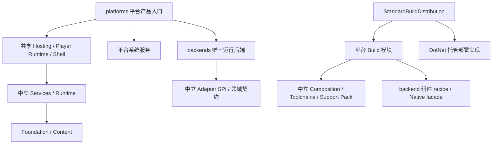

# 平台归属重构验收记录

[架构索引](README.md) · [执行计划](PLATFORM_OWNERSHIP_REFACTOR_PLAN.md) · [项目总览](ENGINE_ARCHITECTURE_OVERVIEW.md) · [扩展指南](PLATFORM_EXTENSION_GUIDE.md)

## 当前状态

后续两项边界收口、NuGet 静态图还原修复及补充可见复核见
[2026-10-08 平台边界收口验收](PLATFORM_BOUNDARY_CLOSEOUT_ACCEPTANCE_2026_10_08.md)。
本页下面的完成数和暂缓项保留原轮次状态，不能覆盖后续结果。

2026-10-08 重新逐项审查发现两个源码边界仍未收口：BGFX 固定目标/发行工厂，以及 Support Pack 的 SDK 预检晚于 staging 创建。
详见[当前计划复核](PLATFORM_OWNERSHIP_PLAN_AUDIT_2026_10_08.md)。本页保留实施和验证记录；下段“源码重构完成”不能证明完整计划全部满足。

源码重构与当前允许的自动验收已完成：四条最终发布/运行路径通过、引擎 1752 项测试通过、217 项有效引用图和 82 项架构契约通过。整体无保留验收仍未关闭：用户最新要求不使用 Computer Use，故三个可见产品复核明确暂缓；macOS 实机等环境边界另列。基线 revision 为 `818163b5222632a6bc2cbe92804b0c6b62b8921d`；没有自动暂存或提交。证据根位于 `artifacts/acceptance/2026-10-07-platform-ownership`。

## 用户问题与已实施结果

| 问题 | 源码结果 | 验收状态 |
| --- | --- | --- |
| 平台实现分散、不易单独维护 | 系统/SDK/产品/Support Pack 集中在 platforms，shared backend 单一 owner 位于 backends。 | 217 项有效引用图、82 项架构契约与四条最终 Player 发布/运行通过。 |
| Desktop 混合运行目标 | WindowsX64、MacOSArm64、Browser Wasm32 明确描述；工具宿主、产品和部署分别冻结。 | 构建与组合契约、Windows Debug/Release 普通 Native 准备通过；三次热测量已完成。 |
| SDL/BGFX/MiniAudio 是否能复用 | 平台选择共享 backend，backend 不引用平台；能力不足时在 SDK 边界接入。 | 七个 Native binding owner 校验与现有 Native 调用测试通过；未宣称未来主机 SDK 已支持。 |
| Editor 是否复制功能 | Editor.Hosting 与功能共享，Windows/MacOS 是薄入口并注入 keyboard/窗口/后端/系统服务。 | 六项启动契约、Debug/Release 启动退出通过；九项可见 UI 检查通过，三项最终可见复核暂缓。 |
| 构建入口重复或隐式注册 | StandardBuildDistribution 唯一具体注册；Composition 保持中立；CLI/Task/Editor 共同消费。 | 全仓编译、架构检查、127 项 Build 契约及四条最终发布路径通过。 |
| 平台增加是否影响共同领域 | 目标、SDK、产品与包装由贡献边界接入；未来 NS/iOS 仅记录结构。 | 自定义贡献测试与禁止依赖验证通过；新增平台还须实际 SDK、设备和生命周期验收。 |

## 已完成 gate

- 共享 Solution 源码编译通过，0 warning / 0 error。
- 仓库级架构验证通过，包含公开边界、项目归属与六个生产入口。
- Editor.Hosting 启动边界 6/6 通过。
- 最终完整 Solution（`logs/solution-build-final-9.log`）：0 warning / 0 error，27 分 19 秒；之后检查器与 SceneView 的必要修正分别独立编译通过。
- 最终有效 MSBuild 引用图（`results/effective-project-dependencies-final-4.json`）：217/217 项求值与架构验证通过，没有执行产品构建目标。
- 最新共同 MSBuild 规则复核（`logs/architecture-effective-final-5.log`、`results/effective-project-dependencies-final-5.json`）：217/217 项再次求值与架构验证通过，包含间接引用和 Analyzer 隔离修正。
- 树行修正后的最终引用图（`logs/architecture-effective-final-6.log`、`results/effective-project-dependencies-final-6.json`）：217/217 项求值与架构验证再次通过。
- 外部普通 restore 修正后的最终引用图（`logs/architecture-effective-final-7.log`）：217/217 项求值与架构验证通过；同轮架构契约为 82/82，整套 Build 契约为 127/127，见 `results/final-remaining-gates.json`。
- 架构契约（`logs/architecture-contract-final-4.log`）：82/82 通过；SDK 环境、interop 编译/恢复目录、Editor Shader 平台配置三组公开契约通过。
- 实际并发 interop 编译（`logs/interop-concurrent-final-2.log`）：两种 symbols 配置产物独立，0 warning / 0 error。
- 最新引用传递契约（`logs/reference-propagation-contract-final-2.log`）：10/10 通过，覆盖直接/SDK 自动追加的间接引用、interop 产物、三个平台 Shader 配置及 Analyzer 隔离；测试项目编译零警告错误。
- Editor Shader 热构建与损坏修复（`results/editor-shader-cache-final.json`）：12/12 Shader 复用、单一内容 Task Host、离线工具一次准备、Native producer 两阶段均为 0；篡改保持长度和 mtime，只重编被损坏的 Direct3D11，11 项保留，修复哈希与原内容相同。热构建 290.578 秒，损坏修复完整 Build 446.969 秒。
- 树行点击回归（`logs/tree-regression-after-fix-2.log`）：26/26 真实 ImGui context 测试通过；修复前同一帧移动/按下的四个正文点击用例失败，见 `logs/tree-regression-before-fix-3.log`。最终产品中的可见点击复核仍待完成。
- 当前八个 Native 产品的完整构建、exports 校验与测试输出部署通过；首行有 14 producer，明确作为预热。三个真实热操作分别为 180.958 / 178.099 / 198.458 秒，producer 和替换文件均为 0，详见 `results/native-final/native-prewarm-and-two-hot-measurements.json` 与 `results/native-final/native-third-hot-measurements.json`。每次 139960 文件 / 13948094581 字节，完整哈希 IO 仍保留；最后一次同时按真实 TargetDir 重新部署测试 Native 闭包，不手工替换 Adapter DLL。
- 七个生成绑定 owner 的公开 `CheckBindings` 全部通过，详见 `results/binding-generation-final.json`；没有手工修改生成结果。

## 最终源码归属与公开契约

- Editor 功能只有一份：`Inno.Editor.Hosting` 与原 framework/features/panels；Windows、MacOS 负责薄产品入口和系统规则。
- Player 共用 `Inno.Player.Runtime`；Windows、MacOS、Browser 分别提供平台启动与内容来源。
- SDL、BGFX、MiniAudio、ImGui、Text、RmlUi、FileSystem、DotNet 和 Interop 的运行/原生/构建实现具有唯一 backend owner。
- 已删除被替代的 `Inno.Editor.Application`、`Inno.Player`、`Inno.Build.Toolchains.Host`、`Inno.Build.Toolchains.Browser`、旧具体 SupportPacks 项目及 `BuiltInBuildDistribution`；没有旧名转发入口。
- 六个生产 Exe：Windows/macOS Editor、Windows/macOS Player、Browser Player、统一 Build CLI。不同 CPU 不复制 Program。五个产品入口保持 Solution 可见并采用显式产品构建，默认共享 Solution 不批量执行它们；本机 Windows 产品的普通独立 Build/Publish 已分别验证，不把共享 Solution 编译当作产品验收。

| 必要公开边界 | 稳定语义与必要性 |
| --- | --- |
| `PlatformTargetDescriptor` / `BuildHostDescriptor` | 分别冻结运行目标事实与工具执行宿主，防止宿主 CPU/OS 替代目标。 |
| `NativeToolchainSelection` / `NativeComponentDescriptor` | 显式声明 SDK/工具环境和组件 owner；删除目录层数、程序集名与当前平台猜测。 |
| `ProductNativeBuildPlan` / `BuildPlatformContribution.nativeProducts` | 产品声明准确组件闭包；Task 与 CLI 从同一贡献解析，不各自维护列表。 |
| `BuildDistribution` / `BuildPipelineFactory` | 中立不可变发行组合；具体注册仅在 Standard 发行项目中执行。 |
| `EditorApplication.RunAsync` / `EditorLaunchOptions` | 最小共享启动入口；配置借用，新建 Host 资源由 Host 退休，平台不访问内部 EditorHost。 |
| `DotNetSdkEnvironment.Create` | 选定 SDK 子进程环境的唯一中立边界；清除父 SDK 变量，保留显式 Native 环境，不修改父进程。 |

233 项显式持久类型/History/Panel 身份与基线一致，证据见 `results/persistent-identity-comparison.json`。脚本逻辑 namespace 未因源码 owner 迁移改变。详细公开 API 由各项目唯一 Wiki 页面记录。

### 项目与逐文件覆盖

有效 Solution 图覆盖 217 个项目，其中 151 个生产项目具有唯一权威 API 页面。测试/fixture 的可执行入口不计入六个生产 Exe；没有通过将工具或测试移出检查根来减少入口数量。

| 原归属 | 最终 owner | 变化 |
| --- | --- | --- |
| `src/adapters` 内具体第三方实现、`native`、组件 Toolchain | `backends/<component>/{runtime,native,build}` | 保留组件程序集/CLR namespace，移动源码与引用，不复制实现。 |
| 共享 `Inno.Editor.Application` | `Inno.Editor.Hosting` 与 Windows/macOS Editor 产品 | Host 为库；平台仅启动与注入系统边界。 |
| 泛称 Desktop Player 与具体平台构建项目 | Windows/macOS/Browser 平台包 | 明确产品、目标、SDK、Support Pack 与模板。 |
| 旧 Host/Browser Native 聚合项目 | 中立 Product Native 机制、backend recipe 与 Browser SDK 聚合 | 删除旧项目；实际组件集合由冻结贡献提供。 |
| 内置构建组合 | 中立 Composition 与 Standard 发行组合 | 注册位置唯一，中立核心不引用具体发行。 |

`file-map.tsv` 覆盖源码、项目、生成配置、模板、脚本、测试和 Wiki，逐行记录原/目标位置、职责、公开 API、消费者和验收状态。`results/removed-file-responsibilities.json` 为 38 个正式删除文件记录替代 owner；保留项也有分类，没有未解释的旧路径。公开主类型与 API 由 `results/project-public-api.json` 的语义清单回填，不能用文件名推断类型。文件覆盖完成不代表其中暂缓的可见运行门禁通过。

可复用 Native、binding、interop 与 Support Pack 使用目标/配置/ABI/SDK/指纹隔离；普通 IDE 产品的实际输出是所属产品 `bin/<target>/<configuration>` 和 `obj/<target>`，并非所有 IDE 输出都写入计划示意的 `artifacts/products/<fingerprint>`。发布候选、缓存与用户最终输出分别由对应 owner 管理，不能将示意布局当作已经存在的目录。

## 环境与命令记录

- 本机为 Windows x64，OS `10.0.26200`；引擎使用工程声明的 .NET SDK `9.0.318` / `net9.0`，没有升级目标框架。
- SDK 路径为 `C:/Users/23842/AppData/Local/InnoWebDotnet/dotnet.exe`；Wasm workload 为 `wasm-tools` 与 `wasm-experimental`。Canvas 的实际父 SDK 单独由其 `global.json` 解析，记录在 `results/canvas-parent-sdk-final.json`。
- `baseline/revisions.json`、`baseline/environment.json` 保存实施前环境；`results/current-execution-boundaries.json` 保存用户最新禁止桌面操作的验收边界，不能把基线中的锁屏状态当作当前状态。
- 每条发布、运行和测试命令的完整参数、工作目录、开始时间、退出码与耗时分别保存在 `results/final-gates-*.json`、`results/consumers-final.json` 与测试汇总中，原始输出保存在同名 `logs/*.log`。
- 本轮没有创建提交或自动暂存；源码工作区保留可审阅改动。BGCS 与 Samples 的 revision/工作区分别核对，不能将 Inno 消费 BGCS 的产物隔离视为 BGCS 自身源码修改。

## 当前真实运行证据

以下将较早阶段和最终冻结源码的证据分别列出。最终四条路径的八个成功 gate 见 `results/current-publications-final.json`；`results/current-publication-evidence-final.json` 逐路径核对实际记录的 SDK/CLI、120 帧或 11 项浏览器运行结果，不把旧发布结果当作最终验收。

| 路径 | 当前证据 | 结果 |
| --- | --- | --- |
| Windows Editor Debug | `logs/windows-editor-debug-build-final.log`、`logs/editor-debug-smoke-final.log` | 普通产品 Build 68 分钟通过；外层托管构建零警告错误，第三方 Native warning 单独保留。FlappyBird 120 帧、8 个 Panel、退出前保存、完整 Dispose 通过。 |
| Windows Editor Release | `logs/windows-editor-release-build-final.log`、`logs/editor-release-smoke-final.log` | 普通产品 Build 41 分 28 秒通过；FlappyBird 120 帧启动、保存与完整退出通过。该可见运行发生在用户要求暂停桌面操作之前。 |
| 较早阶段 Windows Support Pack | `logs/windows-support-pack-final.log`、`results/final-gates-windows.json` | 当时完整包准备通过，979.907 秒；磁盘容量失败另行保留。最终源码由后续实际游戏发布重新供给和校验所需闭包。 |
| SDK 冻结修正前 Windows CoreCLR Player | `logs/flappy-windows-coreclr-final-publish-final.log`、`logs/flappy-windows-coreclr-final-smoke-final.log` | 历史发布 527.765 秒；隐藏窗口 120 帧运行 6.781 秒，2 个 view、25 个 draw，退出码 0。该 smoke 证明当时实际启动/渲染/退出，不替代最终源码发布、人工玩法或听音。 |
| SDK 冻结修正前 Windows NativeAOT Player | `logs/flappy-windows-nativeaot-final-publish-final.log`、`logs/flappy-windows-nativeaot-final-smoke-final.log` | 历史发布 584.922 秒；静态注册、Native 初始化与隐藏窗口 120 帧运行 3.797 秒，退出码 0。 |
| 较早阶段 Browser Support Pack | `logs/browser-support-pack-final-7.log`、`results/final-gates-browser.json` | 当时 wasm32 绑定、共享组件静态归档和托管 Player 闭包准备通过，1899.812 秒；包含 Windows 宿主离线 Shader 工具准备。第三方 warning 在原日志保留；最终发布再次供给和校验所需闭包。 |
| SDK 冻结修正前 Browser 解释执行 Player | `logs/flappy-web-interpreted-final-publish-final.log`、`captures/flappy-web-interpreted-stream-final/report.json` | 历史发布 688.109 秒；静音 headless 的 11 项运行检查通过，39.234 秒：普通输入取得正分 1，刷新后读取相同保存值，昼夜/星光/移动光照与音频信号有效。34 组鸟/光照采样的最大偏差 11.685 像素，垂直运动 104.228 像素；运行 page error 为 0，316 warning 与两条资源 404 保留，不能称 console 全无错误。 |
| SDK 冻结修正前 Browser AOT Player | `results/final-gates-browser-aot.json`、`captures/flappy-web-aot-final/report.json` | 历史 AOT 发布/裁剪/静态链接通过，1060.656 秒；相同 11 项运行检查通过，runner 42.906 秒（探针内部 42.140 秒）。真实分数 1、同 key/value 重载，34 组移动光照最大偏差 11.685 像素、垂直运动 102.173 像素，WebAudio 峰值 0.952。page error 为 0；316 warning 与两条 `/favicon.ico` 404 原样记录。 |
| 最终 Windows CoreCLR Player | `logs/flappy-windows-coreclr-sdk-final-publish.log`、`logs/flappy-windows-coreclr-sdk-final-smoke.log` | 当前源码发布 1765.578 秒，包含 Debug/Release 新 Native 身份的实际准备；隐藏窗口运行 120 帧，4.094 秒，2 个 view、25 个 draw，退出码 0。发布 SDK 为 9.0.318，CLI 固定为对应 SDK 的 dotnet.dll。 |
| 最终 Windows NativeAOT Player | `logs/flappy-windows-nativeaot-sdk-final-publish.log`、`logs/flappy-windows-nativeaot-sdk-final-smoke.log` | 当前源码发布 246.656 秒；静态注册、原生初始化和隐藏窗口运行 120 帧通过，1.578 秒，2 个 view、25 个 draw，退出码 0；同样使用冻结的 SDK 9.0.318 CLI。 |
| 最终 Browser 解释执行 Player | `logs/flappy-web-interpreted-sdk-final-publish.log`、`captures/flappy-web-interpreted-sdk-final/report.json` | 当前源码发布 1052.828 秒；11 项静音 headless 检查通过，runner 39.078 秒（探针内部 37.750 秒）。真实操作得到 1 分，刷新读取同一存储值；昼夜、星光、移动光照和音频信号有效。鸟/光照最大偏差 9.222 像素、垂直运动 100.007 像素，WebAudio 峰值 0.712；page error 为 0，两条 favicon 404 和完整 console 原样保留。 |
| 最终 Browser AOT Player | `logs/flappy-web-aot-sdk-final-publish.log`、`captures/flappy-web-aot-sdk-final/report.json` | 当前源码 AOT 发布/裁剪/最终链接通过，504.141 秒；11 项静音 headless 检查通过，runner 31.437 秒（探针内部 30.781 秒）。真实分数 1、相同存储值重载、昼夜和星光有效；鸟/光照最大偏差 8.753 像素、垂直运动 76.450 像素，音频峰值 0.968；page error 为 0。最终解释执行和 AOT 均保留 316 条 warning、两条 favicon 404 console error，不能称全无浏览器诊断。 |
| 引擎最终测试 | `results/full-tests-final-summary.json` | 55 项目，1752 passed、0 failed、16 macOS Metal skipped；采用第五轮其他 54 项目结果与当前源码整套 Build 127/127 结果，后者包含外部普通 restore、SDK 冻结与单文件发布回归。原第五轮 1750 passed/1 fixture cleanup failed 和第四轮四项失败均保留，不覆盖原日志。 |
| 独立 BGCS NativeAOT | `results/bgcs-native-aot/a9287a1f7f734489879e29c3e63fa0e7/report.json` | 三种 import mode 的实际 C/C++ API 调用通过。 |
| 独立 BGCS 托管矩阵 | `results/bgcs-managed-summary.json` | 11 个项目、1023 passed、0 failed、0 skipped；BGCS 源码未修改。 |
| 独立 BGCS Wasm 解释执行 | `results/bgcs-wasm/6280c5c15cd84df7a27880b4e8e4afbf/report.json` | 三种 import mode 的实际浏览器原生调用通过。 |
| 独立 BGCS Wasm AOT | `results/bgcs-wasm-aot/cc41cc94d00f4670ac637f1eac5e39fe/report.json` | AOT 链接、布局、返回、回调与生命周期调用通过。 |
| SDK 子进程边界 | `logs/sdk-environment-build-4.log`、`logs/sdk-environment-real-process-2.log` | 中立工具库零警告错误；注入错误父 MSBuild/SDK 路径后，真实工程仍由其所属 SDK 求值，父环境不变。 |
| 最新普通产品/消费者 Build | `results/consumers-final.json` | 当前 Windows Editor Release 普通 Build 零警告错误，1708.562 秒，未启动窗口；Canvas SDK 10 普通构建/脚本编译/6 项测试通过，747.656 秒；Rendering2D 脚本编译通过，142.860 秒。可见产品 smoke 按用户要求暂缓。 |
| 当前公开文档 | `logs/wiki-inventory-final-9.log`、`logs/wiki-api-final-9.log`、`logs/doc-links-final-9.log` | 151 个生产项目的语义公开清单与唯一权威页面同步；四仓文档无失效链接。 |

## 验收中发现并处理的问题

1. Editor 产品只依赖 Host 实现闭包会遗漏可发现 Panel/Importer。统一 `EditorProduct.props` 声明产品功能与资产创作注册依赖，Windows/MacOS 共用；不通过目录扫描或无效类型引用保留扩展。
2. importer 尚未激活时的失败依赖在类型目录更新后仍保持 failed。失败记录保存中立的瞬时类型 generation，目录变化后通过现有恢复事务重试；没有新增持久字段或第二套资产数据库。
3. Browser Support Pack 校验器重复维护组件名单且要求实际不需要的静态库。校验器接收同一冻结 Native plan，检查确切归档/绑定集合，并拒绝额外或外来产物。
4. 普通产品 Native 闭包仍可能由调用入口重复选择。平台贡献显式声明 `nativeProducts`，Task/CLI 统一经 distribution 解析；Browser 聚合由所属 Support Pack 请求负责。
5. 不同 SDK 消费者的父 MSBuild 环境污染 Engine 子进程，产生 `System.Runtime, Version=10.0.0.0` 加载错误。`DotNetSdkEnvironment` 隔离继承的 SDK/程序集/扩展根变量，并保留选定 Native 环境；未升级框架或强行固定消费者 SDK。
6. 缓存多进程测试探针在迁移后使用了错误的 MSBuild wildcard 目录。根据实际 `GetTargetPath` 输出 metadata 定位探针目录，完整多进程读取/修复测试重新通过。
7. Inno 对独立 BGCS.Runtime 的源码引用仍写入 BGCS 的普通 bin/obj，产品的调试符号编译属性不同会争用输出。共同 MSBuild 消费规则将产物隔离到本 checkout 的 `artifacts/managed/interop`，区分 SDK、目标、ABI、RID、框架、symbols/AOT/trim 属性；不修改 BGCS 源码。`results/interop-concurrent-profiles.json` 记录实际并发构建：None 配置仅产生 DLL，portable 配置产生 DLL/PDB，输出根不同，全部通过。
8. 检查器仍要求 interop 引用携带已删除的条件，产生静态误报。现在静态规则检查 backend 归属，实际路径与导入引用由 SDK 求值；新增正向与反向边界测试通过。该检查还找到 SceneView 中未使用的 BGCS.Runtime 直接依赖与旧 NuGet 回退，已删除并独立编译通过。
9. Rendering2D 的验证脚本仍使用旧 Application 路径和已经删除的独立 Native Program。Windows/macOS 脚本改为对应平台产品，普通 Build 自动准备闭包；生成 IDE 项目的验证使用同一个临时项目。绑定验收的共同 Solution 构建不再注入产品 Native 属性，报告组件名单取自实际计划。
10. SDK 在执行期间自动加入的间接 interop 引用不继承直接引用的产物 metadata，普通 Editor 构建仍向 BGCS bin/obj 写入。共同 MSBuild 规则在 SDK 添加间接引用后补齐同一目标/SDK/编译属性，SDL 与共享 Editor UI 的实际 SDK 求值进入相同隔离机制；删除 src 中已经无消费者的 BGCS 路径属性。当前普通 Editor Release 构建、Canvas SDK 10 消费和实际引用契约均通过。普通 NuGet 路径遍历仍可在 BGCS 创建中立 restore 元数据；Inno 实际编译/输出使用隔离位置，见第 20 项。
11. 完整普通构建发现 BGFX Composition/OutputTransfer Shader 仍使用旧输出目录及目标选择表。两个 Shader 消费者改为独立 `Outputs` 候选与同一内容完整性门禁；平台 `ProductBuild.props` 声明共同 Shader 配置，Editor 在其上增加 ImGui 配置，Player 显式传入。共享 BGFX 后端不再维护命名目标选择表，也删除时间戳跳过规则。5 项 Shader 属性契约通过，包含三个平台与一个未知 CPU 的实际 SDK 求值；普通 Debug/Release 产品构建、当前 Release Build 和四条最终发布均通过。
12. SDK 补入的其他间接引用也遗漏了产品目标和配置，失败构建继续编译无目标副本。共同引用属性统一覆盖直接与 SDK 间接引用，并排除 Analyzer；没有禁用 SDK 的间接依赖机制。已知失败的进程在收尾重复编译时停止，日志保存在 `logs/windows-editor-debug-build-output-contract-failed.log`，结果保存在 `results/final-gates-editor-output-contract-failed.json`。停止不是成功验收，修正后从普通 Build 重跑。
13. 可见 Editor 验收发现 Hierarchy 左键只悬停、不选择，右键却能选择。共同 Tree widget 的原生整行 `SpanFullWidth/AllowOverlap` 命中区覆盖自绘正文；同帧移动/按下的真实 ImGui 回归复现四项失败。修正为箭头、正文、叠加按钮分别拥有命中区域，并去除正文的 AllowOverlap。26 项回归通过，包含两个缩放、父/叶节点、同帧输入、先悬停输入、箭头、叠加按钮与正文双击；不在 Hierarchy 或 FileBrowser 中增加专用事件处理。
14. 热构建验收的嵌套 Python runner 重复添加 CMake/Ninja PATH 前缀，改变已冻结的 Native 环境身份，因而实际执行冷构建。该轮已停止并保留在 `logs/editor-shader-hot-environment-drift.log`、`results/editor-shader-cache-environment-drift.json`，不能当作热构建通过或性能基线。修正验收 runner 继承同一次操作的 PATH；生产指纹继续覆盖真实工具环境，没有删除环境校验来制造缓存命中。首次恢复正确环境时，已有 Shader 产物仍对应错误 PATH 指纹，因而按真实输入重新发布；这轮日志保存在 `logs/editor-shader-canonical-baseline-restoration.log`，不计作热构建通过。验收正则同步接受 Task Host 实际输出的大小写哈希。正确环境的独立热构建/同长度同 mtime 损坏修复另见 `results/final-gates-editor-cache.json`。

15. Windows Support Pack 准备阶段因磁盘只剩约 280 MB 而无法复制 Task Runtime 的 libclang，未进入游戏输出提交。失败证据保留在 `logs/windows-support-pack-disk-space-failed.log` 和 `results/final-gates-windows-disk-space-failed.json`。当前采用本 checkout Task Host 缓存的无损 NTFS 压缩恢复容量，不删除源码、历史日志或产物；重跑结果独立记录。当前 Task Host 的 125 文件内容身份重新计算后仍为相同的 `8DCE2A772725E80525F8B58E71D1A5F28FB3F6F6CA647B95EEACDD437FAAF564`，见 `results/task-host-compression-integrity.json`；`logs/task-host-lossless-compression.log` 保存压缩证据：4779 文件、24543239532 字节压缩为 13066042872 字节。计数是压缩工具的处理数据量，不是用包含 hardlink 的目录逻辑长度推算实际磁盘使用。工具缓存包含当前及历史内容快照，逻辑文件长度不等于实际磁盘占用，不将该环境失败称为编译通过。

16. 最终 Web 解释执行发布通过，但旧 headless 操作探针的逐张截图约需 0.5–1.4 秒，无法及时控制鸟，75 秒内没有取得正分。局部截图仍有 compositor 等待；固定间隔异步按键又会持续上升，WebGL 读回探针也干扰了绘制。失败日志和各自的 `report.json` 分开保留，没有修改游戏状态、写入测试分数或改变 Sample。新的像素控制探针通过浏览器的 [CDP Page 帧流](https://chromedevtools.github.io/devtools-protocol/tot/Page/) 观察画面，仅在下降到目标高度时使用正常键盘输入；还保留昼夜/星光、实际得分、存储重载、音频信号、移动光照与运行异常检查。帧流第一轮沿用了旧局部截图尺寸，第二轮仍重复向上按键，均未计作通过；最终结果另行记录。此处修正的是验收工具，不将探针失败或重试宣称为引擎功能通过。

上述 Web 探针还沿用旧的 `/flappy-bird/best-score.txt` 后缀，漏掉当前 `flappybird:flappy-bird/best-score.txt` 的真实写入；`control-90.png` 已显示普通玩法取得 1 分。探针改为只匹配当前 `namespace:key` 契约，没有添加旧格式兼容。最终解释执行验收使用全新 profile，初始没有分数，真实操作后保存 `MQ==`，重载后游戏读取同一 key/value；详见 `results/headless-probe-diagnosis.json` 与最终运行报告。失败探针没有足够证据区分“未得分”和“读取规则错误”，不能据其失败消息断言引擎输入或存储故障。

Analyzer 引用明确设置 `PrivateAssets=all`，并移除继承的产品目标、发布、输出和 Native 属性；单纯不添加属性不足以阻止父项目已有全局属性传递。生成器保持宿主工具配置，不进入 Player 运行闭包。

17. 完整真实发布回归发现已解析 SDK 9，但从临时短路径 junction 执行 `dotnet publish` 时又解析成 SDK 10。`DotNetSdkResolver` 现在从原工程目录的真实 `--info` 冻结 SDK identity、Base Path 与 CLI 入口；发布器用记录的 host 直接执行所选 SDK 的 `dotnet.dll`。缺少入口明确失败，不改写或复制 global.json，不选择最高安装版本。工作目录和工程 SDK 是两项独立事实；该边界修正归共同 Toolchains/DotNet executor，不进入平台、Player 或领域运行服务。目标测试验证发布进程内实际 `NETCoreSdkVersion` 与请求一致，并继续验证单文件 Native 闭包、缺失输入拒绝和旧输出保留，`logs/sdk-frozen-publication-final.log` 为 1/1 通过。新增 `DotNetSdkDescriptor.cliPath` 是固定执行所需的最小公开事实，SDK 与 CLI 路径分别写入发布日志。Microsoft 的 [dotnet 命令说明](https://learn.microsoft.com/en-us/dotnet/core/tools/dotnet)与 [SdkPaths 实现](https://source.dot.net/Microsoft.DotNet.Cli.CoreUtils/SdkPaths.cs.html)说明宿主执行 managed entry 和 SDK 从入口位置取得自身路径；本机真实发布验证该行为。

18. 默认中立 BGFX 库构建不携带产品 Shader，而最终测试 runner 执行了未准备产品依赖的三个嵌入 Shader 集成用例。验收现在显式选择 WindowsX64 Editor 产品属性；MSBuild 从 `bin/windows-x64/Debug` 取得 backend 依赖，并正常部署到测试工程实际 `TargetDir`（该工程为 `bin/Debug/net9.0`），不猜测测试目录布局。Native 闭包仍通过公开产品 plan/deployment 契约准备。没有恢复 backend 的宿主 OS 默认值，也没有手工复制另一套 Adapter DLL。失败 TRX 保留；正确配置后的该套测试为 35/35 通过，见 `results/full-tests-final-5/Inno.Adapter.Rendering.Bgfx.Tests.trx`，集成测试命令已写入 BGFX Wiki。

19. 第五轮工具输出故障测试的进程退出断言通过，但 fixture `Dispose` 立即删除自己的工作目录时收到 sharing violation，见 `results/full-tests-final-5/Inno.Build.Tests.trx`。该证据只确定目录瞬时被占用，未识别持有者，不能宣称找到了某个外部进程或进程泄漏。fixture 先验证完整路径仍属于自己的临时 owner，再仅对 sharing/lock violation 作最长两秒的有界删除重试；不捕获其他权限错误，持续占用仍失败。输出故障原异常、父/子进程停止及取消断言均保留。Core.IO 现有有界机制用于原子 rename，没有公开的目录删除契约；本次不为 fixture 扩大内部 API，也不向生产 Process runner 添加延时。当时整套 Build 契约重跑 126/126 通过，见 results/build-contract-fixture-final/Inno.Build.Tests.trx；加入普通 restore 回归后的最终整套为 127/127，见 results/build-contract-interop-final/Inno.Build.Tests.trx。原失败不覆盖。

SDK 补充核查还明确了命令名/相对 host 路径的冻结：Resolver 使用现有 `ToolchainEnvironment.ResolveExecutable` 一次得到绝对 host，后续 Info 和 publish 共用该值；环境隔离不能代替执行路径冻结。现有 SDK 环境测试增加相对 host 的实际解析、绝对 descriptor 和该 CLI 的真实版本一致性检查，完整发布用重新编译的 CLI 执行。

20. Canvas SDK 10 消费验收首次关闭引用构建时出现 `NETSDK1004`，随后普通完整构建仍失败，证实不是 runner 参数的单一问题。外部 NuGet 普通 restore 的路径遍历丢失逐引用 AdditionalProperties，在 BGCS 自己的默认位置准备 assets；Inno 编译按隔离 metadata 查找 SDK 10 assets，因而缺失。两个失败分别保留在 `logs/canvas-current-consumer-failed-sdk10.log`、`logs/canvas-normal-consumer-failed-sdk10.log` 及对应结果。共同 targets 在 ResolveProjectReferences 前，通过实际直接/间接 interop 引用准备同一隔离 restore；Design-time 和明确不构建引用的操作不执行。修正归 Inno 消费集成，不修改 BGCS、不复制 assets 或强制更换消费者 SDK；仓库外、普通 restore、新隔离根的实际 SDK 10 构建回归通过；与 SDK/单文件发布一起 7/7 通过，见 results/interop-restore-contract-final。Canvas 的正式 SDK 10 普通完整构建、脚本编译及 6/6 测试通过，747.656 秒，见 logs/canvas-current-consumer-final.log；两轮原失败均保留。

21. 额度中断发生在最终 CoreCLR 路径的 Native 编译中，未记录发布完成或最终输出提交；原日志保存在 `logs/flappy-windows-coreclr-sdk-final-publish-interrupted-rate-limit.log`。恢复前确认没有残留生产进程，并重新执行该路径；已完成的 127 项 Build 与 82 项架构测试不重复计数。发布 runner 按已完成 gate 恢复，不能将截断日志视为成功。

22. 用户指出 C 盘缓存占用后，先记录本 checkout 缓存清单，再清理 74 个旧任务快照、完成的加载/验证目录和自有 headless profile。当前快照 125 个文件逐项 SHA-256 校验保持不变；源码、SDK、用户浏览器数据、当前产品及验收日志/截图保留。C 盘实测释放 25.909 GiB，可用空间由约 27.667 GiB 增至 53.576 GiB，见 `results/owned-cache-cleanup.json`。逻辑文件长度含 hardlink 与压缩文件，不用它推算释放量。中断的工具目录含 reparse point，整目录递归清理被路径检查拒绝并保留；该项不计作已清理。阶段结束继续复核自有缓存与可用空间。

第二轮按 `project-moves.json` 核对已迁移项目：旧 owner 已无 `.csproj`，新 owner 的项目存在，旧 bin/obj 没有 Git 跟踪文件且均被忽略，不含 reparse point，活跃进程未引用旧位置。随后清理 88 个旧输出目录，包括旧 BGFX Toolchain obj、旧 UI/SDL/Text 以及旧产品缓存，实测释放 40.047 GiB，可用空间为 90.619 GiB，见 `results/superseded-project-cache-cleanup.json`。两轮观测释放合计约 65.956 GiB；第二轮期间新发布仍在生成自己的产物，因此最终可用量与释放总量分别记录。不是遍历全盘删除 bin/obj，也没有清理当前 backend/平台产品的输出。

四条最终发布结束后再次清理 14 个私有加载/发布目录和本轮 headless profile，保留截图及报告；释放 0.135 GiB，最终可用空间 92.748 GiB。当前任务快照的 125 文件哈希仍一致，见 `results/owned-cache-final-retirement.json`。三轮共清理 176 个目录，观测释放约 66.091 GiB；此数不是对目录逻辑大小求和。缓存管理规则已写入 AGENTS；原磁盘满导致的失败记录继续保留。

构建期间修改输入的验收尝试已被稳定性校验拒绝，记录于 `logs/browser-support-pack-6.log`。候选未提交，这是预期失败保护；最终发布必须在源码冻结后重新执行。一次并发 Release 验收还受到复用 MSBuild 节点退出与共享调试符号输出争用影响，最终重跑采用串行命令，不能计作成功。

## 构建测量与含义

| 测量 | Debug | Release |
| --- | --- | --- |
| 普通 Editor 产品完整 Build | 4080.657 秒 | 2488.969 秒 |
| Native 准备阶段 | 803.293 秒 | 1025.765 秒 |
| Native 输入完整哈希 | 262882 文件 / 26066537452 字节 | 262882 文件 / 26066554732 字节 |
| Native 工具进程 / 产品数 | 16 / 8 | 16 / 8 |

这些是当前 recipe 未命中的实际构建，未清空所有缓存，不等于从空磁盘开始的安装基准。完整 Build 包含托管工具引导、当前引用闭包、Shader 与 Native；第三方 BGFX 编译 warning、临时工作目录 warning 与链接 warning 在原日志中保留，不能用外层零 warning 宣称全链无 warning。热命中仍做完整内容校验，工具零启动不等于零磁盘 IO；最终三次热测量另列，不用不同机器负载或不同 PATH 结果推断性能改善。

`statistics.nativeProcesses` 记录组件 Native producer 的启动计数，不是机器上全部 dotnet/MSBuild/解析器子进程的总数。热命中日志仍可能包含 Task/扩展工程的增量求值与编译输出；不能将 producer 为 0 推导为整条构建没有工具进程。Task Host 的唯一内容身份与 Shader 离线工具的一次准备有独立检查，和全部工具引导调用次数分别表达。

最终 Native 探针首次操作仍有实际 producer：727.652 秒、241683 文件 / 24378281761 字节、14 producer、8 产品；首次部署 15 文件。该行保留为预热，不计入三次热命中。三个真实热操作的 Native 阶段为 180.958 / 178.099 / 198.458 秒，包含完整输入校验、绑定准备和有界工具工作，不包含随后为全部测试查找 TargetDir 的部署工作；对应含部署计时为 181.606 / 178.972 / 199.163 秒。每次组件 producer、已存在部署目录的替换文件均为 0。

## 所有权与退出

本轮补充修正了 ImGui 的配置归属与增量验证：Windows/MacOS Editor 各自提供 `EditorProduct.props`，共同 MSBuild 只传递显式配置；ImGui 后端不再维护平台目标表。Shader 产物复用共同内容哈希、完整性、写 lease 与原子发布，避免时间戳判断掩盖目标、工具或内容变化。对应属性、冷/热与损坏输出门禁在最终矩阵中记录。

| Owner | 持有资源 | 退出责任 |
| --- | --- | --- |
| 平台 composition | 明确系统服务、不可变 catalog/selection/distribution、SDK/产品事实 | 配置借用；只转交契约明示的新资源。 |
| Editor Host / Player application | Window、设备、Session、UI、作业和 callback | 停止新工作，取消并排空，注销 callback，保存 Editor 状态/提交存储，退休领域资源，释放设备与原生 owner。 |
| Native build operation | 冻结工具、输入 snapshot、工作目录、lease、staging | 取消进程树并排空输出；稳定性/exports/完整性通过才原子发布。 |
| Support Pack publisher | 候选发布目录与最终提交事务 | 失败或取消保留上次完整输出；提交后清理与提交失败分开报告。 |
| 领域 generation coordinator | Type/Module/Serializer/extension 候选及旧代 | Full GC → finalizers → Full GC，弱监测确认；Pending/Faulted 不绕过。 |

## 当前证据边界

此前桌面锁定期间没有尝试解锁。用户允许操作且桌面恢复后，已运行本次普通 Debug Build 的独立 Editor 产品副本，以真实窗口完成以下检查，详见 `results/editor-ui-final.json` 与 `captures/ui-*.png`：

- 编译 Modal 阻止底层 File Panel 的关闭。
- 浮动 GameView 聚焦时接收游戏点击；聚焦主 Editor 后 Space 不重启游戏。
- 昼夜切换后夜晚星星及蓝色光晕可见。
- Shader 选择器向下展开，十项内容在所属窗口内，没有冗余滚动条。
- ShaderEditor 小地图显示节点、连线及可视区域；点击小地图可以导航。
- 在浮动 ShaderEditor 画布上点击与底层 File 关闭按钮完全重叠的屏幕位置，不关闭底层 Panel。
- Hierarchy 右键菜单的搜索框填满菜单内部宽度。
- Export 表单按约 2:3 分列，无重复滚动条；目标列表没有 Desktop。
- 缩窄 Inspector 并改变 Editor zoom 后，长 label 在自身列换行，未超出列边界。

这一轮同时发现并修复树行左键命中问题。用户随后要求停止 Computer Use；当前只继续命令行构建、测试与隐藏 Player/headless Browser 验收。更新后的可见产品仍须复核该点击及 Export 结束自动关闭；会打开可见 Editor 的 Rendering2D 产品 smoke 同样暂缓，并在结果中标记 deferred，不计作通过。Editor zoom 与狭窄窗口验证不能替代不同显示器的真实 OS DPI/多屏验收；macOS Native 编译和实机运行未实测。

## 尚未关闭的验收与交付结论

当前源码、调用方、有效项目引用、公开边界、Native/binding、构建/取消/损坏保护、reload 契约、消费者以及四条最终 Player 发布/运行均已有通过证据。源码工作区可供审阅，BGCS 与 Samples 本轮没有源码改动；没有自动暂存或提交。初轮失败与实际修正分开保留。

仍暂缓三个可见操作：最终产品 Hierarchy 左键选择、Export 成功/失败后的自动关闭、Rendering2D 当前平台 Editor 600 帧 smoke。它们没有计为通过；不能据自动测试宣称整个计划无保留验收已完成，也不能据此确认可以无条件提交。此前通过的九项可见 UI 及 Debug/Release 启动属于暂停桌面操作前的独立证据。

macOS 本轮未具备实机环境；Linux 不注册完整游戏产品；NS/iOS/新增 CPU/未来 CoreCLR Wasm 不宣称已支持。提示音文件 `/System/Library/Sounds/Glass.aiff` 在本机不可访问。

建议按仓库审阅提交，标题遵循用户指定的 `type(scope): subject`：

- InnoEngine：`refactor(platforms): isolate platform products and shared backends`
- Canvas：`refactor(tooling): consume explicit engine build targets`
- Rendering2D：`refactor(tooling): use platform editor products for validation`

BGCS 与 Samples 没有本轮源码提交内容。普通 IDE bin/obj 的真实布局与计划示意的差异、三次热构建的完整哈希 IO 成本、浏览器 warning 与未实测设备均已在上文明确记录。
