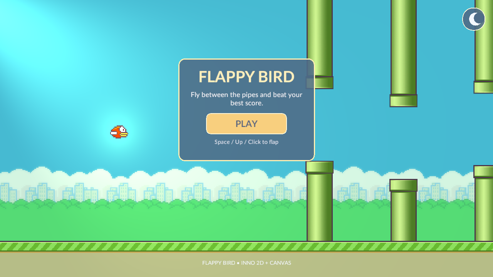
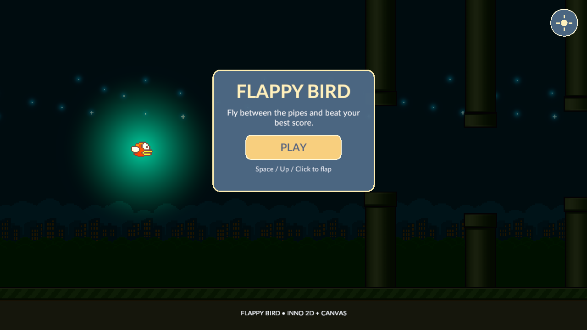
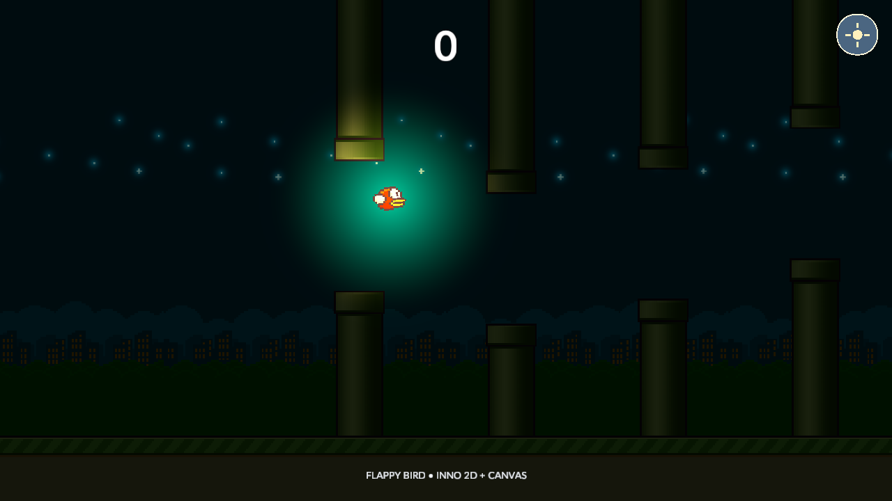
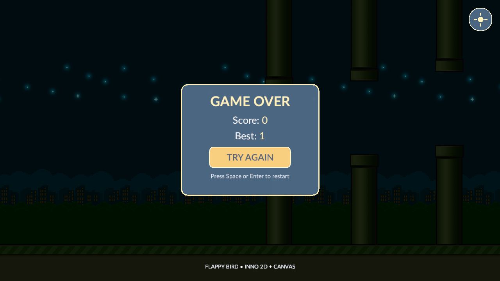

# Web 宿主与统一构建重构验收（2026-10-02）

[架构索引](README.md) · [Wiki 首页](../README.md) · [实施计划](WEB_HOST_REFACTOR_PLAN.md) · [当前架构](WEB_PLAYER_ARCHITECTURE.md) · [统一 CLI](../build/Inno.Build.Cli.md)

## 实现范围

后续实现以[提交前再次核查](PRECOMMIT_RECHECK_ACCEPTANCE_2026_10_02.md)为准：FileLogSink 已删除独立交付策略和 worker，统一由 Router 调度；本页的历史验收记录保留。

游戏代码、Scene、Plugin、Shader 创作链、输入和 Runtime 服务继续共用。平台专属实现收口到入口、Adapter 和目标工具链，不承诺浏览器 SDK、原生 ABI 或平台能力永远不变；这些变化现在具有明确的维护边界。

| 用户目标 | 当前实现 |
| --- | --- |
| 去除 Native Browser 副本 | 删除五个独立项目及调用方。每组件一个 Native 项目、共同 BGCS 定义、host/wasm profile；managed 与 Cpp2C 输出均按目标隔离。 |
| 共用游戏宿主 | 新增真正的 `Inno.Player.Runtime` 程序集，桌面和 Web 使用同一个 `PlayerApplication` / `GamePlayerHost`。Browser 不再链接桌面源码。 |
| 共用 Shell 与输入 | Shell 只保留 `RunAsync` 生命周期；轮询和外部调度由帧驱动组合。SDL3 平台事件经过同一个 `Inno.Core.Events` 分发，每个 Session 独立 backend，消费和释放规则相同。 |
| 去除基础库平台判断 | Foundation、Shell、Player Runtime 不使用 `OperatingSystem.IsBrowser`。入口显式提供调度、模块激活、线程能力、日志与存储。 |
| 合并构建程序 | 相对 Git HEAD 的 14 个生产 Exe，当前剩四个：Editor、桌面 Player、Web Player、Build CLI。12 个原有工具入口收为库，统一由一个 Build CLI 组合；MSBuild 只使用薄 Task。 |
| 分离平台导出 | 通用 Build 管脚本、内容闭包、诊断、取消与原子提交；Windows/macOS/Browser target 管自身部署。Support Pack 核心按 source/validator 注册，不维护具体平台分支。 |
| 保持渲染 | 本轮宿主重构沿用同一 BGFX Adapter、Shader IR、Rendering Runtime 和能力/颜色空间契约，不加入 Web 游戏或 Shader 专用分支。 |

`Inno.Player.Browser` 保留为 .NET 浏览器 SDK 所必需的启动程序，负责 HTTP 内容准备、JS 帧调度和 Browser Storage 组合。它没有第二套 Scene、游戏 Host 或输入系统。浏览器持久化实现属于 `Inno.Adapter.Storage.Browser`；游戏仍调用同一 Storage API。

## 构建与启动中发现并修复的问题

1. Session FileLogSink 仍隐式创建后台线程，导致单线程 Web 启动失败。现在它继承 Host 的 `LogDeliveryMode`，Inline 返回前实际写入文件，具有公开 RuntimeSession 测试。
2. BGCS callback 类型递归分析未沿用别名配置；不完整 record 和 opaque handle 的 extern carrier 不统一。生成器按目标 ABI 使用原生指针 carrier，稳定 managed handle API 保留；修改是通用生成规则，不是 SDL 特例，也不手改生成代码。
3. Browser SDK 原先猜测已安装包的最高版本。现在通过目标项目的 MSBuild 属性取得实际选择的 SDK/Cache/Node/Python，只改变子进程环境。
4. UI wasm Cpp2C 曾覆盖宿主 `Native/Generated`。现在目标桥归 Native owner 的 `obj/browser-wasm/Native`，CMake 显式选择桥；架构门禁拒绝目标与宿主生成根相等、互相嵌套或越出 owner。
5. 隔离 MSBuild Task 的 ModuleHost 原先错误地从默认 ALC 发现 Host 类型。现在以 owner ALC 为准，桌面、MSBuild 与 Web 遵循同一发现规则；隔离加载上下文的类型发现和 Full GC/finalizer/Full GC 释放有实际测试。
6. Windows `engine` 原先依赖 Developer Terminal 的 `msbuild` / `cl`。现在通过官方 `vswhere` 选择已安装 C++ Build Tools，编译环境只进入子进程。
7. SDL3、MiniAudio、ImGui、ImGuizmo 的 Windows/macOS/Linux 构建缓存曾进入 extern。现在统一属于工具链 `obj/native/<platform>/<configuration>`；Text/UI 复用同一 owner 路径契约。ImGui overlay 同样归其工具链缓存，不修改第三方源。BGFX 上游 GENie 仍按上游声明使用 `.build`（非 CMake），已在工具链 Wiki 明确记录。
8. Windows 游戏编译闭包漏掉可选的 OpenGL，导致 Player 切到该 backend 后缺少 Sprite/Lighting/Shadow 目标 Shader。现在 Windows 导出同时生成四个桌面 backend 的产物；没有在 Runtime 添加补编或 fallback。顺便删除该编译器未使用的 sourceRoot 缓存，原 Mount 可用性校验保留。
9. shaderc 的 GLSL scanner 会漏读 `layout(...)` uniform，导致引擎绑定 manifest 与 BGFX 二进制反射表不一致。修复位于 BGFX 编译工具链：以已编译 GLSL 的存活绑定和生成 IR 规范化二进制表，保留原生 metadata，补齐遗漏并删除未使用项。OpenGL 与 OpenGLES 共用，Runtime 严格校验保持；采样器/颜色绑定和未使用绑定通过真实 shaderc 回归测试。
10. Windows GPU 实测发现桌面 GLSL 多输出阶段仍保留已移除的 `gl_FragData`，被驱动拒绝后 BGFX fatal。通过 WinDbg/CDB 崩溃转储确认原因，具体 IR 生成器为现代桌面 GLSL 声明显式 location，其余语言继续使用 shaderc 原有 lowering；稀疏输出槽位同样保留。没有修改 extern、降低目标 profile 或增加 Runtime fallback。

原有 collectible generation 的退休门槛保持：Full GC → finalizers → Full GC → 弱 monitor 验证。超时仍 Faulted，不降级为成功。静态链接策略没有 collectible ALC，不伪造卸载成功。

## 最小公开契约的必要性

| 契约 | 必要性与稳定语义 |
| --- | --- |
| `PlayerApplication.RunAsync` / `PlayerLaunchOptions` | 两个平台入口调用同一个真实 Player 生命周期；只传宿主准备好的内容和能力。 |
| `IPlayerModuleActivator` | 区分 collectible 装载和静态链接；ModuleHost、manifest 校验和领域注册仍共用。 |
| `IShellFrameDriver` 及两种驱动 | 宿主调度绘制机会，Shell 独占帧执行和退休；driver 不实现游戏循环。 |
| `LogDeliveryMode` / `UseLogDelivery` | 根据线程能力选择交付；Host router 与 Session file sink 一致。 |
| `DefaultAdapterCatalog(..., storageFactory)` | 只替换存储工厂，不复制整个 Adapter Catalog。 |
| `IPlayerSupportPackSource` / `IPlayerSupportPackValidator` | 开放目标准备和验证；核心发布事务不依赖具体平台。 |
| 各组件 `Build(configuration)` / `ShaderArtifactBuilder` / `ArchitectureValidator.Execute` | CLI 与 MSBuild 调用真正的库，避免一组件一 Program。 |
| `ToolchainEnvironment.RunAsync` / `CaptureOutputAsync` | 结构化参数、child-only 环境、错误输出、取消后等待完整退出；不通过 shell 拼接参数。 |
| `GetNativeBuildRoot(Assembly)` | 验证真实工具链 owner，并统一返回可重建的项目内缓存位置。 |
| `BrowserToolchain.ResolveEnvironmentAsync` | 根据真实目标项目的 SDK/workload 属性解析工具，不猜测机器安装状态。 |

公开 XML、项目 Wiki、分类索引、Solution 与架构规则已随实现更新。未保留旧 overload、namespace facade、转发 Program、Browser Native 副本或 migration 路径。

## FlappyBird Web 实测

使用 `InnoEngine.Samples/FlappyBird` 的工作拷贝，正式导出到 `%TEMP%/FlappyBirdWebRefactorAcceptance/InnoFlappyBirdWebProject-Web`。拷贝中的 Rendering2D Plugin 来自前轮颜色/光照修复；原 Samples 创作源没有因验收被修改。

- 正式导出完成原子提交，退出码 0；站点包含 355 个文件，未发现 `.cs`、`.csproj`、`.dll`、`.pdb` 或 `.iplugin`。
- Headless Edge/WebGL 2 使用真实鼠标、Space、N 输入，验证首屏、夜景、Play、得分 1、碰撞、重开和刷新。
- 白天亮度、鸟身光晕与上部星光可见；最新夜景图检测到 13,410 个星光区域像素。图片同时经过人工查看，像素数量只作为辅助证据。
- 得分通过游戏自身 Storage 写入值 `1`；完整刷新后失败界面显示 `Best: 1`。没有向游戏注入得分或写入存储。
- SwiftShader 运行较慢，玩法自动化对外部 requestAnimationFrame 调度机会进行逐帧控制，并按画面发送 Space；仍执行真实 Shell/Runtime 帧，未替换 gameplay 时间、物理或输入 API。启动画面及刷新使用正常调度。
- 浏览器运行异常为 0；有 316 条 warning（两次加载合计）：310 条 BGFX WebGL capability probe，4 条 SwiftShader queue/performance，2 条 MiniAudio ScriptProcessor 弃用提示。未隐藏警告、禁用扩展或修改 extern。它们是本轮仍可见的第三方/验证环境限制，不能宣称 console 完全干净。
- 验证用服务器和浏览器由 harness finally 关闭，当前没有留下本轮本地网页游戏。









## 验证记录

### 构建、导出和运行

| 验证 | 结果 | TEMP 证据文件 |
| --- | --- | --- |
| 统一 `engine` Windows Release | 退出码 0；生成七组宿主绑定、构建八个 Native/工具组件、Editor 与 Windows Support Pack | `inno-unified-engine-refactor-final2.log` |
| 最终 Build CLI Release | 0 警告、0 错误 | `inno-refactor-cli-final10.log` |
| 最终完整 Solution Debug（含 Browser target） | 0 警告、0 错误 | `inno-refactor-solution-final6.log` |
| 宿主生成的目标隔离 | 五个 wasm managed 文件及四个 UI 目标桥文件 SHA-256 均未被宿主构建改写 | `inno-target-isolation-final.json` |
| 最新 Windows Support Pack | 发布成功，退出码 0 | `inno-windows-refactor-support-final5.log` |
| 最新 Windows FlappyBird 导出 | 原子提交，退出码 0 | `inno-windows-refactor-export-final6.log` |
| Windows D3D11 实际 GPU smoke | 120 帧、2 views、25 draws，退出码 0，当前错误诊断为 0 | `inno-windows-refactor-smoke-d3d11-final6.log` |
| Windows OpenGL 实际 GPU smoke | 60 帧、2 views、25 draws，退出码 0，当前错误诊断为 0 | `inno-windows-refactor-smoke-opengl-final6.log` |
| 最新 Browser Support Pack | 0 警告、0 错误，发布成功 | `inno-browser-refactor-support-final3.log` |
| 最新 Web FlappyBird 导出 | 原子提交，退出码 0 | `inno-browser-refactor-export-final3.log` |
| 最新 Edge/WebGL 2 完整玩法 | 首屏、夜景、实际输入、得分、碰撞、重开和刷新持久化通过；运行异常 0 | `inno-refactor-headless-final5.log`、`InnoRefactorHeadlessFinal2/flappybird-refactor-headless.json` |
| 仓库架构验证 | 通过，退出码 0 | `inno-architecture-refactor-final2.log` |

统一 Native 构建仍输出第三方 FreeType/HarfBuzz 的 Windows C4819 编码提示及上游 CMake 提示；它们没有被隐藏。上表的 managed 最终构建为零警告，不能据此把全部第三方原生构建描述为零警告。

Windows 最新输出位于 `%TEMP%/FlappyBirdWindowsRefactorAcceptance/InnoFlappyBirdWebProject-Windows-x64`，共 **9 个文件**：一个约 74.7 MB 的自包含 Exe、三个 Content 文件及五个 Native DLL。框架 managed 程序集收进 Exe，三个游戏/Plugin 程序集收进内容包；未通过合并不同 Native ABI 来减少 DLL。macOS 保留自己的应用部署与 Metal 内容目标，本轮不把 Windows 文件数量当作 macOS 实测。

### 自动化测试

完整 Solution 构建后，以下 11 个项目重新执行；**414 项通过，0 失败，0 跳过**。

| 项目 | 通过 |
| --- | ---: |
| `Inno.Core.Logging.Tests` | 9 |
| `Inno.Input.Tests` | 9 |
| `Inno.Build.Tests` | 45 |
| `Inno.Extensibility.Modules.Tests` | 32 |
| `Inno.Editor.PlayMode.Tests` | 37 |
| `Inno.Editor.Interactions.Tests` | 98 |
| `Inno.Editor.Graph.Tests` | 9 |
| `Inno.Rendering.Runtime.Tests` | 65 |
| `Inno.Adapter.Rendering.Bgfx.Tests` | 33 |
| `Inno.Tooling.Architecture.Tests` | 50 |
| `Inno.Runtime.Tests` | 27 |

TRX 统一保存在 `%TEMP%/InnoRefactorFinalTestResults`，逐项目日志为 `%TEMP%/<project>-refactor-final.log`。覆盖帧驱动成功/取消、输入 Session 隔离/消费/释放、日志交付、真实文件 sink、隔离 ALC 归属与完整 GC 释放、Support Pack 成功/失败/取消/回滚、SDK 解析和目标生成路径拒绝、Editor 弹层滚动/前景输入，以及真实 shaderc 的反射和稀疏颜色输出。

相关 BGCS 仓库测试另有 **183 项通过，0 失败，0 跳过**：Generation 95、Cpp2C 71、wasm 目标 CppAst 17。对应日志为 `bgcs-generation-refactor-final-all.log`、`bgcs-cpp2c-refactor-final-all.log`、`bgcs-wasm-target-refactor-tests.log`。Generation 内已有的 IR 测试不重复计数；两仓库合计 **597 项通过**。

### 可复现入口

验证使用本机已安装的 .NET 9 wasm-tools SDK。生产 Browser 工具链按项目 MSBuild 选择解析其 SDK，不依赖验收脚本中的机器路径。下面的 `$dotnetHost` 指向所选 SDK；命令从引擎根目录执行。

```powershell
$cliPath = 'build/cli/Inno.Build.Cli/bin/Release/net9.0/Inno.Build.Cli.dll'
& $dotnetHost build build/cli/Inno.Build.Cli/Inno.Build.Cli.csproj -c Release --disable-build-servers -m:1 -nodeReuse:false
& $dotnetHost $cliPath engine --target windows-x64 --configuration Release --dotnet $dotnetHost --output "$env:TEMP/InnoRefactoredSupportPacks"
& $dotnetHost $cliPath support-pack --target browser-wasm --dotnet $dotnetHost --output "$env:TEMP/InnoRefactoredSupportPacks"
& $dotnetHost $cliPath game --project "$env:TEMP/InnoFlappyBirdWebProject" --support-packs "$env:TEMP/InnoRefactoredSupportPacks" --output "$env:TEMP/FlappyBirdWebRefactorAcceptance" --target browser-wasm --startup-scene FlappyBird/FlappyBird.iscene
& $dotnetHost $cliPath verify .
```

最终 `git diff --check` 在两个修改仓库通过，Wiki 相对链接没有缺失目标。构建产物、测试 harness 与本机日志均放在可重建输出或 TEMP，源码证据截图归属本页的 `images`。

## 修改范围和验证限制

- 本轮实现没有把 Web 判断加入游戏、共享 Player、Shell、Logging 或输入服务。平台 ABI、浏览器启动协议、文件系统替代与静态链接仍需要所属边界的实现。
- 当前 Windows 主机验证不等于 macOS/Safari 实机通过；相同目标架构和调用路径保留，但此机器不能完成它们的实际运行验收。Linux 本轮也未实际编译运行。
- 音频调用和初始化未产生运行异常，可听效果未人工验收。
- 工作树原有 Editor UI、渲染修复、Rendering2D 修改及 Samples PipePair 重命名均保留；大量未提交修改不能全部算作本轮 Web 特例。测试 probe 和临时构建日志放在 TEMP，正式文档与证据在 docs。
- 未执行 Git 提交。当前 Windows 环境没有 `/System/Library/Sounds/Glass.aiff`，完成提示音无法播放。
