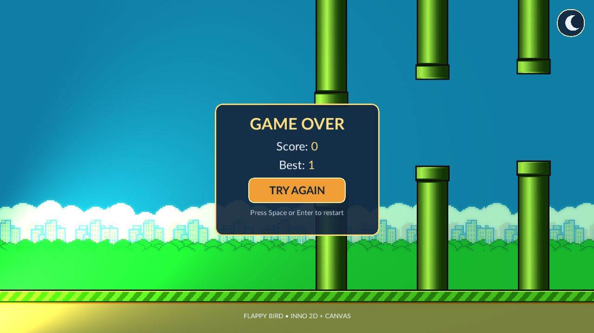
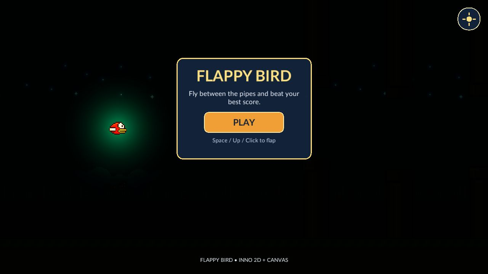
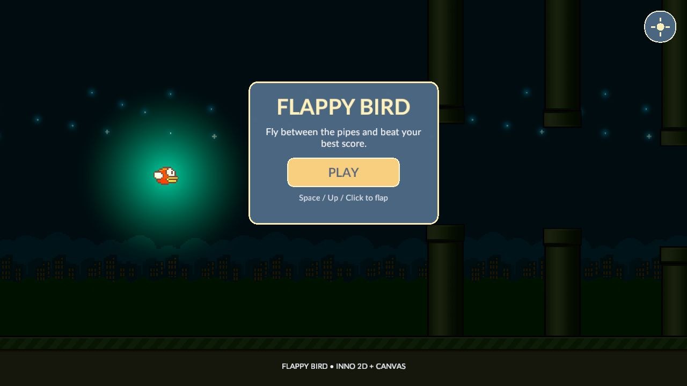
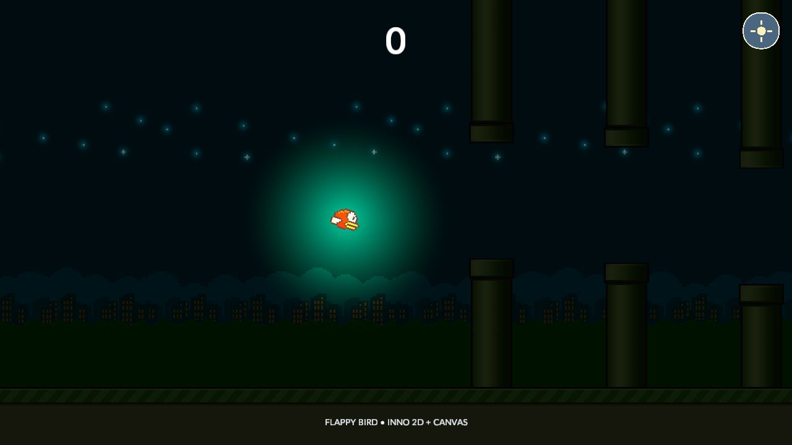
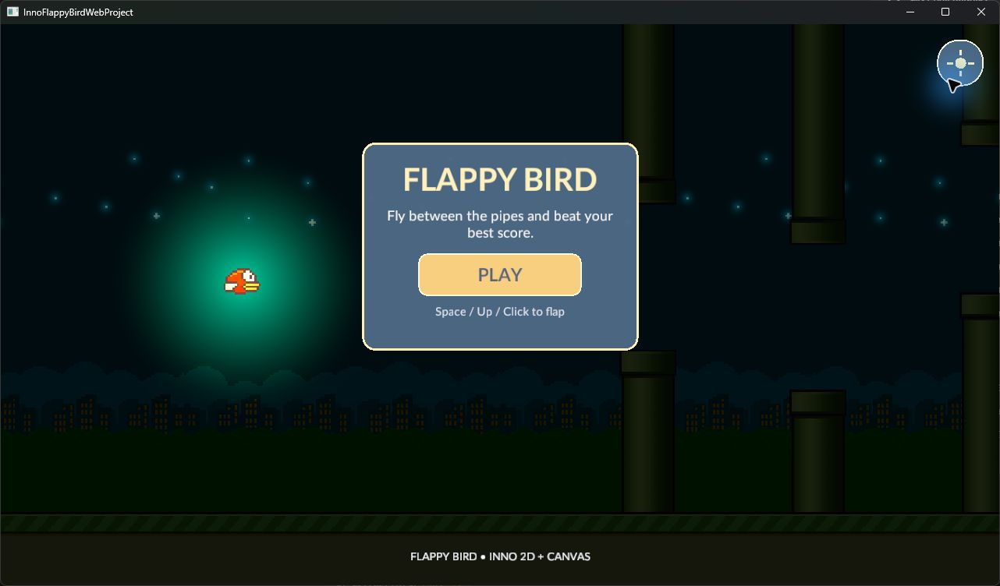

# Web Player 实现与验收（2026-10-01）

[架构索引](README.md) · [Wiki 首页](../README.md) · [Web 架构](WEB_PLAYER_ARCHITECTURE.md) · [Browser Build target](../platform/Browser/Inno.Build.Browser.md)

> 本页保留宿主重构之前的验收证据；其中独立 Browser Native 项目、BrowserAdapterCatalog、旧 CLI 与共享 Host 平台分支已经被当前重构删除。当前架构见 [Web 宿主边界](WEB_PLAYER_ARCHITECTURE.md)。以下历史运行结果不代替本轮重构验收。

## 交付边界

`browser-wasm` 已作为独立 `IGameBuildTarget` 注册到 Editor 和 Build CLI。通用 Build Pipeline 负责同一 Project 快照、runtime 脚本编译、Content Pack 和原子提交；浏览器 target 负责 WebGL 2 内容、每游戏 WASM 链接和静态站点。Windows/macOS 原生 target 没有引入浏览器分支。

Browser Support Pack 只包含目标引擎引用、wasm32 原生 archive、Browser Player 链接模板和必要的宿主源码。项目的 GameScripts/Plugin runtime 程序集在导出时与浏览器 Player 同次发布；浏览器从 Content Pack 初始化相同的 Scene、资产、脚本和 UI。`GamePlayerHost` 在浏览器使用已链接程序集和 `requestAnimationFrame`，浏览器 Storage adapter 将应用数据保存于同源 `localStorage`。WASM 所需的 SDL3、BGFX、MiniAudio、Text、UI 绑定按目标 ABI 单独生成，业务脚本不直接引用原生类型。

## Windows 实测

测试主机为 Windows x64，.NET 9 WebAssembly SDK/Emscripten 3.1.56。使用 `InnoEngine.Samples/FlappyBird` 的拷贝作为 Project，正式 Build CLI 导出到 `%TEMP%/FlappyBirdWebAcceptance3/InnoFlappyBirdWebProject-Web`。随后从仓库内的 wasm32 archive 重新生成 Browser Support Pack，再次正式导出到 `%TEMP%/FlappyBirdWebAcceptance4/InnoFlappyBirdWebProject-Web`。以下结果来自正式导出目录，由本机 HTTP 静态服务器托管；独立链接探针不计入这些结果。

| 验收项 | 结果与证据 |
| --- | --- |
| Build CLI 导出 | 两次 `--target browser-wasm` 均完成，日志报告 `Game build committed atomically`，进程退出码 0。第二次使用从仓库输入重建的 Browser Support Pack。 |
| 游戏内容 | 浏览器首屏显示 Scene、精灵、Canvas UI、字体和 WebGL 2 背景；点击 Play 后进入游戏。 |
| 输入与玩法 | 鼠标、Space、N 键有效；碰撞后出现 Game Over；Space/按钮可以重开；越过第一组水管显示得分 1。 |
| 持久化 | 得分 1 后刷新网页，再次失败显示 `Best: 1`，确认游戏的 `flappy-bird/best-score.txt` 通过 Browser Storage 跨刷新保留。 |
| 运行诊断 | 两次正式产物的浏览器 console error/warn 列表均为空；第二次产物再次确认首屏和 Play 进入游戏。 |
| 输出闭包 | 最终站点只有页面、运行时 Webcil/WASM、Content Pack 等文件；未发现 `.cs`、`.csproj`、`.dll`、`.pdb` 或 `.iplugin`。 |
| 公开契约测试 | `Inno.Build.Tests` 全套 32 项通过，其中包含 Browser Support Pack 成功与缺失输入边界；BGCS Emscripten opaque-handle emitter 测试通过。 |
| 架构与编译 | `Inno.Tooling.Architecture` 通过；Browser Player Debug 构建在排除不支持的 MiniAudio 绑定后为 0 警告、0 错误。 |
| 桌面回归 | Windows Player Release 构建 0 警告、0 错误；重新发布 `windows-x64` Support Pack 后，FlappyBird 的正式 Windows Build CLI 导出也完成原子提交，退出码 0。 |



## 颜色与光照回归验收

最终正式导出使用重新打包的 Rendering2D Plugin 和重新发布的 Browser Support Pack，输出位于 `%TEMP%/FlappyBirdWebAcceptance6/InnoFlappyBirdWebProject-Web`，由本机 HTTP 服务在 `http://127.0.0.1:51506/` 运行。Build CLI 报告 `Game build committed atomically`，退出码为 0；浏览器能加载首屏并进入 Play，鸟身待机上下浮动时光晕保持同一高度，console 的 error/warn 列表为空。上一轮同一行为修复的正式产物还验证了 Game Over。

浏览器的 WebGL 2 默认画布实测使用线性写入，且没有 `EXT_sRGB_write_control`；之前 BGFX 初始化把请求的 `SrgbBackbuffer` 当成已实现能力，导致最终线性颜色直接作为 sRGB 显示。此轮增加了设备契约与输出传递 Shader，但上述首屏检查漏掉了单模型实际使用的直接输出路径；后续夜景验收发现 FlappyBird 仍没有执行最终颜色转换。第 6 次导出的画面不能作为完整颜色修复已通过的证据，修复与最终结果见下节。

Rendering2D 原本按 `originBottomLeft` 再次反转光照纹理的片元 Y 坐标，而 WebGL 的片元坐标和离屏纹理都已采用相同的底部原点。移除这次额外翻转及其未再使用的 uniform 后，浏览器首屏与游玩时鸟身和青色光晕位于同一高度；待机动画向上和向下移动时光晕随鸟移动。原正式导出中可看到光晕偏向场景下方。此修复也适用于使用底部原点的其他图形后端。

回归验证：`Inno.Rendering.Runtime.Tests` 63 项通过（含多模型图层只执行一次最终传递的测试），`Inno.Adapter.Rendering.Bgfx.Tests` 28 项通过，架构验证器通过。Windows Player Release 构建为 0 警告、0 错误；重建 `windows-x64` Support Pack 后，同一项目和更新后的 Rendering2D Plugin 正式导出到 `%TEMP%/FlappyBirdWindowsAcceptance5/InnoFlappyBirdWebProject-Windows-x64`，原子提交且退出码为 0。当前只有 Windows 作者主机及本机 WebGL 浏览器的实际验收；macOS 浏览器和不同 GPU/浏览器组合仍需各自实机验收。

## 夜晚星星修复与最终验收

### 根因与修复

FlappyBird 只注册一个 Rendering2D 模型，Canvas 作为该模型中的 drawable 工作。`SubmitPrimaryOutput` 原先对单模型直接 `Submit`，绕过了最终输出颜色转换；因此上一轮新加的传递 Shader 并未在这个项目实际执行。低亮度星光、城市和地面被显示得接近黑色，并非星星资源未导入或玩法脚本未激活。

- 主输出根据设备的 `primaryPresentationEncodesSrgb` 能力选择路径。设备已编码时保持直接输出；设备未编码时，单模型和多模型都恰好执行一次最终转换。Render Runtime 中没有 Web 或 FlappyBird 专用判断。
- 单模型直接从图层执行最终转换，不增加合成中间纹理。多模型沿用声明的图层格式完成合成，再执行最终转换，避免用线性 RGBA8 中间纹理损失夜景暗部精度。
- `OutputTransfer.ishader` 的作者定义名称原先仍为 `Inno/Host/Composition`；已通过现有 Graph/Serialization 公开协议改成 `Inno/Host/OutputTransfer`，保留产物加载的严格名称校验。
- `ConsoleLogSink` 在浏览器调用终端颜色 API 会抛异常并被 Router 隔离，曾掩盖上述产物加载诊断。现在在不支持终端颜色的平台及重定向输出中交付普通文本，桌面彩色终端仍恢复原颜色。
- 扩展桌面后端验证时发现 shaderc 的原生 uniform 表会漏掉 OpenGL GLSL layout 声明。工具链复用已有词法器，从已编译 GLSL payload 反射实际声明与引用；OpenGL/OpenGLES 的有效绑定保留，无引用的绑定裁剪。该处理留在 BGFX 工具链，没有修改第三方源码或向中立层泄漏 GLSL。

公开行为调整：`RenderRuntime.SubmitComposition` 现在接受一个或多个非 null 图层；这允许 Host 在共享合成机制中完成单图层呈现。零图层继续明确失败，所有图层的 target/viewport 和格式能力仍校验。对应 Runtime Wiki 已同步。

### 最新正式产物

从最新仓库输入重建 Browser Support Pack 后，用同一 FlappyBird 拷贝与更新后的 Rendering2D Plugin 正式导出到 `%TEMP%/FlappyBirdWebAcceptance9/InnoFlappyBirdWebProject-Web`。Build CLI 报告 `Game build committed atomically`，退出码 0。`http://127.0.0.1:51506/` 已替换为该产物；验收通过真实键盘/鼠标输入进行，没有向游戏注入测试逻辑。

| 验收项 | 结果 |
| --- | --- |
| 白天与夜晚 | 最新产物首屏白天亮度正常；N 切换夜晚后，上部星星蓝色光晕、鸟身绿色光照以及暗部城市/地面可见。 |
| 夜景生命周期 | 已验证 Ready、Play、Game Over、Space 重开及刷新后重新切换夜晚；星星效果保持。 |
| 桌面对照 | 实际运行此前正式 Windows 产物的同一夜景，星星分布、光晕与整体亮度和修复后的 Web 画面一致。Windows 参考图包含系统标题栏，不作逐像素一致承诺。 |
| 运行诊断 | 独立正式验收 tab 的 console warn/error 列表为空；历史诊断探针产生的日志不计入正式结果。 |
| Runtime 测试 | 65 项通过；覆盖单模型硬件编码/软件编码，以及多模型仅执行一次最终转换和保留图层格式。 |
| BGFX 测试 | 31 项通过；实际加载 D3D11/D3D12/Vulkan/OpenGL 的合成及输出转换产物，另验证桌面 GLSL/WebGL profile 的有效与未使用 uniform 绑定。 |
| 日志测试 | 7 项通过；包含 Console sink 正常送达消息且不被隔离。 |
| 编译与架构 | Windows Player Release 0 警告、0 错误；仓库架构验证通过；`git diff --check` 通过。 |
| 输出闭包 | 最新静态站点没有 `.cs`、`.csproj`、`.dll`、`.pdb` 或 `.iplugin`。 |

修复前（第 6 次正式产物）：



最新 Web 夜景：





桌面参考：



## 平台与运行约束

Web 输出是普通静态站点，运行时要求 WebGL 2 和 HTTP(S) 托管；直接打开 `file://` 不能加载 WebAssembly 内容。Windows 和 macOS 作者端使用同一 browser target、链接模板和仓库内的 wasm32 原生 archive；导出主机需要安装 .NET 9 `wasm-tools`。本次只在 Windows 主机执行完整导出与浏览器测试，macOS 主机尚未实际运行这一验收。游戏的音频播放调用在开始、拍翅和计分路径中执行且没有报错；此环境未进行扬声器可听性采集，因此不将“实际可听”标为已验证。

## 工作区改动归属

当前未提交的内容包含此前多个任务，不能全部视为 Web 特例。

| 类别 | 主要位置 | 为什么需要 |
| --- | --- | --- |
| 浏览器目标与宿主 | `Inno.Build.Platform.Browser`、`Inno.Player.Browser`、Support Pack `BrowserLink` | WebGL 2 目标内容、WASM 静态链接、HTTP 内容加载和浏览器帧回调；复用共同 Build Pipeline、Scene、游戏脚本和内容闭包。 |
| 浏览器存储与 ABI | `Inno.Adapter.Storage.Browser`、五个 `Inno.Native.*.Browser` 项目、`BrowserNative`、SjLj shim | 同源持久化、wasm32 布局及静态 native archive。生成绑定文件较大；SjLj shim 只解决已记录的 Emscripten/LLVM 工具链 ABI，不进入游戏或服务层。 |
| 共用运行机制 | Shell、Rendering Runtime、BGFX Adapter/工具链、Core Logging | 宿主驱动的帧入口、设备呈现能力、一次最终颜色转换、真实 GLSL 绑定反射与可用的日志交付。光照坐标修复位于 Rendering2D Plugin，并非 FlappyBird 专用分支。 |
| 此前 Editor 修复 | Editor ImGui、各 Panel、Export Modal、Game View 输入捕获 | 表单 2:3、滚动 owner、受限下拉框、小地图、导出 modal 关闭和 UI 前景命中/输入焦点，与 Web Player 的运行画面无关。 |
| 验证与文档 | tests、Wiki、AGENTS、solution | 公开契约回归、架构归属和使用规范。solution 已清除工具自动加入的无关 x64/x86 配置，只保留八个浏览器项目的必要新增项。 |

确实存在平台适配：共享 `GamePlayerHost` 根据浏览器选择单线程渲染/Jobs、受控虚拟内容目录和已链接程序集；Logging 在浏览器不创建 worker。它们反映当前平台执行条件，不能称为“完全没有 Web 分支”。本轮检查的浏览器宿主、存储、Build target 和链接输入没有 TODO/未实现占位或关闭星星的特殊路径；没有改写 FlappyBird 玩法、提高夜晚亮度参数或添加另一套网页游戏。该检查也不代表整个仓库不存在任何其他未使用代码。

本轮保留全部待审阅改动，没有创建 commit。工作区已有的其他修改不被清除或混同为本轮修复。

## 相关命令

```text
dotnet run --project src/composition/editor/host/Inno.Editor.Build.Cli/Inno.Editor.Build.Cli.csproj --configuration Release -- game --project <FlappyBird Project> --support-packs <SupportPacks root> --output <destination> --target browser-wasm --startup-scene FlappyBird/FlappyBird.iscene
```

浏览器 Support Pack 通过 `Inno.Build.SupportPacks --target browser-wasm` 或源码工作区的缺包供给器构建。导出失败与取消沿用通用 Build staging/atomic commit，链接子进程收到取消后会终止，不交付半成品目录。
