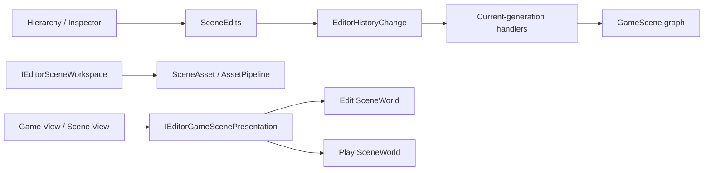

# Inno.Editor.Scene

[Editor 索引](README.md) · [Interactions](Inno.Editor.Interactions.md) · [Scene](../scene/Inno.Scene.md)

`Inno.Editor.Scene` 是 Scene 领域的 Editor feature，不是 Panel。它拥有 Scene document workspace、统一的 `SceneEdits` 修改门面，以及把 Scene 修改解释为中立 Undo/Redo payload 的 Handler。Hierarchy 和 Inspector 只负责收集用户意图与绘制，不再各自实现 Scene 快照或恢复算法。

## 边界与依赖



- `IEditorSceneWorkspace` 是当前 Edit/Play presentation 与 Open/Save 工作流契约；internal `EditorSceneWorkspace` Module 管理 Edit 文档、source path、dirty baseline、selection 映射与 `editor.ini` 状态。
- `IEditorGameScenePresentation` 是 Game View 与 Scene View 的只读游戏场景来源；它在 Play 世界完整物化成功后才从 Edit SceneWorld 原子切换到 Play SceneWorld。
- `SceneEdits` 是 Scene 内容修改的唯一高层入口，负责“修改成功后记录最小可逆数据”。
- History Handler 根据 persistent ID 和 Stable Type ID 在当前 generation 重新解析对象，不保留旧实例。
- `Inno.Scene` 提供通用 property/subtree/element 序列化能力，但不知道 Editor History；`Inno.Scene.Assets` 只负责导入器。
- Scene feature 通过 [Inno.Editor.Core](Inno.Editor.Core.md) 中 `EditorReloadCoordinator` 的中立 participant contract 接入 assembly reload，并自行拥有 Scene migration、Coroutine 清理和 Missing/reload diagnostics；`Inno.Editor.Scripting` 不引用 Scene 项目或 Scene 类型。
- `EditorReloadCoordinator.Register` 返回的 registration lease 强持有 participant，而 Coordinator 只保留弱引用。只要 Workspace 持有 lease，GC 就不能移除 Scene migration；Workspace Dispose 会注销并释放 participant，避免新 TypeCache 激活后仍遗留旧 collectible `Type` 的 Component/System。该所有权契约适用于所有 Editor reload feature，不是 Scene 私有补丁。

## 公共 API

### IEditorSceneWorkspace

| 成员 | 作用 |
| --- | --- |
| `scenes` / `activeScene` | Edit 时查询 authoring Scene；Play 时查询同 persistent ID 的 runtime copy。 |
| `canPersist` | 当前 Scene 是否是可保存的 Edit 文档；Play runtime copy 为 `false`。 |
| `Open(path)` | additive 打开 Scene asset。 |
| `Save(scene, directory)` | 保存到已有 source；未保存 Scene 在调用方提供的 fallback directory 创建 Asset。 |
| `SaveToDirectory(scene, directory)` | 显式保存到目标 Asset directory。 |
| `SavePrefab(gameObject, directory)` | 从 GameObject 子树保存 PrefabAsset。 |
| `IsDirty(scene)` | Edit 时比较序列化 hash、source path 与文件名；Play copy 恒为 `false`。比较或 source 同步失败时保守返回 dirty，并发布 Scene Diagnostic。 |
| `TryGetSourcePath(scene, out path)` | 查询保存后的 source-relative path。 |

具体 `EditorSceneWorkspace`、构造函数、Create/Close/Clear/Refresh 和 history/document helpers 均为 internal；可逆的 Scene 文档修改必须经 `SceneEdits`。该 Module 通过标准 protected Capture/Restore hooks 只把已保存 Scene 的顺序与 active Scene 写入 `[InnoEditor][Module.scene-workspace]`。Selection 属于当前 Editor session，不写入项目设置。未保存 Scene 内容和 dirty 内存同样不会写入 `editor.ini`；它们必须保存为 `.iscene`。

Scene setup 因缺少 Stable Type ID 或反序列化失败而暂时无法恢复时，Workspace 保留 pending setup 并发布 `Scene Workspace Restore` Diagnostic。TypeCache generation 或 Asset Database 变化后会重新尝试，成功才清除。每帧可重试的 document synchronization 使用 Scene persistent ID 维护独立 Diagnostic；相同异常只在首次出现时写入 Log，恢复、关闭 Scene 或停止 Workspace 都会清理对应状态。Missing Scene 被明确跳过属于历史事件，因此只写 Log warning。

`IsDirty` 的序列化比较失败另在 `Scene Dirty Check` 组发布诊断；下一次成功比较后清除。它仍按现有 0.1 秒节流做完整序列化 hash，以保持任意脚本或 Inspector 改动都能被观察，不把未覆盖的变更通知机制伪装成可靠 dirty 结果。

Asset Browser 移动或重命名已加载 Scene 的 source（包括移动其父目录）时，Workspace 会同步 document path、persistent source identity 与 Scene 显示名。source relocation 是文件元数据变化，不是 Scene 内容编辑：`IsDirty` 会先消费已提交的 source move，因此同一 UI frame 的 Hierarchy 绘制也不会短暂出现 `*`；原本 clean 的文档在同步显示名后重建保存基线，原本 dirty 的文档则保持 dirty，移动操作不会掩盖已有内容修改。

dirty baseline 也不会把任意 Asset 引用的 `lastKnownPath` 当成 Scene 内容。Scene/Prefab 的真实落盘仍保留该路径提示，但 Workspace 的语义 hash 只比较 persistent asset identity、Stable Type ID 与 Scene property state。因此 File Browser 对 SceneAsset 或其他被引用 Asset 的 Rename/Move 不会使引用它的 loaded Scene 显示 `*`；引用被用户替换为另一个 persistent asset 才属于真实内容变化。

脚本 Component/System 在 reload 中进入或退出 Missing 同样不是用户数据编辑。Scene serializer 保持原逻辑类型与 property payload 的规范表示；Workspace reload participant 还会在迁移前强制判定每个文档原本是否 dirty，并在整次迁移成功后只为原本 clean 的文档重建保存基线。因此即使恢复后的脚本增加了带默认值的序列化属性，Hierarchy 也不会把 generation migration 显示成用户造成的 `*`。原本 dirty 的文档绝不会被 rebase 掩盖，Missing 期间对其他 Scene 数据的真实修改仍正常保持 dirty、可以保存，并且不会破坏未来的原位恢复。恢复是否完整由原子 reload 事务和精确 diagnostics 判断，而不复用 dirty 标记：构造、属性或引用恢复不兼容会报告对应问题；事务失败则恢复旧 generation 与旧 dirty baseline。

Scene Missing 是当前状态诊断，而不是 Scripting 编译诊断。Workspace 启动、loaded Scene 集合变化或 TypeCache generation 变化后的下一次主线程更新，会完整替换 `Missing Scene Scripts` 诊断组；因此刚打开的 Scene 若含 Missing 会立即出现在 Console，类型恢复或 Scene 关闭后也会被清除。协调 reload 的成功、失败恢复与无变化 diagnostics refresh 由 Scene 自己响应，不要求 Scripting 理解 Scene。

### IEditorGameScenePresentation

这是 viewport presentation 与 Scene owner 之间唯一的 Edit/Play 场景协议：

| 成员 | 作用 |
| --- | --- |
| `Capture()` | 返回调用者必须释放的共享 `ContentReadScope`，不强持有 Scene 或 session。 |
| `ContentReadScope.contents` / `activeContent` | 同一次捕获的有序 Identity 值与可空 active persistent ID。 |
| `GetValues<GameScene>()` / `TryGetValue<GameScene>(...)` | 在当前操作内经过 Identity domain 与 runtime generation 校验再解析对象；退休后的旧 identity 不会跳转到新 session。 |

该接口不暴露 `RuntimeSession`、可切换 setter、Rendering 类型或生命周期操作。Viewport 直接把同一个 scope 交给 Rendering 消费，不再复制整组 GameScene 引用。`using ContentReadScope content = presentation.Capture();` 的使用者必须在本次操作内复制需要的领域值并释放 scope，不得缓存解析出的 live object。Play lease 退出只切换 presentation；Scene 的真正退休仍由 RuntimeSession 完成。Hierarchy、Inspector 和 Scene Action 通过 `IEditorSceneWorkspace`/`SceneEdits` 操作当前 world。Play 修改只进入 runtime copy 与临时 History 分支，Edit 文档所有权没有转移。

### IEditorScenePlayMode

该公开接口是 [Play Mode](Inno.Editor.PlayMode.md) 的跨程序集基础设施，不是普通 Scene 编辑入口：

| 成员 | 作用 |
| --- | --- |
| `BeginPlayMode(runtimeSession)` | 捕获完整 Edit scene setup，把同 persistent ID 的独立对象图物化到 Play `RuntimeSession`，提交 presentation/selection 切换并返回幂等 lease。 |
| 返回 lease 的 `Dispose()` | 停止向 Game View 与 Scene View 呈现 Play Scene；Edit Scene 从未被替换，因此无需反序列化恢复。 |

物化是候选事务：目标 world 非空、快照捕获失败或任一 Scene 反序列化失败时，会清空候选 Play world，所有 Editor feature 继续指向 Edit world。只有全部 Scene、顺序和 active Scene 都准备完成后才发布 Play lease，并按 persistent ID 把 Selection 映射到 runtime copy。`CanEdit` 对当前 Play world 中的 Project scene 与临时 scene 返回 true，Inspector、Hierarchy 和 Scene gizmo 可通过 `SceneEdits` 修改运行副本；同 persistent ID 的 Edit world 对象不因此变成可编辑目标。Play History 使用独立分支，退出时销毁 Play world 和该分支，原 Edit world 与 Undo/Redo 状态恢复。Play session 活动期间 Workspace 不消费 Asset source change、不把 runtime graph 写入 `editor.ini`，并禁止 Scene/Prefab Open/Save；排队的 source change 在退出后才应用到始终保留的 Edit 文档。

### SceneEdits

| 分类 | 成员 |
| --- | --- |
| Scene 文档 | `CreateScene`、`CloseScene`、`SetSceneIndex` |
| GameObject | `CreateGameObject`、`InstantiatePrefab`、`DeleteGameObject`、`RenameGameObject`、`SetGameObjectActive`、`SetGameObjectTag`、`SetGameObjectLayer`、`ChangeHierarchy` |
| Component | `AddComponent`、`RemoveComponent`、`ResetComponent`、`SetComponentIndex` |
| System | `AddSystem`、`RemoveSystem`、`ResetSystem`、`SetSystemIndex` |
| 属性 | `ChangeProperty` |

Action 只需要注入该 Module：

```csharp
[EditorAction("animation.add-controller", "scene/hierarchy")]
public sealed class AddAnimationControllerAction(SceneEdits edits)
    : EditorAction<GameObject>
{
    protected override void Execute(EditorActionContext<GameObject> context)
        => edits.AddComponent(
            context.target,
            typeof(AnimationController),
            "Add Animation Controller");
}
```

`InstantiatePrefab` 使用当前 workspace 的 Serialization/Asset generation，在 active Scene（或显式 scene/parent）中创建实例，并把完整新 subtree 记录为一次可撤销编辑；失败会销毁尚未记录的实例。File Browser 的 Prefab 双击和右键 Instantiate 都调用这一个入口。扩展不需要知道 History protocol、序列化格式或 Handler。若未来 Animation Graph 有自己的数据模型，应由 Animation Editor Module 采用相同模式提供 `AnimationEdits`，而不是把 Animation 特例塞进 `SceneEdits`。

## 最小历史数据

| 修改 | payload |
| --- | --- |
| serializable property | target persistent ID、root property key、before/after property bytes |
| name / active / tag | target persistent ID、scalar kind、before/after value |
| Component/System | owner、element persistent ID、Stable Type ID、before/after index、property bytes、incoming references |
| GameObject create/delete | Scene/root/parent ID、sibling index、仅该 subtree bytes、incoming references |
| hierarchy | 受影响对象的 before/after parent ID 与 sibling index |
| Scene order | Scene persistent ID 与两个 index |
| Scene create/close | 一个 document 的 Scene bytes、source identity、dirty baseline、active/selection IDs |

因此修改一个 `int` 不会序列化整张 Scene。只有删除一棵 GameObject 子树或关闭一个 Scene document 时，payload 才与实际被移除的数据规模相关；超过 History inline threshold 后自动存到磁盘。

## 原子性与热重载

- Property/Scalar restore 在应用前捕获实际 rollback bytes/value，并检查严格恢复结果。
- Component/System 与 Subtree 同时捕获 element/subtree、index、parent、state 和受影响 incoming references；恢复任一步失败都会逆序删除候选并还原原引用。
- Hierarchy 与 Scene order 先捕获真实 placement/index；正向和反向 placement 都检查结构化结果。
- Scene document 把 loaded document、source path、active scene、dirty baseline 作为一个领域事务；Selection/焦点只在成功后 best-effort 通知，不决定 History 成败。
- `SceneEdits` 对 after capture、payload/blob 创建或 `RecordApplied` 失败执行严格 before rollback；补偿也失败时抛出包含两侧原因的聚合异常，禁止留下未记录修改。
- Subtree/Element Handler 的失败补偿以 persistent identity 的实际 postcondition 分类：目标仍注册且存活时必须返回 `statePreserved=false`；回调即使抛异常，只要目标已彻底移除就不会误报状态丢失。恢复新元素后的 incoming-reference 失败也同时检查引用回滚与元素清理两个结果。
- 类型由 Stable Type ID 在当前 TypeCache generation 解析。Undo 创建元素时类型 Missing 不再直接阻断，而是按原 ID/index/state 恢复 Missing Component/System；已存在占位的类型匹配使用其逻辑 Stable Type ID，不使用 placeholder 的实现类型。目标 owner 不可用、Handler 缺失或无法原子恢复时仍形成 barrier，原栈保持不变。
- Element History 保存统一 `SceneElementSerialization.CaptureState` 的中立 bytes，包含类型名、属性、Asset dependencies 和 Scene reference aliases。Missing 元素的删除、移动和 Undo 保留这些值；相同类型恢复后原 Redo 继续作用于同一 persistent ID。
- 脚本 reload 后中立 payload 保留，Handler Registry 切换到新 generation；History 不固定旧 ALC。

## 相关序列化 API

`ScenePropertySerialization`、`SceneSubtreeSerialization` 和 `SceneElementSerialization` 位于 [Inno.Scene](../scene/Inno.Scene.md)，不是 Importer 程序集。它们不引用 Editor。普通 property History 仍保存单 property-data；Element History 则使用独立元素状态封套，通过同一个 Core Serialization 和 owner context 编码，不序列化整个 Scene，也不增加 legacy reader。

## Scripting API

EditorScripts 显式 `using InnoEditor.Scene;` 后只看到 `IEditorSceneWorkspace` 与 `SceneEdits`。`IEditorScenePlayMode` 和 `IEditorGameScenePresentation` 是 host/Panel 协调协议，不在脚本清单中；Play 控制使用 `InnoEditor.PlayMode.IEditorPlayMode`。concrete Workspace、构造/关闭/清空/刷新 helper、History payload、引用扫描器和 Handler 不导出；工作流通过接口，所有可逆 Scene 数据修改通过 `SceneEdits`。

## 当前源码公开 API 清单

以下仅列出当前程序集自己声明的 public/protected 契约；继承成员遵循所属基类页面。internal/private 实现不作为稳定公开 API。签名依据当前源码语义模型生成，行为、参数、异常与所有权说明同时以对应英文 XML 为准。

### `Inno.Editor.Scene.EditorSceneWorkspaceFactory`

| 当前声明 | 行为 |
| --- | --- |
| [`static Inno.Editor.Scene.EditorSceneWorkspaceHost Inno.Editor.Scene.EditorSceneWorkspaceFactory.Create(Inno.Runtime.RuntimeSession runtimeSession, Inno.Assets.Pipeline.AssetPipeline assets, Inno.Extensibility.Types.TypeCatalog types, Inno.Core.Serialization.SerializationRegistry serialization, Inno.Core.Logging.LogRouter logs, Inno.Editor.Interactions.IEditorSelectionCoordinator? selection = null)`](../../src/composition/editor/features/Inno.Editor.Scene/Documents/EditorSceneWorkspaceFactory.cs#L44) | Creates an unattached workspace over explicitly owned Edit-session services. |
| [`Inno.Editor.Scene.EditorSceneWorkspaceFactory`](../../src/composition/editor/features/Inno.Editor.Scene/Documents/EditorSceneWorkspaceFactory.cs#L15) | Creates explicitly owned editor scene workspaces for embedded editor hosts and command-line tooling. |

### `Inno.Editor.Scene.EditorSceneWorkspaceHost`

| 当前声明 | 行为 |
| --- | --- |
| [`void Inno.Editor.Scene.EditorSceneWorkspaceHost.Dispose()`](../../src/composition/editor/features/Inno.Editor.Scene/Documents/EditorSceneWorkspaceHost.cs#L58) | Releases the workspace and any isolated scene session that it still owns. |
| [`Inno.Editor.Scene.IEditorGameScenePresentation Inno.Editor.Scene.EditorSceneWorkspaceHost.gamePresentation`](../../src/composition/editor/features/Inno.Editor.Scene/Documents/EditorSceneWorkspaceHost.cs#L48) | Gets the Edit-or-Play rendering presentation boundary owned by this host. |
| [`Inno.Editor.Scene.IEditorScenePlayMode Inno.Editor.Scene.EditorSceneWorkspaceHost.playMode`](../../src/composition/editor/features/Inno.Editor.Scene/Documents/EditorSceneWorkspaceHost.cs#L53) | Gets the isolated Play Mode scene-session boundary owned by this host. |
| [`Inno.Editor.Scene.IEditorSceneWorkspace Inno.Editor.Scene.EditorSceneWorkspaceHost.workspace`](../../src/composition/editor/features/Inno.Editor.Scene/Documents/EditorSceneWorkspaceHost.cs#L43) | Gets the Edit-or-Play scene presentation and persistence boundary owned by this host. |
| [`Inno.Editor.Scene.EditorSceneWorkspaceHost`](../../src/composition/editor/features/Inno.Editor.Scene/Documents/EditorSceneWorkspaceHost.cs#L17) | Owns an editor scene workspace created outside the attribute-discovered editor application. |

### `Inno.Editor.Scene.IEditorGameScenePresentation`

| 当前声明 | 行为 |
| --- | --- |
| [`Inno.References.ContentReadScope Inno.Editor.Scene.IEditorGameScenePresentation.Capture()`](../../src/composition/editor/features/Inno.Editor.Scene/Presentation/IEditorGameScenePresentation.cs#L19) | Captures one coherent game-scene presentation for the current Editor frame. |
| [`Inno.Editor.Scene.IEditorGameScenePresentation`](../../src/composition/editor/features/Inno.Editor.Scene/Presentation/IEditorGameScenePresentation.cs#L9) | Supplies the scene set that represents the game to Editor viewport consumers without exposing runtime-session ownership. |

### `Inno.Editor.Scene.IEditorScenePlayMode`

| 当前声明 | 行为 |
| --- | --- |
| [`System.IDisposable Inno.Editor.Scene.IEditorScenePlayMode.BeginPlayMode(Inno.Runtime.RuntimeSession runtimeSession)`](../../src/composition/editor/features/Inno.Editor.Scene/Documents/IEditorScenePlayMode.cs#L30) | Captures the editable scene set and materializes independent runtime copies in the supplied session. |
| [`Inno.Editor.Scene.IEditorScenePlayMode`](../../src/composition/editor/features/Inno.Editor.Scene/Documents/IEditorScenePlayMode.cs#L10) | Creates isolated runtime scene sessions from the current editable scene set. |

### `Inno.Editor.Scene.IEditorSceneWorkspace`

| 当前声明 | 行为 |
| --- | --- |
| [`bool Inno.Editor.Scene.IEditorSceneWorkspace.CanEdit(Inno.Scene.GameScene scene)`](../../src/composition/editor/features/Inno.Editor.Scene/Documents/IEditorSceneWorkspace.cs#L37) | Gets whether a loaded scene may be changed in the current Edit or isolated Play world. |
| [`bool Inno.Editor.Scene.IEditorSceneWorkspace.IsDirty(Inno.Scene.GameScene scene)`](../../src/composition/editor/features/Inno.Editor.Scene/Documents/IEditorSceneWorkspace.cs#L63) | Gets whether an Edit scene contains unsaved serialized changes. |
| [`Inno.Scene.GameScene Inno.Editor.Scene.IEditorSceneWorkspace.Open(string relativePath)`](../../src/composition/editor/features/Inno.Editor.Scene/Documents/IEditorSceneWorkspace.cs#L77) | Opens a scene asset additively as the active editor scene. |
| [`string Inno.Editor.Scene.IEditorSceneWorkspace.Save(Inno.Scene.GameScene scene, string currentDirectory)`](../../src/composition/editor/features/Inno.Editor.Scene/Documents/IEditorSceneWorkspace.cs#L94) | Saves a scene to its existing path or into a fallback directory. |
| [`string Inno.Editor.Scene.IEditorSceneWorkspace.SavePrefab(Inno.Scene.GameObject gameObject, string currentDirectory)`](../../src/composition/editor/features/Inno.Editor.Scene/Documents/IEditorSceneWorkspace.cs#L134) | Captures a game object subtree as a prefab in the requested directory. |
| [`string Inno.Editor.Scene.IEditorSceneWorkspace.SaveToDirectory(Inno.Scene.GameScene scene, string currentDirectory)`](../../src/composition/editor/features/Inno.Editor.Scene/Documents/IEditorSceneWorkspace.cs#L114) | Saves a scene into the requested asset directory. |
| [`void Inno.Editor.Scene.IEditorSceneWorkspace.SetActiveScene(Inno.Scene.GameScene scene)`](../../src/composition/editor/features/Inno.Editor.Scene/Documents/IEditorSceneWorkspace.cs#L51) | Makes one presented scene active without changing scene order. |
| [`bool Inno.Editor.Scene.IEditorSceneWorkspace.TryGetSourcePath(Inno.Scene.GameScene scene, out string relativePath)`](../../src/composition/editor/features/Inno.Editor.Scene/Documents/IEditorSceneWorkspace.cs#L151) | Tries to get the current source-relative asset path of a saved scene. |
| [`Inno.Scene.GameScene? Inno.Editor.Scene.IEditorSceneWorkspace.activeScene`](../../src/composition/editor/features/Inno.Editor.Scene/Documents/IEditorSceneWorkspace.cs#L20) | Gets the active scene from the currently presented Edit or Play world. |
| [`bool Inno.Editor.Scene.IEditorSceneWorkspace.canPersist`](../../src/composition/editor/features/Inno.Editor.Scene/Documents/IEditorSceneWorkspace.cs#L25) | Gets whether the currently presented scenes are authoring documents that may be persisted. |
| [`System.Collections.Generic.IReadOnlyList<Inno.Scene.GameScene> Inno.Editor.Scene.IEditorSceneWorkspace.scenes`](../../src/composition/editor/features/Inno.Editor.Scene/Documents/IEditorSceneWorkspace.cs#L15) | Gets the Edit scenes outside Play Mode or the isolated runtime copies while Play Mode is active. |
| [`Inno.Editor.Scene.IEditorSceneWorkspace`](../../src/composition/editor/features/Inno.Editor.Scene/Documents/IEditorSceneWorkspace.cs#L10) | Exposes the active Edit or Play scene presentation and the persistence operations available to it. |

### `Inno.Editor.Scene.SceneEdits`

| 当前声明 | 行为 |
| --- | --- |
| [`Inno.Scene.GameComponent Inno.Editor.Scene.SceneEdits.AddComponent(Inno.Scene.GameObject owner, System.Type componentType, string? historyName = null)`](../../src/composition/editor/features/Inno.Editor.Scene/Documents/SceneEdits.Elements.cs#L33) | Adds one component and records its identity, stable type, index, and persistent properties. |
| [`Inno.Scene.GameSystem Inno.Editor.Scene.SceneEdits.AddSystem(Inno.Scene.GameScene scene, System.Type systemType, string? historyName = null)`](../../src/composition/editor/features/Inno.Editor.Scene/Documents/SceneEdits.Elements.cs#L283) | Adds one scene system and records its identity, stable type, index, and persistent properties. |
| [`bool Inno.Editor.Scene.SceneEdits.CanEdit(Inno.Scene.EngineObject target)`](../../src/composition/editor/features/Inno.Editor.Scene/Documents/SceneEdits.cs#L63) | Gets whether a scene object belongs to an editable presented scene. |
| [`bool Inno.Editor.Scene.SceneEdits.CanEdit(Inno.Scene.GameScene scene)`](../../src/composition/editor/features/Inno.Editor.Scene/Documents/SceneEdits.cs#L52) | Gets whether the scene is editable in the current Edit or isolated Play world. |
| [`bool Inno.Editor.Scene.SceneEdits.ChangeHierarchy(Inno.Scene.GameObject gameObject, System.Action<Inno.Editor.Scene.SceneHierarchyEdit> mutation, string historyName = "Move GameObject", System.Collections.Generic.IReadOnlyCollection<Inno.Scene.GameObject>? relatedObjects = null)`](../../src/composition/editor/features/Inno.Editor.Scene/Documents/SceneEdits.Hierarchy.cs#L80) | Applies a hierarchy mutation and records only the affected parent and sibling-index tuples. |
| [`bool Inno.Editor.Scene.SceneEdits.ChangeProperty(Inno.Scene.EngineObject target, string propertyName, System.Action mutation, string historyName, string? mergeKey = null)`](../../src/composition/editor/features/Inno.Editor.Scene/Documents/SceneEdits.Properties.cs#L210) | Applies a mutation to one serializable scene property and records only its before and after values. |
| [`bool Inno.Editor.Scene.SceneEdits.CloseScene(Inno.Scene.GameScene scene, string historyName = "Close Scene")`](../../src/composition/editor/features/Inno.Editor.Scene/Documents/SceneEdits.cs#L130) | Closes one loaded scene without deleting its source asset and records a reversible document change. |
| [`Inno.Scene.GameObject Inno.Editor.Scene.SceneEdits.CreateGameObject(Inno.Scene.GameScene scene, Inno.Scene.Components.Transform? parent = null, string historyName = "Create GameObject")`](../../src/composition/editor/features/Inno.Editor.Scene/Documents/SceneEdits.Objects.cs#L33) | Creates a GameObject, optionally parents it, and records only the new subtree state. |
| [`Inno.Scene.GameScene Inno.Editor.Scene.SceneEdits.CreateScene(string historyName = "Create Scene")`](../../src/composition/editor/features/Inno.Editor.Scene/Documents/SceneEdits.cs#L87) | Creates an additive scene and records a reversible document change. |
| [`bool Inno.Editor.Scene.SceneEdits.DeleteGameObject(Inno.Scene.GameObject gameObject, string historyName = "Delete GameObject")`](../../src/composition/editor/features/Inno.Editor.Scene/Documents/SceneEdits.Objects.cs#L150) | Deletes a GameObject subtree and records only that subtree plus incoming serialized references. |
| [`Inno.Scene.GameObject Inno.Editor.Scene.SceneEdits.InstantiatePrefab(Inno.Scene.PrefabAsset prefab, Inno.Scene.GameScene scene, Inno.Scene.Components.Transform? parent = null, string historyName = "Instantiate Prefab")`](../../src/composition/editor/features/Inno.Editor.Scene/Documents/SceneEdits.Objects.cs#L91) | Instantiates a prefab into a loaded scene and records the created subtree as one reversible edit. |
| [`bool Inno.Editor.Scene.SceneEdits.RemoveComponent(Inno.Scene.GameComponent component, string? historyName = null)`](../../src/composition/editor/features/Inno.Editor.Scene/Documents/SceneEdits.Elements.cs#L90) | Removes the component from its scene owner and records a reversible serialized history change. |
| [`bool Inno.Editor.Scene.SceneEdits.RemoveSystem(Inno.Scene.GameScene scene, Inno.Scene.GameSystem system, string? historyName = null)`](../../src/composition/editor/features/Inno.Editor.Scene/Documents/SceneEdits.Elements.cs#L341) | Removes the system from its scene and records a reversible serialized history change. |
| [`void Inno.Editor.Scene.SceneEdits.RenameGameObject(Inno.Scene.GameObject gameObject, string name, string historyName = "Rename GameObject")`](../../src/composition/editor/features/Inno.Editor.Scene/Documents/SceneEdits.Properties.cs#L61) | Renames a live GameObject and records the two display strings. |
| [`void Inno.Editor.Scene.SceneEdits.RenameScene(Inno.Scene.GameScene scene, string name, string historyName = "Rename Scene")`](../../src/composition/editor/features/Inno.Editor.Scene/Documents/SceneEdits.Properties.cs#L30) | Renames a loaded scene and records the two display strings. |
| [`void Inno.Editor.Scene.SceneEdits.ResetComponent(Inno.Scene.GameComponent component, string? historyName = null)`](../../src/composition/editor/features/Inno.Editor.Scene/Documents/SceneEdits.Elements.cs#L165) | Resets one component and records its compact property state before and after Reset. |
| [`void Inno.Editor.Scene.SceneEdits.ResetSystem(Inno.Scene.GameScene scene, Inno.Scene.GameSystem system, string? historyName = null)`](../../src/composition/editor/features/Inno.Editor.Scene/Documents/SceneEdits.Elements.cs#L419) | Resets one scene system and records its compact property state before and after Reset. |
| [`void Inno.Editor.Scene.SceneEdits.SetComponentIndex(Inno.Scene.GameComponent component, int componentIndex, string historyName = "Move Component")`](../../src/composition/editor/features/Inno.Editor.Scene/Documents/SceneEdits.Elements.cs#L225) | Moves an attached component and records only its two attachment indices. |
| [`void Inno.Editor.Scene.SceneEdits.SetGameObjectActive(Inno.Scene.GameObject gameObject, bool active, string? historyName = null)`](../../src/composition/editor/features/Inno.Editor.Scene/Documents/SceneEdits.Properties.cs#L92) | Changes the explicit active state of a GameObject and records the two Boolean values. |
| [`void Inno.Editor.Scene.SceneEdits.SetGameObjectLayer(Inno.Scene.GameObject gameObject, Inno.Scene.Layers.GameLayer layer, string historyName = "Set GameObject Layer")`](../../src/composition/editor/features/Inno.Editor.Scene/Documents/SceneEdits.Properties.cs#L169) | Changes the layer of a live GameObject and records the two stable numeric layer slots. |
| [`void Inno.Editor.Scene.SceneEdits.SetGameObjectTag(Inno.Scene.GameObject gameObject, string tag, string historyName = "Set GameObject Tag")`](../../src/composition/editor/features/Inno.Editor.Scene/Documents/SceneEdits.Properties.cs#L130) | Changes the tag of a live GameObject and records the two ordinal tag strings. |
| [`void Inno.Editor.Scene.SceneEdits.SetSceneIndex(Inno.Scene.GameScene scene, int sceneIndex, string historyName = "Reorder Scene")`](../../src/composition/editor/features/Inno.Editor.Scene/Documents/SceneEdits.Hierarchy.cs#L30) | Moves a loaded scene to a hierarchy index and records the two integer positions. |
| [`void Inno.Editor.Scene.SceneEdits.SetSystemIndex(Inno.Scene.GameScene scene, Inno.Scene.GameSystem system, int systemIndex, string historyName = "Move System")`](../../src/composition/editor/features/Inno.Editor.Scene/Documents/SceneEdits.Elements.cs#L483) | Moves a registered system and records only its two display indices. |
| [`Inno.Editor.Scene.SceneEdits`](../../src/composition/editor/features/Inno.Editor.Scene/Documents/SceneEdits.cs#L19) | Applies scene-document mutations and records compact, reload-safe inverse data in editor history. |

### `Inno.Editor.Scene.SceneHierarchyEdit`

| 当前声明 | 行为 |
| --- | --- |
| [`void Inno.Editor.Scene.SceneHierarchyEdit.MoveToScene(Inno.Scene.GameObject gameObject, Inno.Scene.GameScene destination)`](../../src/composition/editor/features/Inno.Editor.Scene/Documents/SceneHierarchyEdit.cs#L34) | Moves a live GameObject subtree into another scene owned by the current editor world. |
| [`Inno.Editor.Scene.SceneHierarchyEdit`](../../src/composition/editor/features/Inno.Editor.Scene/Documents/SceneHierarchyEdit.cs#L10) | Exposes world-owned hierarchy operations inside one atomic scene history mutation. |

## 项目依赖

- [Inno.Assets](../assets/Inno.Assets.md)：实现依赖（`PrivateAssets="compile"`）。
- [Inno.Extensibility.Modules](../extensibility/Inno.Extensibility.Modules.md)：实现依赖（`PrivateAssets="compile"`）。
- [Inno.Core.Coroutines](../core/Inno.Core.Coroutines.md)：实现依赖（`PrivateAssets="compile"`）。
- [Inno.Core.Diagnostics](../core/Inno.Core.Diagnostics.md)：实现依赖（`PrivateAssets="compile"`）。
- [Inno.Core.Identity](../core/Inno.Core.Identity.md)：实现依赖（`PrivateAssets="compile"`）。
- [Inno.Scripting.Api](../scripting/Inno.Scripting.Api.md)：实现依赖（`PrivateAssets="compile"`）。
- [Inno.Scene.Assets](../scene/Inno.Scene.Assets.md)：实现依赖（`PrivateAssets="compile"`）。
- [Inno.Extensibility.Reload](../extensibility/Inno.Extensibility.Reload.md)：实现依赖（`PrivateAssets="compile"`）。
- [Inno.Editor.Core](Inno.Editor.Core.md)：项目引用；公开签名可见性由语义边界检查确认。
- [Inno.Scene](../scene/Inno.Scene.md)：项目引用；公开签名可见性由语义边界检查确认。
- [Inno.Runtime](../runtime/Inno.Runtime.md)：项目引用；公开签名可见性由语义边界检查确认。
- [Inno.Assets.Pipeline](../assets/Inno.Assets.Pipeline.md)：项目引用；公开签名可见性由语义边界检查确认。
- [Inno.Core.Logging](../core/Inno.Core.Logging.md)：项目引用；公开签名可见性由语义边界检查确认。
- [Inno.Extensibility.Types](../extensibility/Inno.Extensibility.Types.md)：项目引用；公开签名可见性由语义边界检查确认。
- [Inno.Core.Serialization](../core/Inno.Core.Serialization.md)：项目引用；公开签名可见性由语义边界检查确认。
- [Inno.Editor.Interactions](Inno.Editor.Interactions.md)：项目引用；公开签名可见性由语义边界检查确认。
- [Inno.References](../references/Inno.References.md)：项目引用；公开签名可见性由语义边界检查确认。
- [Inno.Extensibility.Catalogs](../extensibility/Inno.Extensibility.Catalogs.md)：项目引用；公开签名可见性由语义边界检查确认。

共同 MSBuild 注入的 analyzer 与编译规则属于构建依赖，完整有效项目图记录在本轮验收证据中。
