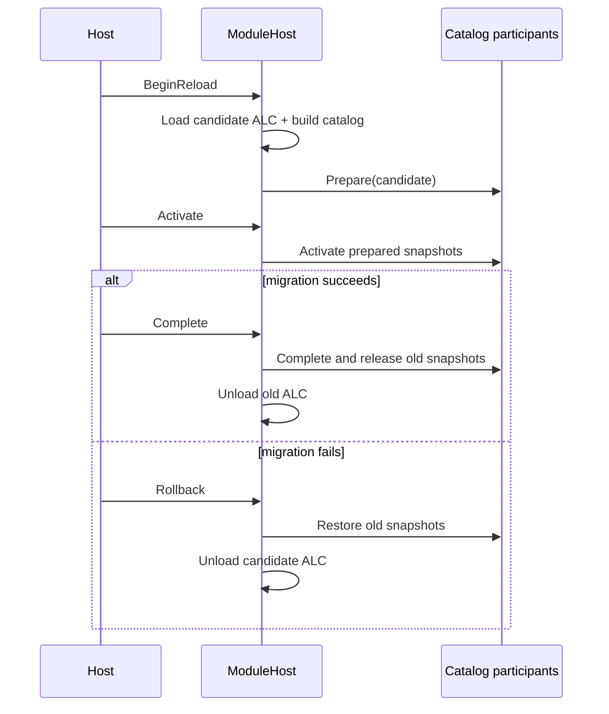

# Inno.Extensibility.Modules

[Extensibility 索引](README.md) · [下一页：Reflection](Inno.Extensibility.Types.md) · [Wiki 首页](../README.md)

Pending / timeout 的分类覆盖整棵 Aggregate/InnerException 树。Catalog/Reload participant 和 ModuleHost
保留原始异常、事务及未退出的两代 context；不得将包装 Pending 当成普通错误后继续 BeginUnload。
已用真实 collectible ALC 验证 Activate、Complete、Rollback 三条包装异常路径。

Catalog 候选失败并完整回滚后，保留当前 last-good publication，不因异常本身重新设置自动刷新请求。
失败原样上抛；只有新的 Host Assembly load、显式 `Rebuild()` 或后续实际代际变更才发起新尝试。
这样普通 `TypeCatalog.current` / Asset 查询不会不断重跑同一被拒绝候选，导致 last-good 虽已恢复却无法访问。
候选准备期间实际到达的新 Assembly load 仍保留 dirty 标志，不吞掉新变化。
AssemblyLoad 只为符合 Catalog 同一分类规则的非动态 Host/InnoInternal 程序集置 dirty；
异常格式化时加载的 BCL、测试工具和不参与 Catalog 的程序集不会触发无关的全域重新发布。

`Inno.Extensibility.Modules` 是不依赖反射业务的程序集生命周期层。它管理当前“哪些程序集是活动的”、模块代际、shadow copy、collectible `AssemblyLoadContext` 和原子切换事务；它不知道 TypeCache、Importer、Converter、Component 或脚本目录。

## 源码目录

`AssemblyCatalogSnapshot.assemblies` 持有独立只读副本，不能通过数组/IList 强转改写 generation 内容。快照仍强持有该代 Assembly；调用者必须在代际退休前释放其引用，不能把只读误解为弱引用。

```text
Inno.Extensibility.Modules/
├─ ModuleHost.cs
├─ ModuleHostOptions.cs
├─ Catalog/              # 不可变程序集快照与 participant 事务契约
├─ Loading/              # 加载请求与 AssemblyLoadContext 实现
├─ Metadata/             # AssemblyDomain/AssemblyScope 与 metadata 扩展
├─ Modules/              # 模块 handle、诊断信息与卸载监视
├─ Reloading/            # Reload session 与迁移上下文
└─ Internal/
   ├─ Catalog/           # participant 协调与原子刷新集合
   └─ Modules/           # Manager 内部模块状态
```

公开类型虽然按职责分文件夹，但继续使用稳定的 `Inno.Extensibility.Modules` namespace；目录整理不会迫使调用方修改 using。只有具体的加载上下文实现位于内部的 `Inno.Extensibility.Modules.Loading` namespace。

## 职责边界

- Host assembly：位于默认 ALC 的引擎程序集，由运行时拥有。
- External module：通过 `Register` 登记，生命周期仍由调用者拥有。
- Managed module：通过文件路径加载，由 Manager 创建独立 ALC，并可协作式卸载。
- Catalog participant：从完整程序集快照派生状态的通用事务参与者。
- 不负责：编译 C#、监视源文件、扫描扩展类型、迁移 Scene 实例。

## 初始化与关闭

```csharp
string cache = Path.Combine(projectRoot, "Library", "Assemblies");
ModuleHost.Initialize(new ModuleHostOptions
{
    cacheDirectory = cache,
    preloadEntryAssemblyDependencies = true
});

// Register TypeCatalog and other higher-level services here.

ModuleHost.Shutdown();
```

`cacheDirectory` 用来存放 generation shadow copy，不能留空。`preloadEntryAssemblyDependencies=true` 会合并 CLR AssemblyRef 图与 `.deps.json` runtime dependency 图，预加载入口及ModuleHost 所在 ALC 的 host roots 关联的 Inno assembly。即使某个项目只通过 Attribute 提供扩展、没有产生具体类型调用，它仍会进入初始 catalog；由通用 launcher 或 testhost 承载时也使用同一规则。

Shadow generation 是可再生缓存，不是序列化状态。collectible ALC 仍可达时目录会保留；`AssemblyUnloadMonitor` 观察到 ALC 不再可达后会协作式删除对应目录，后续 module staging 也会重试。Editor 异常退出或旧 ALC 一直存活时，下一次 `ModuleHost.Initialize` 会清理上次进程遗留的 cache directory。非 collectible module 在当前进程中无法安全回收，只能在下一次进程初始化时清理其文件。

## ModuleHost

| 成员 | 说明 |
| --- | --- |
| `bool isInitialized` | 是否已经建立全局程序集 catalog。 |
| `IReadOnlyList<AssemblyModuleInfo> modules` | 当前 managed/external 模块的非 owning 诊断视图。 |
| `Initialize(ModuleHostOptions)` | 初始化缓存目录、Host 发现和首次 catalog 发布。重复初始化会先关闭旧状态。 |
| `RegisterCatalogParticipant(IAssemblyCatalogParticipant)` | 注册派生状态参与者，并立即用当前 catalog 初始化；返回的 `IDisposable` 用于注销。 |
| `Load(AssemblyLoadRequest)` | shadow copy 并激活一个新 managed module，返回稳定 handle。 |
| `Register(string, IReadOnlyList<Assembly>)` | 注册调用者已经加载的 assembly；Manager 不拥有也不卸载它们。 |
| `BeginReload(handle, request)` | 加载并验证候选代际，但尚不发布；返回 reload session。 |
| `BeginReload(requests)` | 按显式模块依赖顺序 stage 一个 reload closure，并用一个 session 原子切换。 |
| `BeginReload(requests, removedModuleNames)` | 在同一候选 Catalog 中原子替换与移除模块；缺失反向依赖 closure 时拒绝。 |
| `Unload(handle)` | 从活动 catalog 移除模块，并对 owned collectible ALC 发起卸载。 |
| `Unload(handles)` | 用一个 catalog transaction 移除闭包，并按 Editor → Runtime → Plugin 请求卸载。 |
| `Refresh()` | 仅在 Host AssemblyLoad 令 catalog dirty 时刷新；无变化时不重建。 |
| `Rebuild()` | 强制重建当前 catalog，并事务刷新全部参与者；不会重新读取 DLL。 |
| `Shutdown()` | 发布空 catalog、注销事件并发起 owned module 卸载。 |

`AppDomain.AssemblyLoad` 事件只把 Host catalog 标记为 dirty。下一次 `Refresh()`（TypeCache 查询会间接调用）或显式 `Rebuild()` 才构建新快照。候选 ALC 在 `Activate()` 前不会出现在活动 catalog 中。

## 加载请求和模块信息

### ModuleHostOptions

| 属性 | 默认值 | 说明 |
| --- | --- | --- |
| `cacheDirectory` | `<AppBase>/AssemblyCache` | shadow generation 目录。Host 通常改成 `<Project>/Library/Assemblies`。 |
| `preloadEntryAssemblyDependencies` | `true` | 是否从 CLR 引用和 runtime dependency manifests 预加载 Inno host dependencies。 |

### AssemblyLoadRequest

| 属性 | 说明 |
| --- | --- |
| `required moduleName` | 跨代际稳定的逻辑名称；Reload 时必须与旧模块一致。 |
| `required mainAssemblyPath` | 主 DLL 路径。 |
| `preloadAssemblyPaths` | 在同一 ALC 中预加载的 DLL 列表。 |
| `upstreamModuleNames` | 可满足本模块 AssemblyRef 的稳定上游模块名；也用于拓扑排序和反向依赖 closure。该清单对所有 domain 都是显式且完整的；空清单严格表示没有上游，Host 不从当前活动模块推断依赖。 |
| `collectible` | 是否允许协作式 unload，默认 `true`。 |
| `domain` | `InnoPlugin` 或 `InnoScripting`；`InnoInternal` 不能进入 collectible module。 |
| `scope` | 模块的 `Runtime`/`Editor` 依赖边界。 |
| `assemblyScopes` | 同一模块 ALC 内按 simple name 声明每个 DLL scope；未列出项使用 `scope`。 |

### 诊断类型

- `AssemblyModuleHandle(Guid id)`：不持有 Assembly/ALC 的稳定句柄。
- `AssemblyModuleInfo`：record，公开 `handle`、`moduleName`、`generation`、`collectible`、`externallyOwned`、`domain`、`scope`、`status`、`assemblyNames` 与 `upstreamModuleNames`。
- `AssemblyModuleStatus.Active`：当前公开状态。
- `AssemblyUnloadMonitor.status` / `isCompleted`：通过弱引用观察旧 ALC 是否已经不可达。
- `AssemblyUnloadStatus.Pending` / `Completed`：卸载仍被引用或已经完成。

## 事务式 Reload

```csharp
using AssemblyReloadSession reload = ModuleHost.BeginReload(handle, new AssemblyLoadRequest
{
    moduleName = "RuntimeScripts",
    mainAssemblyPath = nextDll,
    domain = AssemblyDomain.InnoScripting,
    scope = AssemblyScope.Runtime,
    collectible = true
});

reload.Activate();
try
{
    // Migrate higher-level state while both old and candidate contexts are available.
    MigrateState(reload.context);
    AssemblyUnloadMonitor oldGeneration = reload.Complete();
}
catch
{
    reload.Rollback();
    throw;
}
```



`AssemblyReloadSession.Dispose()` 会对未完成 session 自动 rollback。`Complete()` 后 `AssemblyReloadContext` 会释放强引用，不能继续访问。
普通、已终结的清理错误会在尝试其余清理后报告 Fault。`RetirementPendingException` 则表示依赖仍在使用：
保留 transaction、module entries 和迁移 context，停止下游清理及 ALC Unload，原样抛出并关闭 generation gate。
重复 Dispose/Complete/Rollback 不允许借由 finished 标志绕过该屏障；必须重启整个 Host。
此时已提交 generation 不伪回滚，但 reload 不报告 Success，也不允许继续 Play/Build/Export。

自动 Catalog refresh 在 Build/Export 的读租约期间保留当前快照，将 dirty 刷新延后；
它通过 TryAcquireChange 预留互斥发布，不得为了响应一次类型查询而突破冻结 generation。

多模块 session 使用 [Core Collections](../core/Inno.Core.Collections.md) 的 `DependencyGraph<string>` 对 `upstreamModuleNames` 做确定性拓扑排序；Project Scripting 自然位于其 Plugin 依赖之后，Editor Scripts 位于 Runtime Scripts 之后。下游 `ModuleLoadContext` 显式复用同一事务上游 candidate 中的精确 `Assembly` 实例，不复制并二次加载依赖 DLL。发布时一次切换 module map、Assembly catalog、TypeCache 与全部 Registry candidate；任一 stage、participant、Scene 或 extension 激活失败都恢复完整 previous 集合并逆序卸载 candidate。`Complete` 仅释放 previous snapshot 并按反向拓扑请求协作式卸载，不执行可失败的发现或刷新。

依赖闭包是强制约束：Runtime Scripts reload 或 removal 必须包含 Editor Scripts；某个 Plugin reload/unload 必须包含依赖它的 Plugin 与 Project Scripting。Closure validation 对 replacement request 与 explicit removed module 使用完全相同的 domain/scope 语义，因此允许在没有替代 DLL 时原子退休完整闭包，同时仍拒绝遗漏任一活动下游。`upstreamModuleNames` 的空值语义不可被活动进程状态改写；否则删除 Plugin 的同一事务会让新的 Runtime Scripts 再次引用正在退休的 Plugin ALC。Plugin module 数量不封闭，通常每个稳定 Plugin ID 对应独立 collectible ALC；Runtime Scripting 和 Editor Scripting 各保持一个模块。每个事务会在加载前建立完整 module/simple-name/domain/scope 图，并在加载后校验实际 AssemblyRef；重复 simple name、Runtime → Editor、Plugin → Scripting、模块依赖 cycle、未声明的自定义依赖以及非 `InnoInternal` 的 Default ALC 共享依赖都会在发布前拒绝。只有受信任的平台程序集与具有当前 `InnoInternal` metadata 的 Host contract 可以从 Default ALC 共享。

### AssemblyReloadContext

| 成员 | 说明 |
| --- | --- |
| `previousCatalog` / `candidateCatalog` | 激活前后的 `AssemblyCatalogSnapshot`。事务结束后不可访问。 |
| `module` | staging 顺序中的第一个逻辑模块句柄。 |
| `modules` | 该原子事务涉及的全部逻辑模块句柄。 |
| `GetContext<TContext>()` | 取得某个 participant 提供的迁移上下文；不存在或重复时抛异常。 |
| `TryGetContext<TContext>(out ...)` | 尝试取得唯一的指定上下文。 |

例如 Reflection participant 会提供 `TypeCacheReloadContext`：

```csharp
TypeCacheReloadContext types = reload.context.GetContext<TypeCacheReloadContext>();
TypeRef previous = types.previous.GetTypeRef(oldInstance.GetType());
types.TryResolveReplacement(previous, out TypeRef replacement);
```

## 自定义 Catalog Participant

`IAssemblyCatalogParticipant` 只有一个 `Prepare(AssemblyCatalogSnapshot)`。实现必须旁路构建完整候选状态，返回 `IAssemblyCatalogTransaction`：

| 事务成员 | 契约 |
| --- | --- |
| `object? context` | 可选的短生命周期迁移上下文。 |
| `Activate()` | 原子发布候选状态。 |
| `Complete()` | 仅释放旧状态，不得再执行发布；普通错误聚合并 Fault，不伪回滚；未退休信号保留 owner 并停止下层释放。 |
| `Rollback()` | 恢复旧状态并释放候选状态；普通错误继续尝试其他 participant，Pending 不可伪装为完成。 |

参与者不要保留过期的 `AssemblyCatalogSnapshot`，因为其中的 `assemblies` 会强引用 collectible ALC。

## Assembly domain 与 scope

程序集分类使用两个正交维度：`AssemblyDomain.InnoInternal/InnoScripting/InnoPlugin` 与 `AssemblyScope.Runtime/Editor`。Host csproj 通过 `InnoAssemblyDomain` / `InnoAssemblyScope` 生成当前 `Inno.AssemblyDomain` / `Inno.AssemblyScope` metadata；脚本编译器写入 Scripting 分类。外部 Plugin DLL 不必修改 metadata，Plugin asset/加载请求提供 domain 与逐程序集 scope，加载后只在弱分类表中登记当前 `Assembly`。

```csharp
AssemblyDomain domain = typeof(MyType).Assembly.GetInnoAssemblyDomain();
AssemblyScope scope = typeof(MyType).Assembly.GetInnoAssemblyScope();
```

两个查询使用 `ConditionalWeakTable<Assembly, ...>`，不会因分类缓存固定可卸载程序集。旧 `AssemblyGroup`、旧 metadata key 和兼容 reader 已删除。

物理 ALC 拓扑为 Default/Internal、多个按显式 DAG 连接的 `Plugin.<id>`、Runtime Scripts、Editor Scripts。依赖只能沿 Internal ← dependency Plugin ← dependent Plugin ← Runtime Scripts ← Editor Scripts 方向；Editor Scripts 还可访问 editor-scope Plugin/Internal API。ALC 只提供卸载和更新粒度，不是安全沙箱。

内部 `ModuleLoadContext` 在 `Unloading` 时释放共享程序集解析表。这张表只服务于活动 generation 的依赖解析，不能在退休后继续强持有上游 collectible Assembly；跨上下文泛型依赖可能使这类引用与 CLR 的 loader allocator 形成保留环。该清理覆盖正常卸载和候选加载失败，不改变弱 monitor、GC barrier 或 Faulted 语义。

## 常见误区

- `Rebuild()` 只对当前活动 assembly 重做 catalog/participant 状态，不会从磁盘重新加载同名 DLL；文件内容变化必须走 `BeginReload()`。
- `Unload()` 是协作式的。旧线程、静态事件、缓存的 `Type`/delegate/instance 都可能让 monitor 长期 `Pending`。
- `Unload()` 发起退休并登记共享 GenerationCoordinator；`Pending` 不是成功。退休对象经 Full GC → Finalizers → Full GC 和弱 monitor 确认不可达后才能完成；等待期间不得开始另一代际事务或 Play/Build/Export，超时进入 Faulted，不能忽略 monitor 继续运行。
- 不要从该层访问 TypeCache；依赖方向是 [Reflection](Inno.Extensibility.Types.md) → Assemblies，而不是反过来。
- 一个时刻只允许一个 reload session；新 Load/Register/Unload/Rebuild 不能穿插在未完成事务中。
